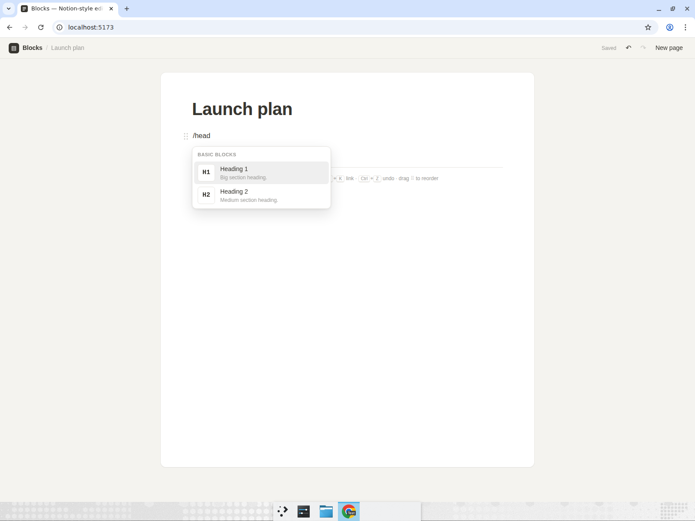
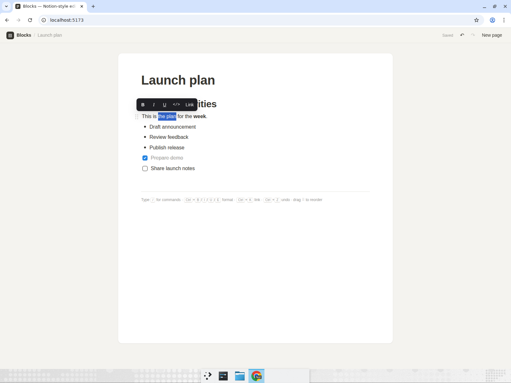
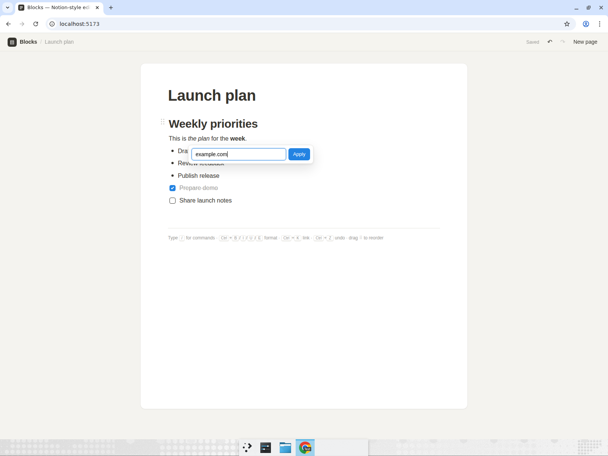
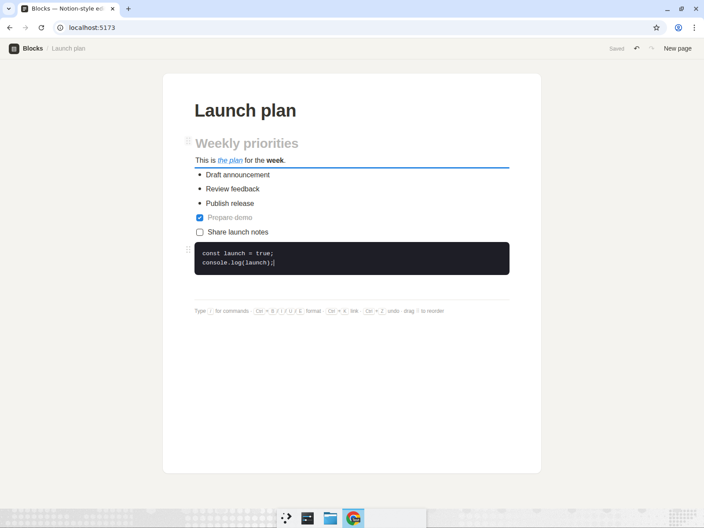
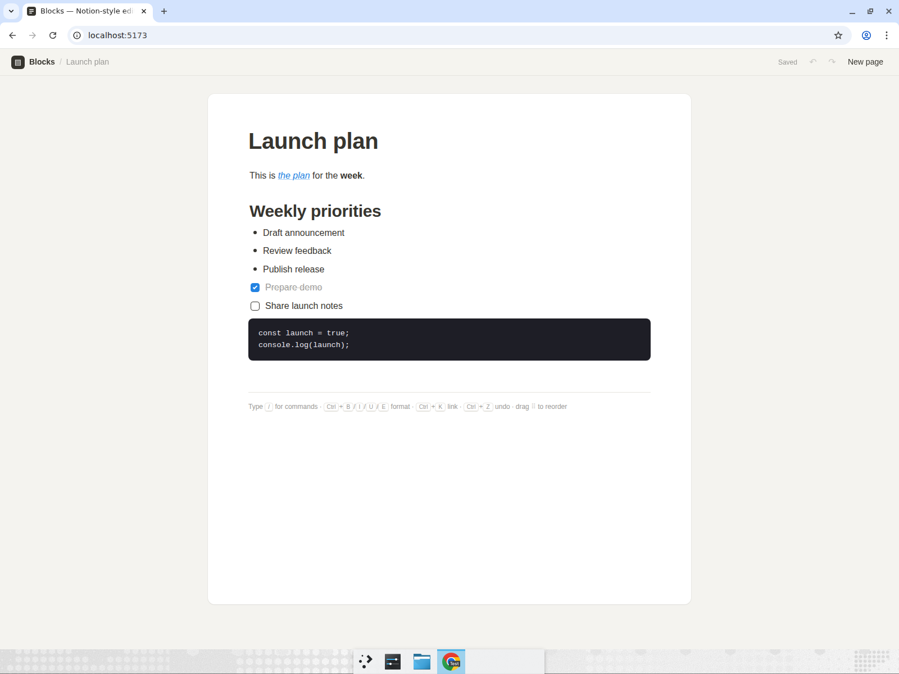

# block-editor — Notion-style rich text block editor

A Notion-like document editor built on plain `contentEditable` with Vite, React and TypeScript (no editor library, no UI kit). Every line is a block: Enter splits a block, Backspace on an empty block removes it, and ArrowUp/ArrowDown move between blocks. Typing `/` opens a filterable slash-command menu (Heading 1, Heading 2, Bullet list, Numbered list, To-do, Quote, Code block, Divider), and markdown shortcuts (`# `, `## `, `- `, `1. `, `[] `, `> `) convert a block as you type. Selecting text shows a floating toolbar, and Ctrl+B / I / U / E / K apply bold, italic, underline, inline code and links (with a URL popover). Blocks can be reordered by dragging their `⠿` handle, everything is undoable with Ctrl+Z / Ctrl+Shift+Z, and the document is persisted to `localStorage`.

## Run it

```bash
cd block-editor
npm install
npm run dev
```

Then open the URL Vite prints (normally http://localhost:5173/).

## Computer-use showcase

After building the app, Devin opened it in a real, maximized Chrome window and drove it exactly like a person would — typing, filtering menus with the keyboard, selecting text with Shift+Ctrl+Arrow and with a click-drag of the mouse, clicking toolbar buttons, dragging a block by its handle, and refreshing the page. The full run is in the recording linked below; every step was asserted visually.

**Recording:** [block-editor-demo.mp4](https://app.devin.ai/attachments/661b6516-47e2-48de-a231-9c40c85fd271/block-editor-demo-edited.mp4) (annotated, ~85 s) — also embedded in [PR #9](https://github.com/dabit3/experiments/pull/9).

### Scenario performed

1. **Write the document.** Click the title and type `Launch plan`, press Enter. Type `/` → the slash menu opens; type `head` → the menu narrows to *Heading 1* / *Heading 2*; Enter → a Heading 1 block, type `Priorities`. Enter, type the paragraph `This is the plan for the week.` Enter, type `- ` → the block becomes a bullet; type three items (*Draft announcement*, *Review feedback*, *Publish release*), pressing Enter twice on the empty bullet to leave the list. Type `[] ` → a to-do block; add *Prepare demo* and *Share launch notes*; click the first checkbox → it is checked and struck through. Also verified: ArrowUp/ArrowDown hop between blocks and Backspace on an empty block deletes it.

   

2. **Inline formatting.** Place the caret after `week`, press **Shift+Ctrl+Left** to select the word, press **Ctrl+B** → `week` is bold. Then **click-drag with the mouse** across `the plan` → the floating toolbar appears; click *Italic*, then click *Link*, type `example.com` in the popover and press Enter → the phrase is italic and links to `https://example.com`.

   
   

3. **Code block.** Click at the end of the last to-do, press Enter twice (the empty to-do turns back into a paragraph), type `/code` → the menu filters to *Code block*; Enter → a dark code block; type a two-line snippet (Enter inserts a newline inside the block).

4. **Drag to reorder.** Hover the heading so its `⠿` handle appears, press and hold on the handle, drag below the paragraph (a blue drop indicator follows the pointer), release → the heading now sits below the paragraph.

   

5. **Undo / redo.** Press **Ctrl+Z** three times → the drag, the code text and the code-block conversion are reverted. Press **Ctrl+Shift+Z** three times → all three are restored.

6. **Persistence.** Reload the page → title, all eight blocks, the bold word, the italic link, the checked to-do, the two-line code block and the new block order are all still there.

   

## Code map

| File | Role |
|---|---|
| `src/editor/model.ts` | `Doc` / `Block` types, block metadata, markdown shortcuts, pure document helpers |
| `src/editor/Editor.tsx` | Editor shell: block keyboard handling, slash menu, formatting, drag, undo/redo, persistence |
| `src/editor/BlockView.tsx` | Renders a single block (handle, marker/checkbox, `contentEditable`) |
| `src/editor/SlashMenu.tsx`, `FormatToolbar.tsx`, `LinkPopover.tsx` | Popups |
| `src/editor/formatting.ts` | Inline formatting (`execCommand` + custom inline code / links) |
| `src/editor/useHistory.ts` | Snapshot undo/redo with grouped text edits |
| `src/editor/useBlockDrag.ts` | Pointer-based drag reordering with drop indicator |
| `src/editor/caret.ts` | Selection / caret DOM utilities |
| `src/editor/storage.ts` | `localStorage` load/save |
