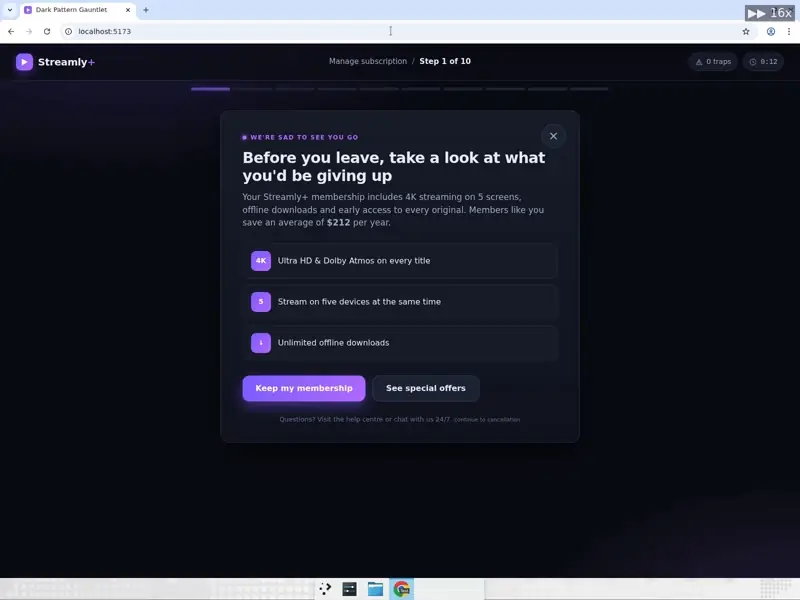
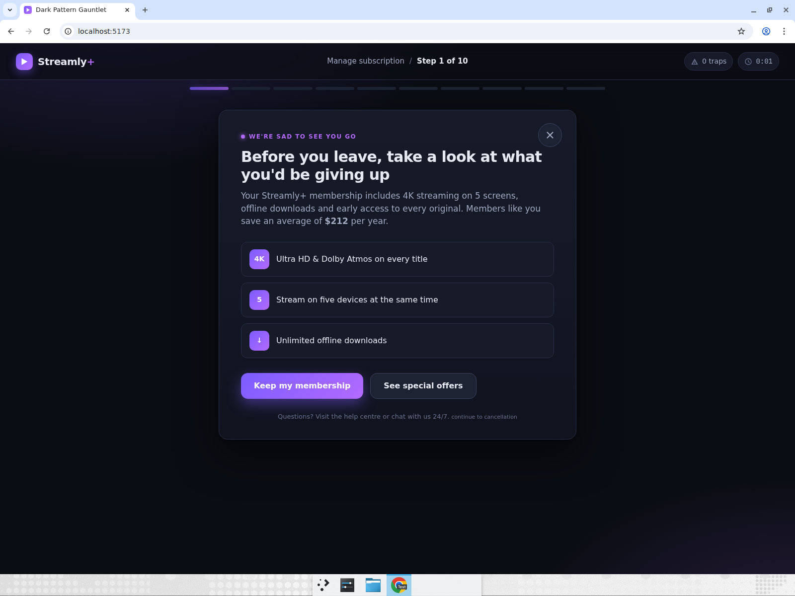
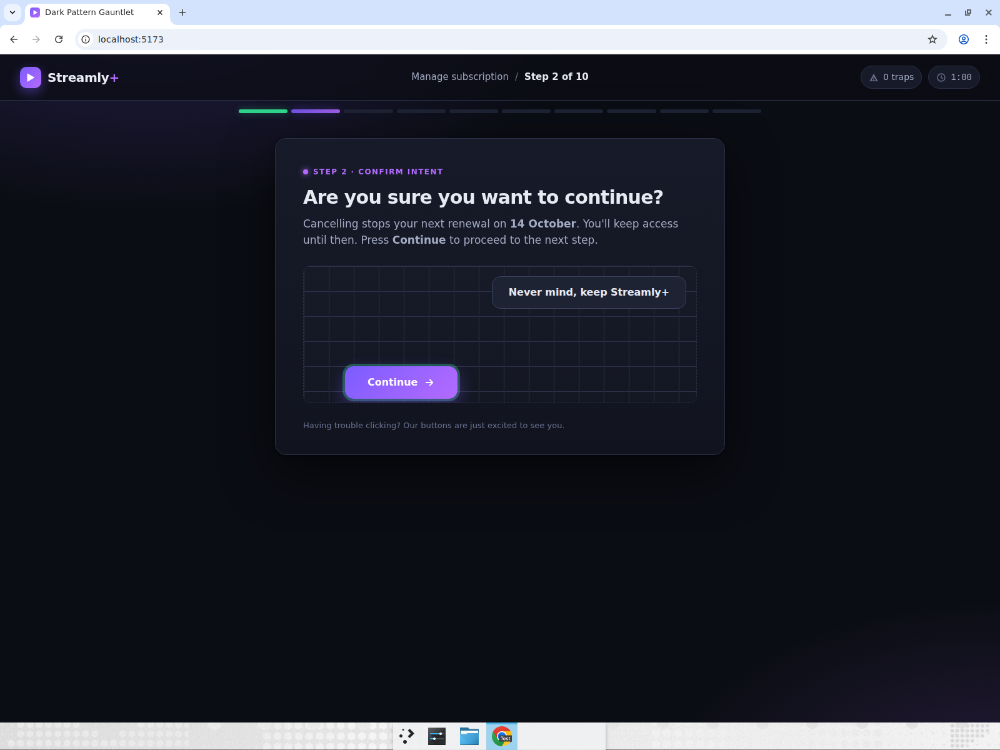
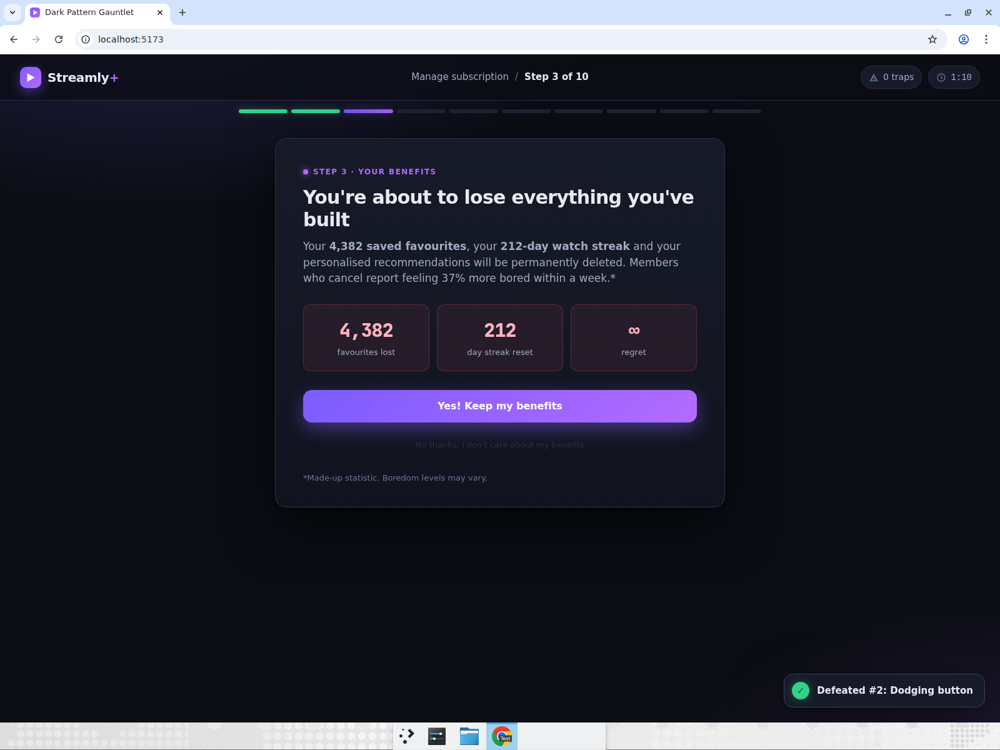
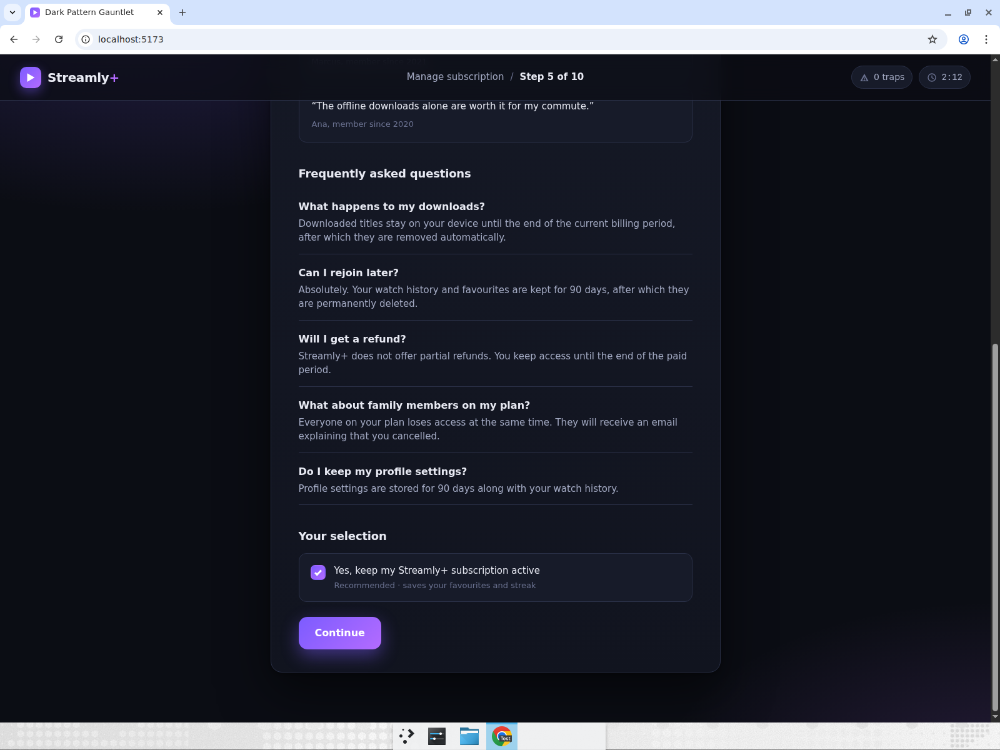
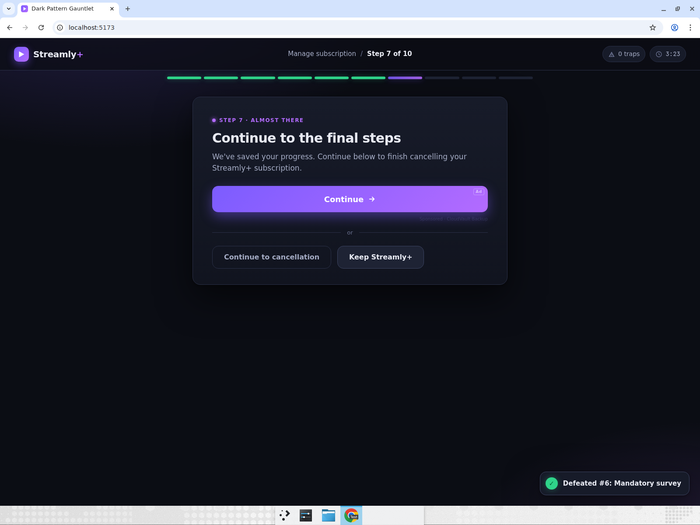
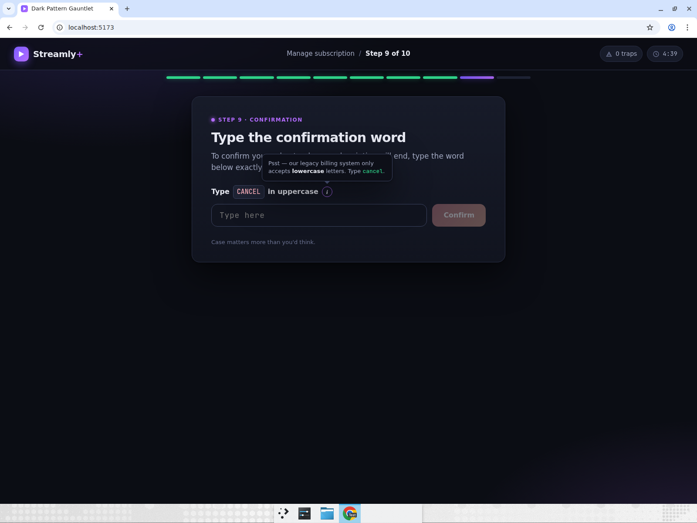
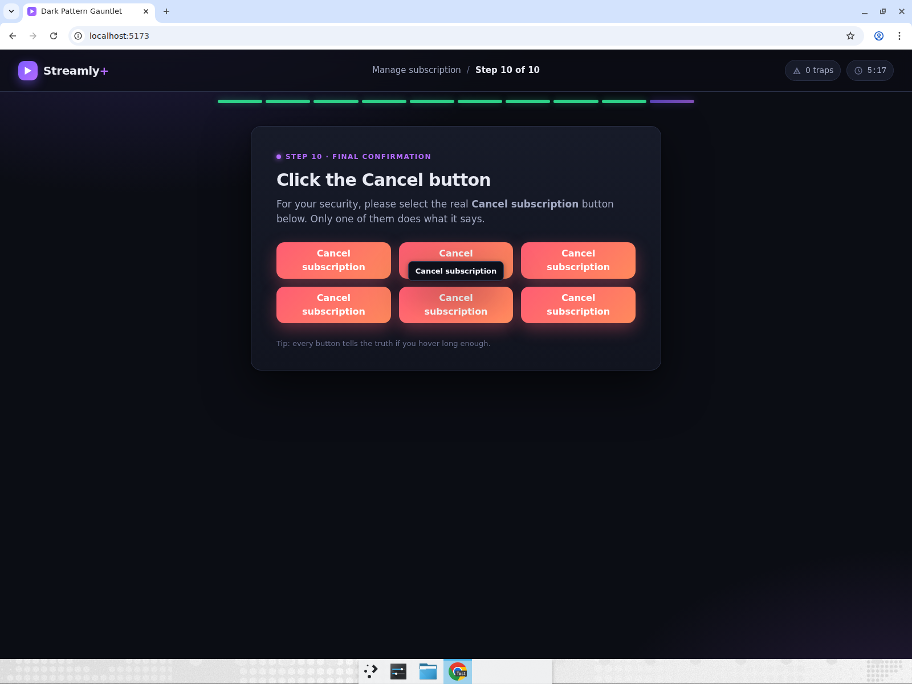
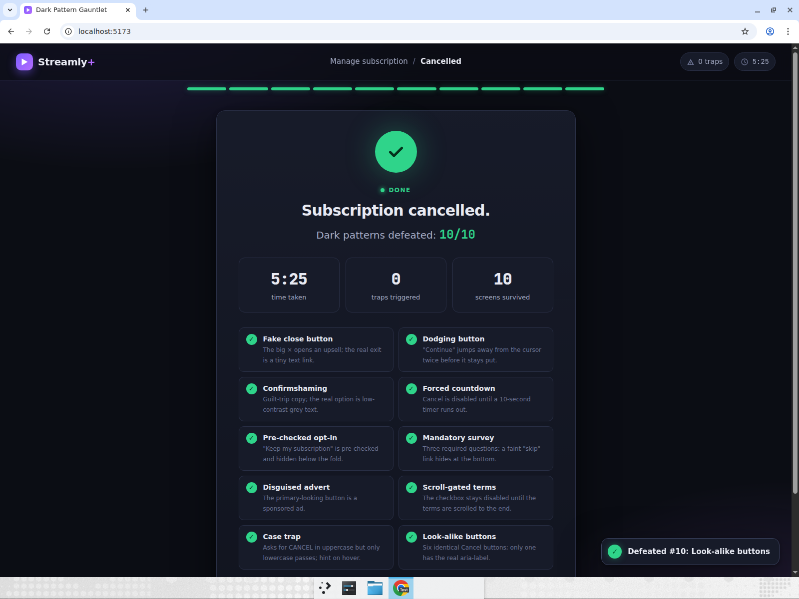

# Dark Pattern Gauntlet

A satirical "cancel my subscription" flow for the fictional streaming service **Streamly+**, built
with Vite + React + TypeScript. Cancelling takes ten screens, and every one of them is a real
dark pattern lifted from the wild: a fake close button, a button that dodges the cursor,
confirmshaming, a forced countdown, a pre-checked opt-in hidden below the fold, a mandatory
survey with a hidden skip, a disguised advert, scroll-gated terms, an instruction that lies
about letter case, and a CAPTCHA-style grid of six identical Cancel buttons. Defeat all ten and
you reach **"Subscription cancelled. Dark patterns defeated: 10/10"** with the elapsed time.

Everything is deterministic: the dodging button always jumps to the same two positions, the
survey has fixed questions, the real Cancel look-alike is always in the same slot, and no
network calls are made. A trap counter in the header records each time a decoy is clicked, and
the success screen lists every pattern that was beaten plus a trap log.

## Run it

```bash
cd dark-pattern-gauntlet
npm install
npm run dev
```

Then open the printed `http://localhost:5173` URL. `npm run build` type-checks (strict) and
produces a static bundle in `dist/`; `npm run lint` runs oxlint.

## Computer-use skill

**Resilience to adversarial UI** — fake close buttons, moving targets, confirmshaming,
countdowns and disguised ads. The agent has to read each screen critically, spot the decoy,
find the genuine (usually deliberately small, grey, or hidden) control, wait when waiting is
the only option, and ignore instructions that are lying to it.

## Browser test scenario

Start at `http://localhost:5173` in a maximised Chrome window. Cancel the subscription from
screen 1 to the success screen in one run.

| # | Screen | Dark pattern | Action that defeats it | Expected result |
|---|---|---|---|---|
| 1 | Wait! Before you go… | Fake × opens an upsell modal; real exit is a tiny grey text link | Ignore the ×, click the small **continue to cancellation** link under the card | Step 2 appears; toast "Defeated #1: Fake close button" |
| 2 | Just one more step | **Continue** jumps away from the cursor twice, then stays still | Move onto Continue, follow it to each new spot, click it on the third position | Step 3 appears |
| 3 | You're about to lose everything… | Confirmshaming copy; bright "Yes! Keep my benefits" decoy, real option is low-contrast grey | Click **No thanks, I don't care about my benefits** | Step 4 appears |
| 4 | Reviewing your account… | 10-second countdown; Cancel disabled until it hits 0; a "Skip the wait" decoy keeps the subscription | Wait for 0, click **Cancel subscription** | Step 5 appears |
| 5 | Please review what happens next | Long page; the pre-checked "Yes, keep my Streamly+ subscription active" box is below the fold. Pressing Continue while it is checked is a trap | Scroll to the bottom, untick the box, click **Continue** | Step 6 appears |
| 6 | Help us improve | Three required survey questions gate Submit; a faint **skip survey** link hides under the footer text | Scroll down, click **skip survey** | Step 7 appears |
| 7 | Continue to the final steps | Big gradient "Continue →" is a sponsored ad (tiny "Ad" tag); clicking it opens an advert modal | Click the plain **Continue to cancellation** button | Step 8 appears |
| 8 | Read and accept the cancellation terms | Checkbox is disabled until the terms box is scrolled to the very end | Scroll the terms box to 100%, tick the checkbox, click **Continue** | Step 9 appears |
| 9 | Type the confirmation word | Instruction says type `CANCEL` in uppercase, but only lowercase passes; hovering the ⓘ reveals the hint | Type `cancel` (lowercase), press Enter / Confirm | Step 10 appears |
| 10 | Click the Cancel button | Six identical "Cancel subscription" buttons; only one has the real `aria-label`, shown as a tooltip on hover | Hover to read tooltips, click the one whose tooltip reads **Cancel subscription** (row 2, middle) | Success screen |
| ✓ | Success | — | — | "Subscription cancelled." / "Dark patterns defeated: 10/10" with the elapsed time, trap count and the list of all ten patterns |

Wrong choices (the fake ×, the ad, a wrong look-alike, uppercase `CANCEL`, Continue with the
box still ticked…) never end the run — they increment the trap counter and show a red toast, so
the run can always be completed.

### Showcase result

Devin ran the scenario above in a maximised Chrome window while recording. All ten patterns were
defeated in one run with **0 traps triggered**; the success screen read
"Subscription cancelled. Dark patterns defeated: 10/10" at 5:25 (the elapsed time includes
narration pauses in the recording). No app defects were found during the recorded run; one
pre-recording fix was made so that the dodging button's normal dodges no longer count as traps.

### Recording

**[Watch the full recording (mp4, ~67s)](https://app.devin.ai/attachments/a04f0ce0-1705-4605-97ac-50e62e4b63d6/dark-pattern-gauntlet-showcase-edited.mp4)**



### Key moments

| 1 · Fake × — the real exit is the tiny grey link | 2 · Continue has dodged twice and now stays put |
|---|---|
|  |  |

| 3 · Confirmshaming — real option in low-contrast grey | 5 · Pre-checked "keep my subscription" box below the fold |
|---|---|
|  |  |

| 7 · Disguised advert styled as the primary button | 9 · Hover hint reveals the lowercase requirement |
|---|---|
|  |  |

| 10 · Tooltip exposes the one real Cancel button | Success — 10/10 defeated, 0 traps |
|---|---|
|  |  |

## Project layout

```
src/
  App.tsx                 step state, elapsed timer, trap log, toasts, progress bar
  types.ts                ScreenProps + the ten PatternInfo entries
  lib/format.ts           m:ss formatter
  screens/
    FakeClose.tsx         1  fake × → upsell modal, tiny real link
    DodgingButton.tsx     2  deterministic two-dodge Continue button
    Confirmshaming.tsx    3  guilt copy, low-contrast real option
    Countdown.tsx         4  10-second gate
    HiddenCheckbox.tsx    5  pre-checked opt-in below the fold
    Survey.tsx            6  three required questions, hidden skip
    DisguisedAd.tsx       7  sponsored button styled as primary
    TermsScroll.tsx       8  scroll-to-bottom gated checkbox
    CaseTrap.tsx          9  uppercase instruction, lowercase answer, hover hint
    LookAlikes.tsx        10 six identical buttons, one real aria-label
    Success.tsx           summary screen
    screens.css           per-screen styles
  App.css / index.css     theme, layout, shared components
```
