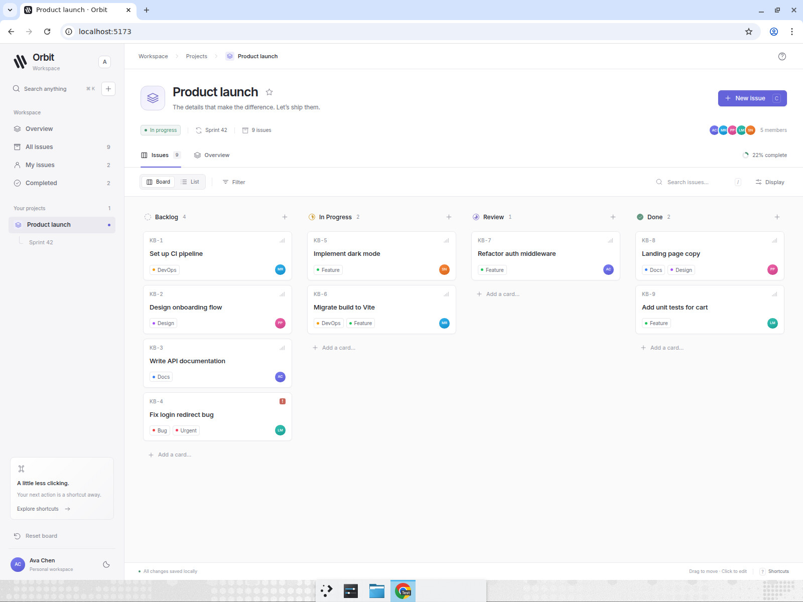
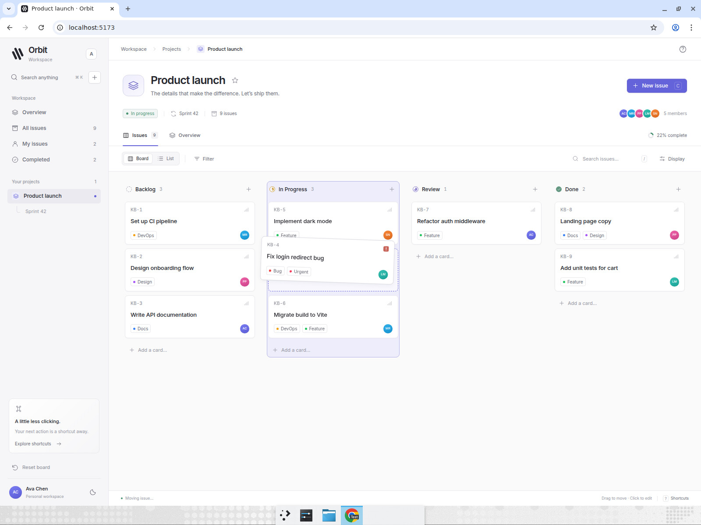
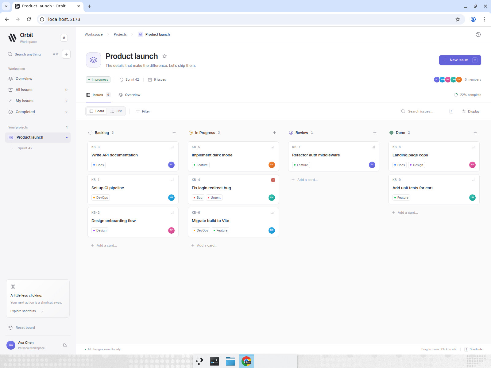
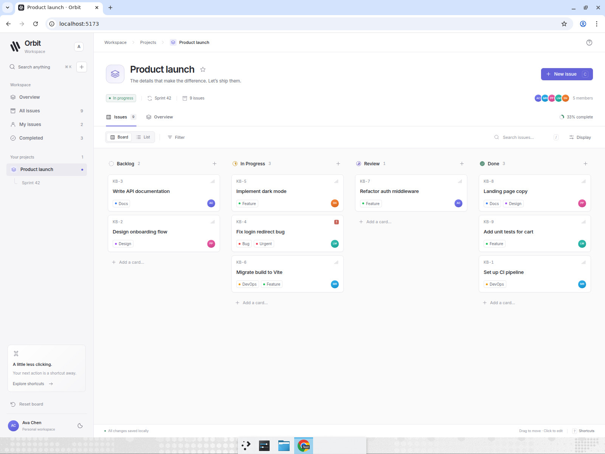
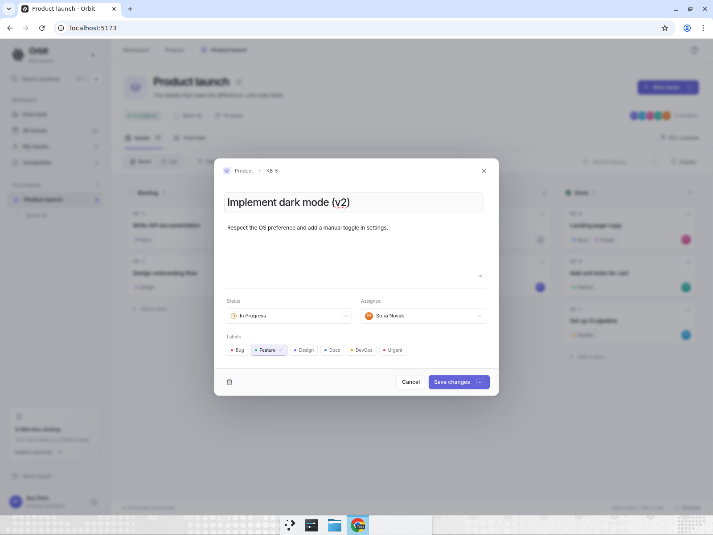
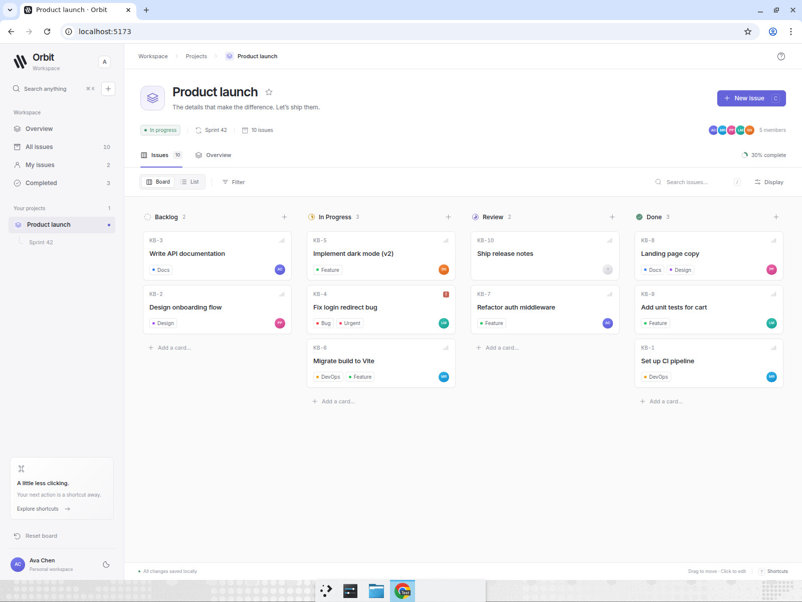
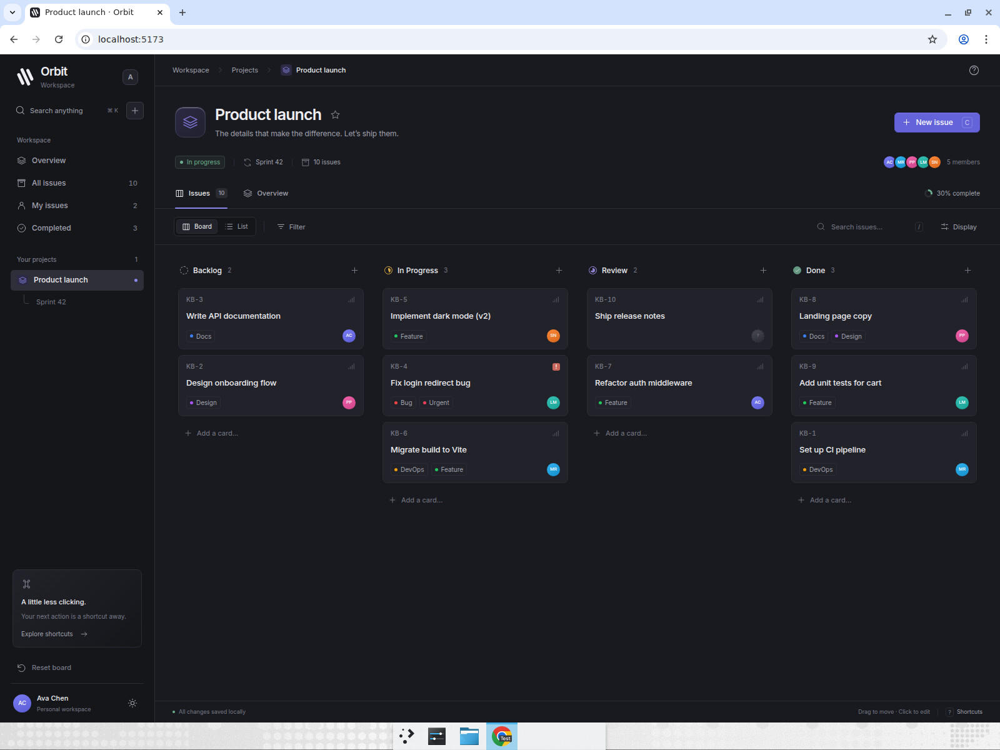
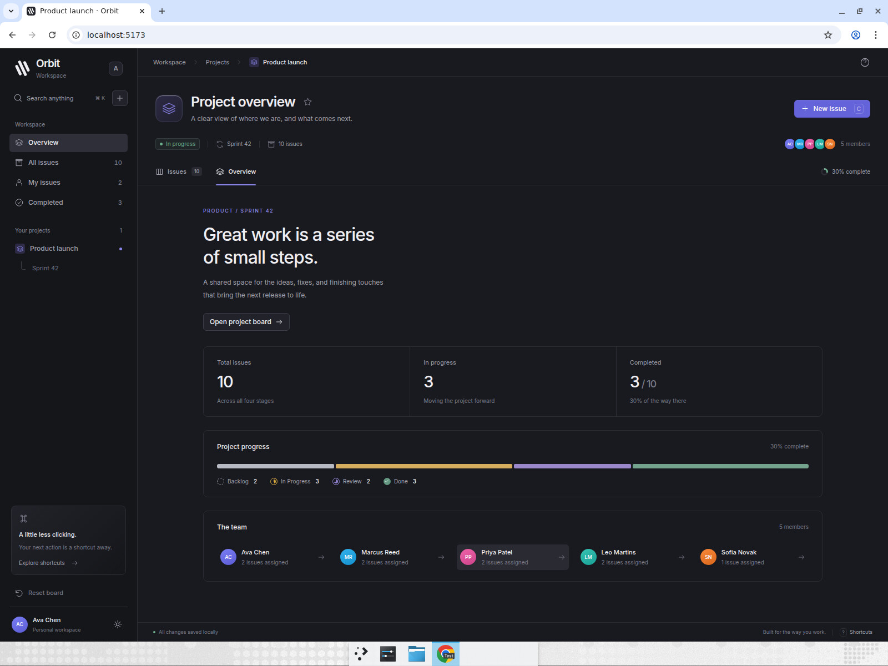
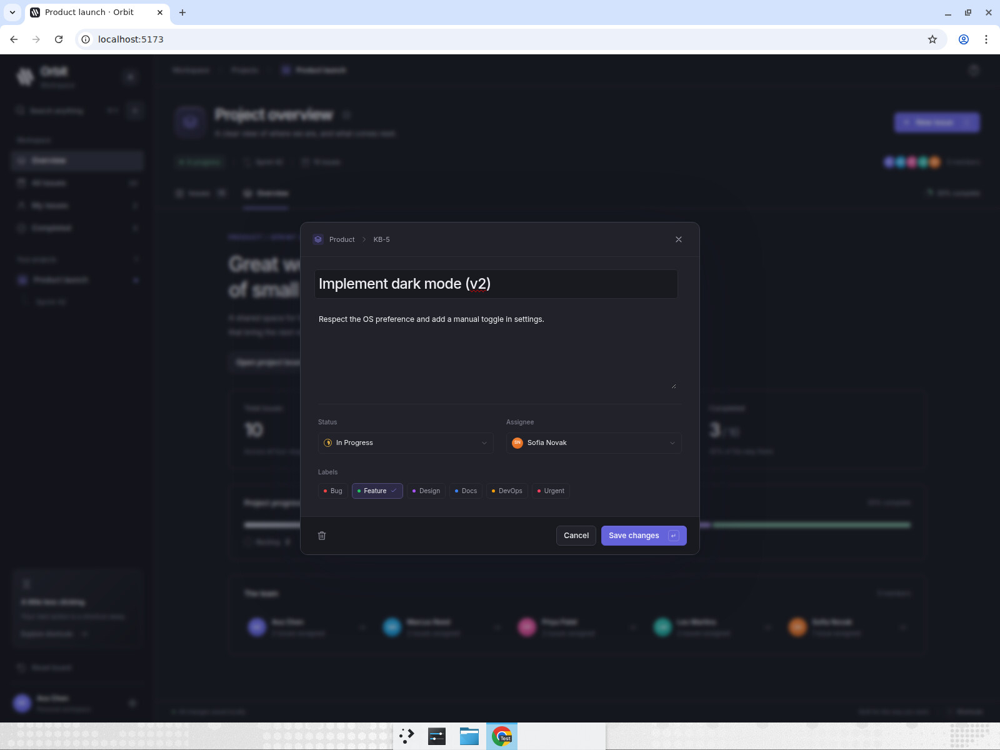

# Orbit — kanban-board

A Linear-inspired project workspace built with Vite, React and TypeScript.
Inter typography, restrained surfaces, compact cards, and light/dark themes
frame four columns: Backlog, In Progress, Review, and Done. Nine seeded issues
have colored labels and assignee avatars; real pointer drag-and-drop supports
reordering and movement across columns with live counts, a lifted overlay, and
a dashed placeholder. Add cards inline or use the issue editor to update titles,
descriptions, status, labels, and assignees. Board/list layouts, search, combined
filters, a command palette, and a project overview make the workspace functional.
Board state and appearance persist locally without accounts, APIs, or a backend.



## Run it

```bash
cd kanban-board
npm install
npm run dev
```

Then open http://localhost:5173. Other scripts: `npm run build`, `npm run lint`.

## Working in Orbit

- Use **Board** or **List**, search by title, description, or issue ID, and combine
  label and assignee filters.
- **Display** controls descriptions and dark appearance. The sidebar also has an
  appearance toggle.
- **Overview** shows live progress and team assignments. **My issues** uses Ava
  Chen, the demo workspace member.
- Click an issue to edit it. Delete and reset actions ask for confirmation.
  **Reset board** restores the nine original issues.
- Drag a card with the mouse, or focus it and use Space, arrow keys, and Space
  to pick up, move, and drop. Escape cancels a drag and restores its starting state.

| Shortcut | Action |
|---|---|
| Ctrl/Cmd + K | Search issues and commands |
| C | Create an issue |
| / | Focus board search |
| Ctrl/Cmd + Enter | Save the issue editor |
| ? | Show keyboard shortcuts |
| Escape | Close a dialog or cancel a drag |

## Computer-use showcase

Devin opened the app in a maximized Chrome window and drove it with real mouse
press / move / release events (no synthetic DnD events), asserting each result
visually. All six steps below passed in the redesigned workspace. The recording
uses setup, test-start, and assertion annotations, then ends with a tour of the
dark board, list, overview, command search, and issue editor.

**Recording:** [Watch the Orbit showcase](https://app.devin.ai/attachments/61532f34-0b62-4866-8c29-ba478d9b2290/orbit-showcase-9916f40-edited.mp4)
(74 seconds, annotated).

1. **Drag across columns and check counts** — dragged KB-4 "Fix login redirect
   bug" from Backlog and dropped it between the two In Progress cards. Backlog
   count went 4 → 3 and In Progress 2 → 3. While held, the lifted card follows
   the cursor, the original slot becomes a dashed placeholder and the target
   column is outlined:

   

2. **Reorder within a column** — dragged the bottom Backlog card (KB-3 "Write
   API documentation") up to the top slot; Backlog order became KB-3, KB-1, KB-2.

   

3. **Drag across three columns in one motion** — pressed KB-1 "Set up CI
   pipeline" in Backlog and, in a single press-move-release, carried it past In
   Progress and Review into Done. Backlog 3 → 2, Done 2 → 3.

   

4. **Add a card and drag it** — typed "Ship release notes" into Backlog's
   "Add a card…" input and pressed Enter (new card KB-10 appeared at the bottom
   of Backlog), then dragged it into Review above KB-7. Review 1 → 2.

5. **Edit in the modal** — clicked KB-5 "Implement dark mode" to open its
   detail modal, changed the title to "Implement dark mode (v2)", clicked Save changes,
   and confirmed the card on the board shows the new title.

   

6. **Persistence** — pressed F5. Counts were still Backlog 2 / In Progress 3 /
   Review 2 / Done 3, KB-1 was in Done, KB-10 in Review and KB-5 kept its edited
   title, all restored from `localStorage`.

   

## Workspace details







Additional browser checks covered keyboard-first creation, status/label/assignee
editing, cancellation and deletion, search and combined filters, dragging while
filtered, Escape restoration, reloading during a drag, appearance persistence,
command navigation, and mobile search/edit/save at 390 × 844.
