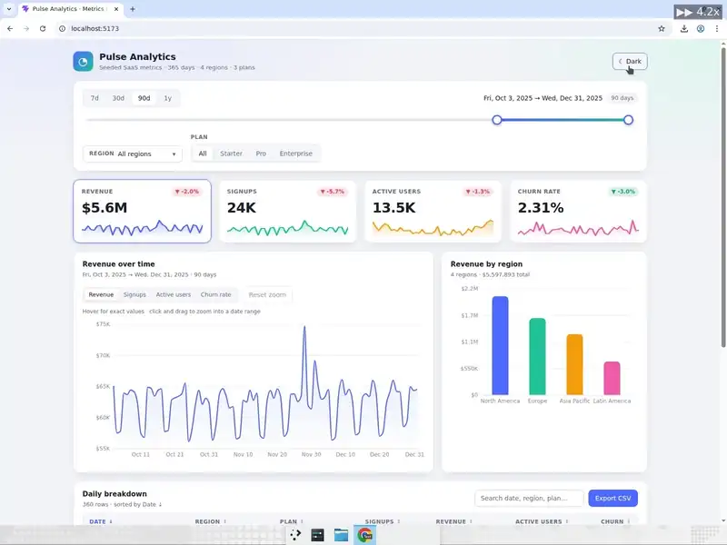
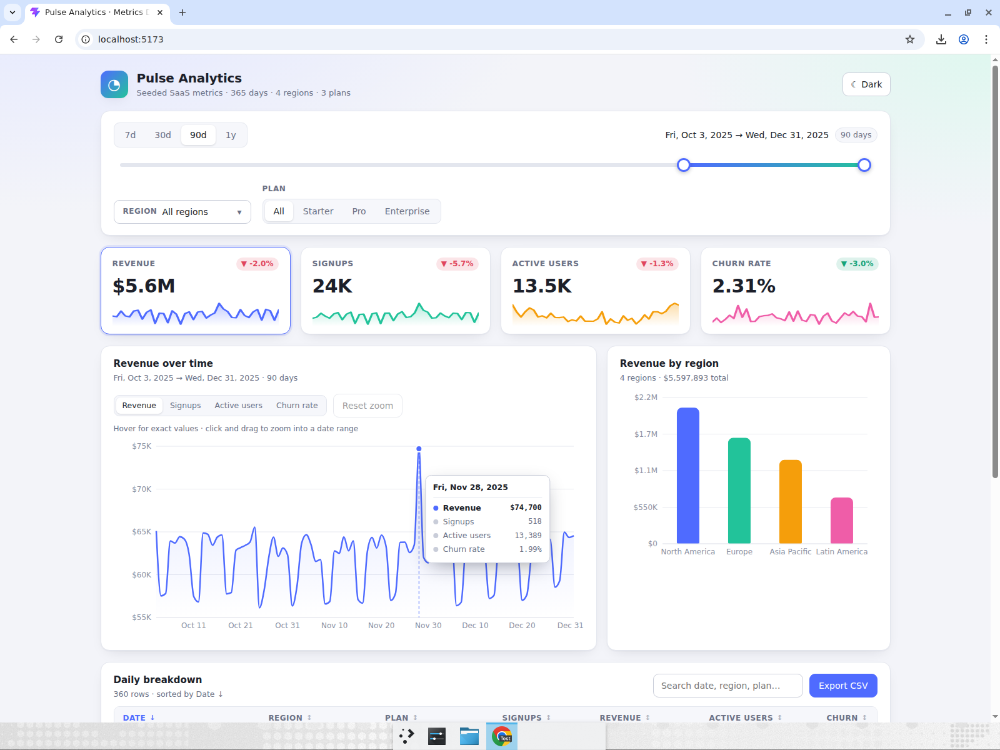
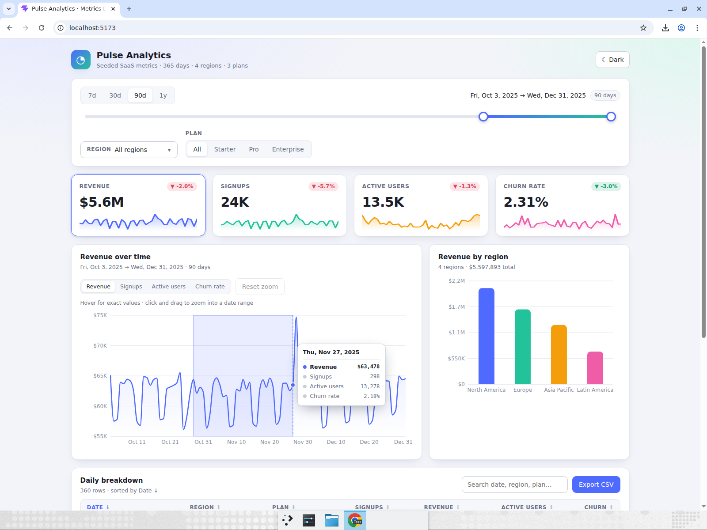
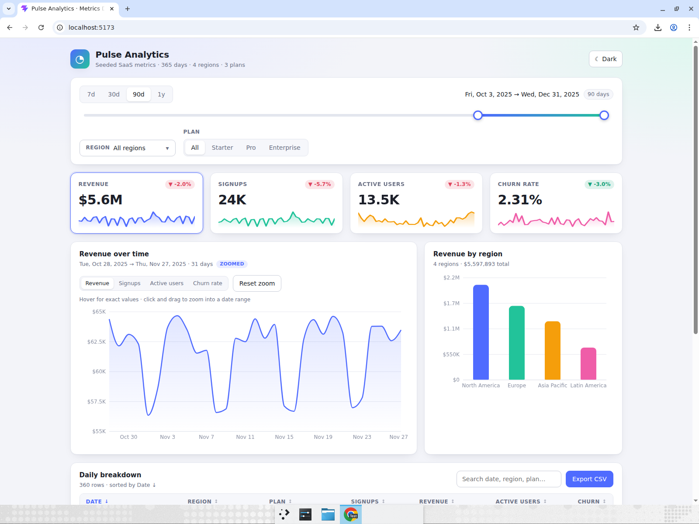
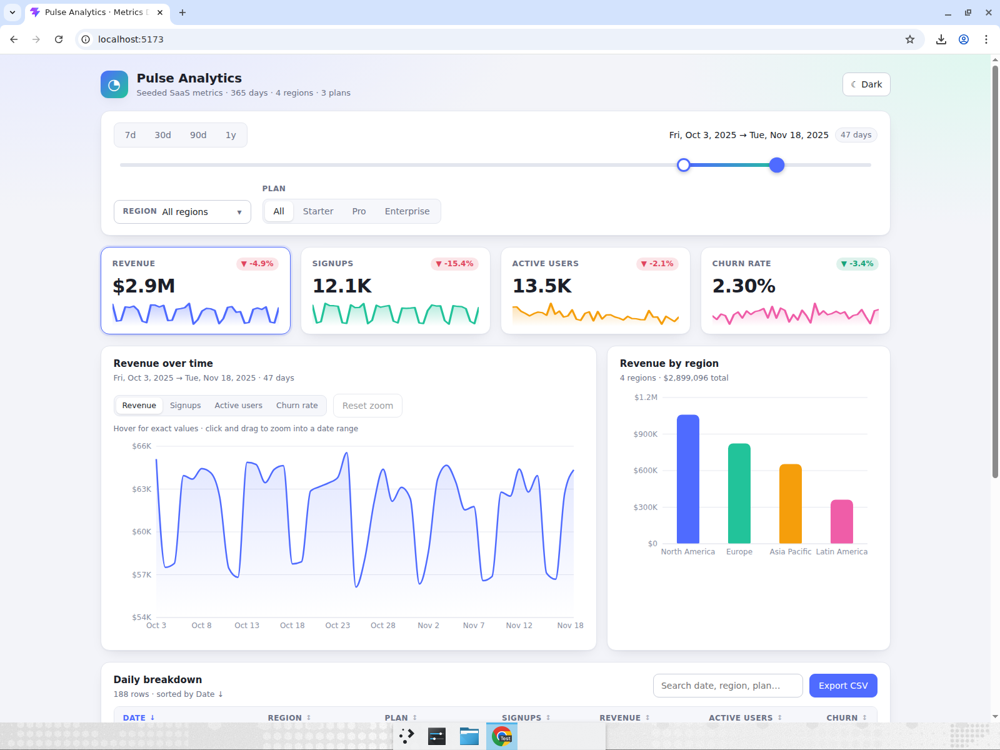
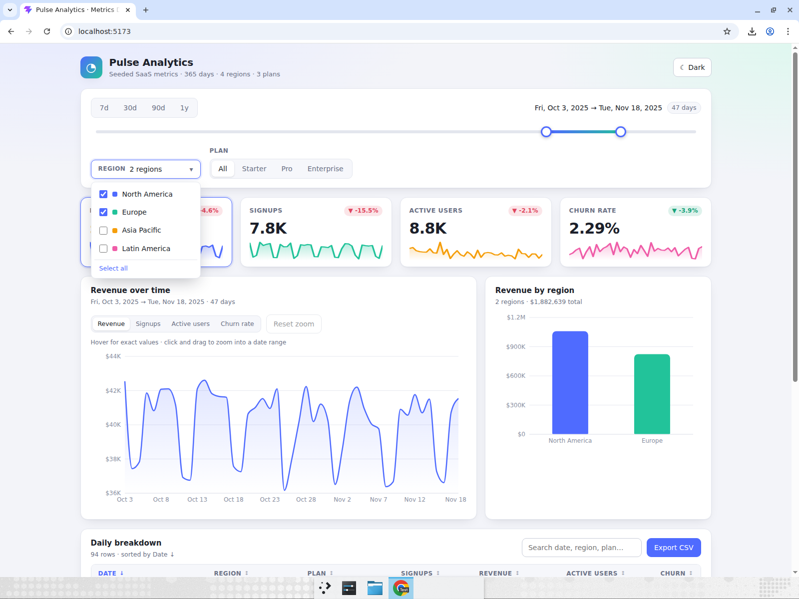
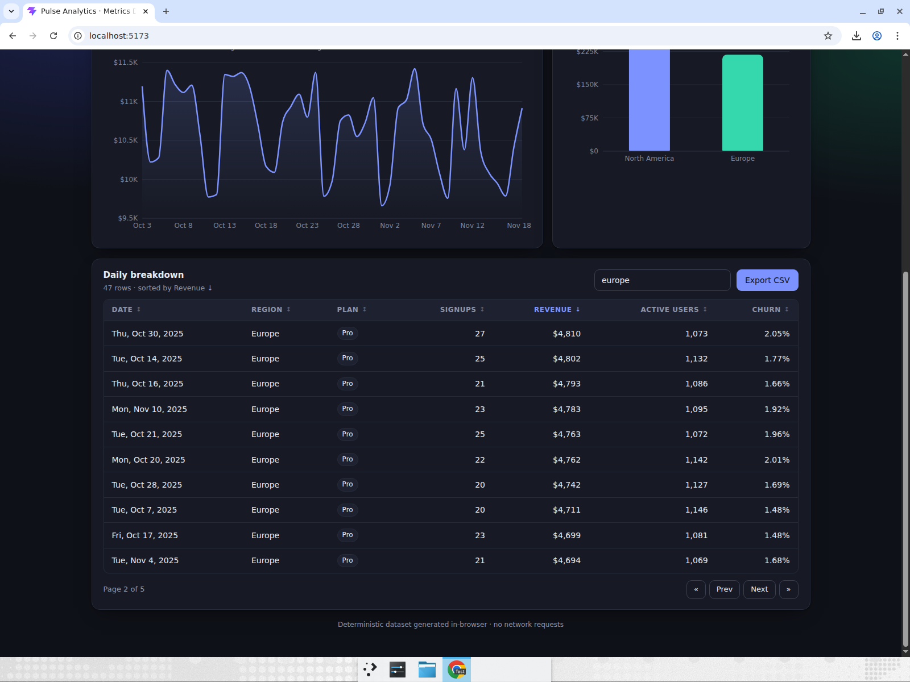

# metrics-dashboard — Pulse Analytics

A SaaS-style analytics dashboard over a deterministic, seeded dataset: 365 days of
signups, revenue, active users and churn across 4 regions and 3 plans, generated
in-browser with a mulberry32 PRNG (no network, no backend). It has KPI cards with
sparklines and period-over-period deltas, a Recharts time-series chart with a
hover crosshair/tooltip and click-drag zoom, a date-range picker with presets and a
dual-handle range slider, a region multi-select and plan segmented control that
re-filter every view, a per-bar-highlighting revenue-by-region bar chart, a
sortable/searchable/paginated data table, a dark/light theme toggle and a CSV export
of the filtered table.

## Run it

```bash
cd metrics-dashboard
npm install
npm run dev      # http://localhost:5173
```

Other scripts: `npm run build` (typecheck + production bundle), `npm run lint` (oxlint).

## Code map

```
src/
  data/dataset.ts      seeded generator → 365 × 4 regions × 3 plans DailyRecord[]
  data/aggregate.ts    filters → daily series, KPIs, region bars, table rows
  components/          KpiCard, TimeSeriesChart, RegionBarChart, DateRangeControls,
                       RegionMultiSelect, PlanSegmented, DataTable
  hooks/useTheme.ts    theme state + chart palettes
  utils/               number/date formatting, CSV serialisation + download
```

## Computer-use showcase

After building the app Devin opened it in a real browser (maximized window, screen
recording on) and drove it like a human:

1. **Hover tooltips** — moved the mouse across the revenue line chart at several
   points; the dashed crosshair followed the cursor and the tooltip showed a
   different date and exact revenue / signups / active users / churn each time.
2. **Drag-to-zoom** — pressed the mouse on the chart, dragged across ~a third of it
   and released; the x-axis narrowed to the selected dates and a "Zoomed" badge
   appeared. Clicked **Reset zoom** to restore the full range.
3. **Range slider** — dragged the right slider handle leftward (and the left handle
   rightward) to narrow the date range; the day count, KPI values and sparklines
   all updated.
4. **Filters** — opened the Region multi-select, unticked two regions and watched
   the bar chart drop to two bars; then switched the Plan segmented control to
   Pro, changing every chart and KPI.
5. **Table** — clicked the Revenue header twice to sort descending, typed in the
   search box to filter rows, and paged to page 2.
6. **Theme + export** — toggled dark mode, then clicked **Export CSV** and confirmed
   the filtered table downloaded as a `.csv` file.

### Recording

[▶ Watch the full recording (mp4, ~65 s, annotated)](recording/metrics-dashboard-showcase.mp4)



### Screenshots

| Hover tooltip + crosshair | Drag-to-zoom selection (mouse held) |
|---|---|
|  |  |

| Zoomed to 31 days | Slider thumb held — KPIs update live |
|---|---|
|  |  |

| Region multi-select → 2 bars | Dark mode, sorted + searched table, page 2 |
|---|---|
|  |  |
