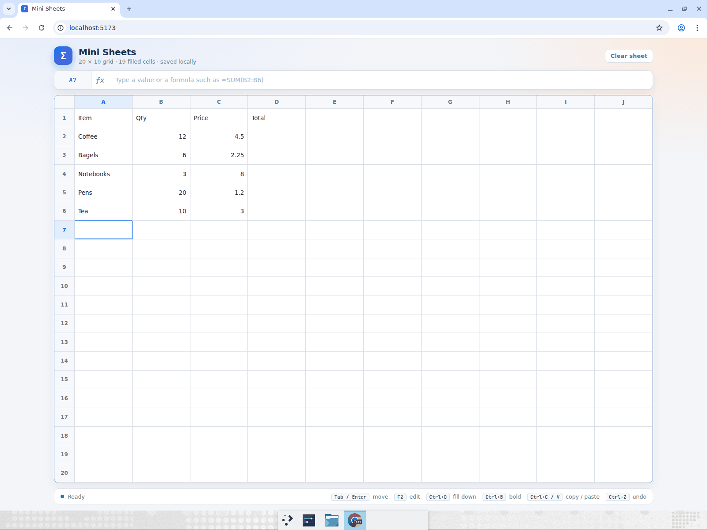
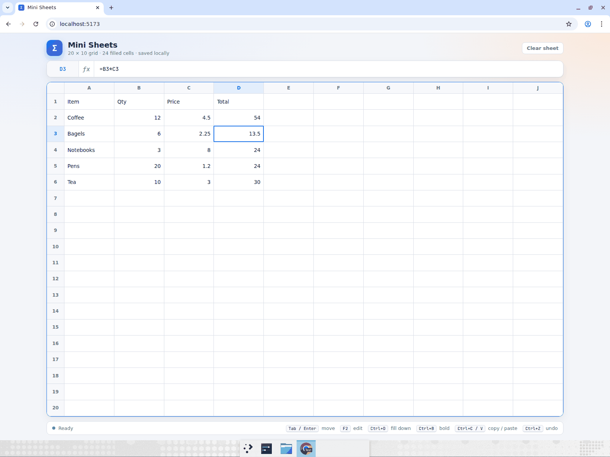
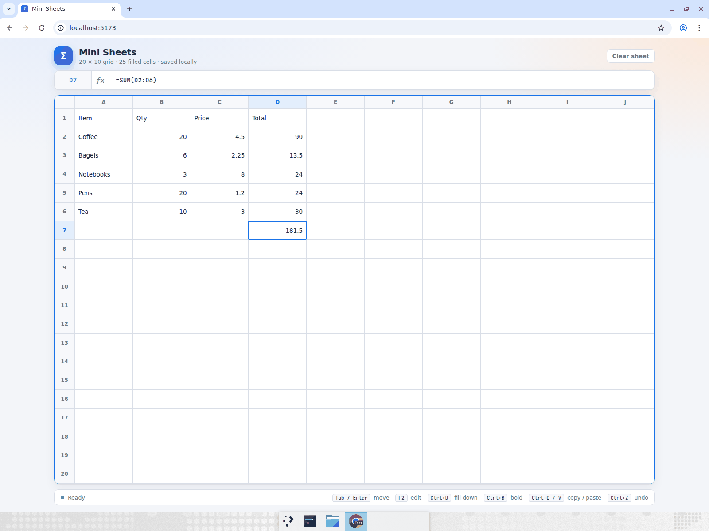
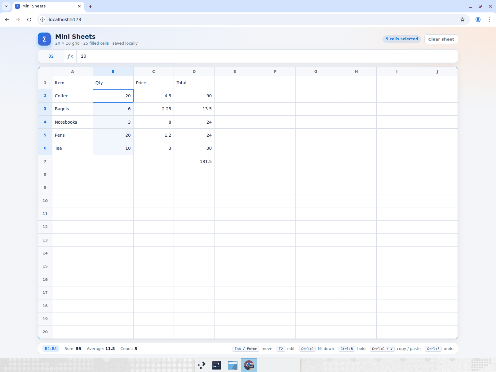
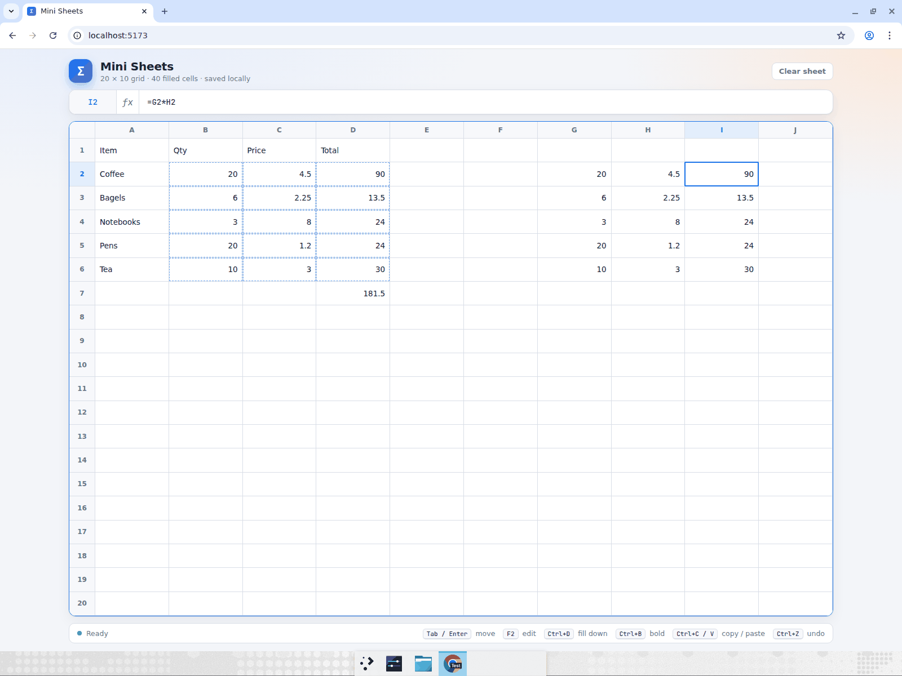
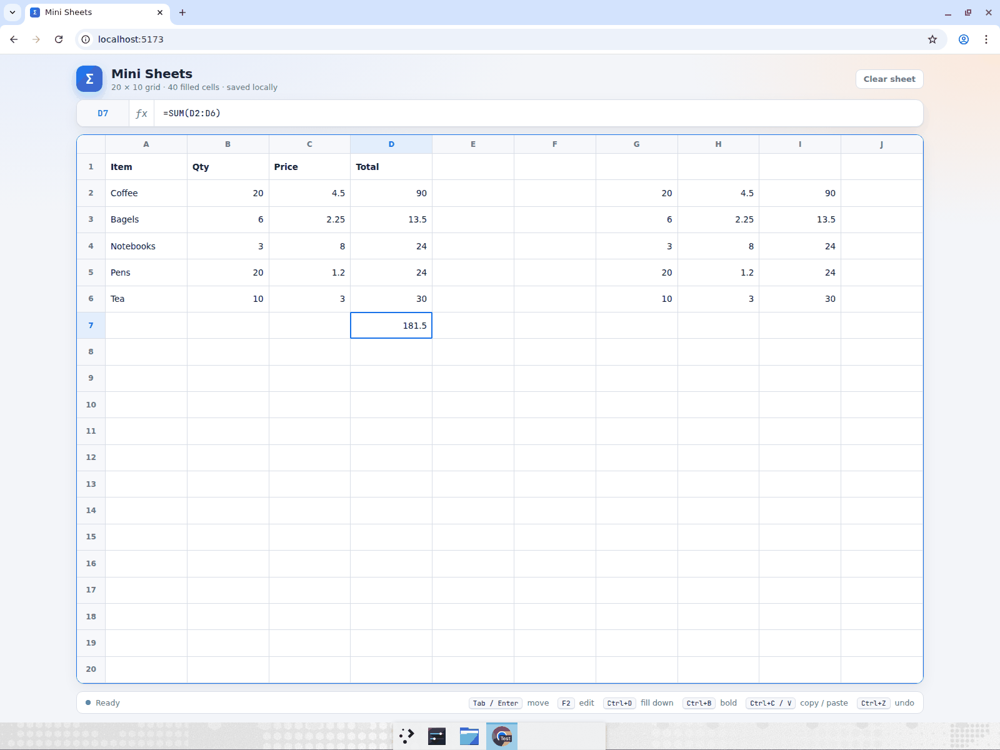

# mini-sheets — keyboard-driven spreadsheet

A small but complete spreadsheet: a 20 × 10 grid (rows 1–20, columns A–J) with a formula bar,
mouse and keyboard selection, in-place editing, and a formula engine that understands
`+ - * / ^ ( )`, cell references (`A1`, `$A$1`), ranges (`D2:D6`) and the functions
`SUM`, `AVERAGE`, `MIN`, `MAX`, `COUNT`, `ABS`, `ROUND`. Dependencies are recalculated live,
copy/paste and fill-down adjust relative references the way Excel does, and the sheet is
persisted to `localStorage`, so a refresh brings everything back.

## Run it

```bash
cd mini-sheets
npm install
npm run dev
```

Then open the URL Vite prints (usually http://localhost:5173).

## Keyboard reference

| Keys | Action |
|------|--------|
| Arrow keys | Move the active cell |
| Shift + arrows | Extend the selection |
| Tab / Shift+Tab, Enter / Shift+Enter | Move right/left, down/up (Enter after a run of Tabs returns to the starting column) |
| Type | Replace the cell contents |
| F2 / double-click | Edit the existing contents |
| Escape | Cancel the edit / collapse the selection |
| Delete | Clear the selection |
| Ctrl+C / Ctrl+X / Ctrl+V | Copy / cut / paste with relative reference adjustment |
| Ctrl+D | Fill the top row of the selection down |
| Ctrl+B | Toggle bold |
| Ctrl+Z / Ctrl+Y | Undo / redo |
| Ctrl+A | Select the whole sheet |

The status bar shows the sum, average and count of the selected range.

## Computer-use showcase

After building the app, Devin opened it in a maximized Chrome window and drove it with one mouse
click (A1) and the keyboard for everything else. Recording (3m59s, 1600×1200, annotated):

- **[Watch the recording](https://app.devin.ai/attachments/83bc563a-b760-489d-a674-d914d11c3c84/mini-sheets-keyboard-showcase.mp4)**
  (also committed at [`docs/mini-sheets-keyboard-showcase.mp4`](docs/mini-sheets-keyboard-showcase.mp4))

What Devin did, step by step, and what it asserted:

1. **Typed the table.** Clicked A1, then typed `Item` Tab `Qty` Tab `Price` Tab `Total` Enter — the
   Excel-style Enter jumped back to A2 — and five rows of items the same way
   (Coffee 12 4.5, Bagels 6 2.25, Notebooks 3 8, Pens 20 1.2, Tea 10 3).
   Asserted A1:C6 filled exactly as typed.

   

2. **Fill down with relative references.** Arrowed to D2, typed `=B2*C2` Enter (54). Pressed Up,
   then Shift+Down ×4 to select D2:D6, then Ctrl+D. Asserted D3:D6 = 13.5, 24, 24, 30 and that
   the formula bar on D3 read `=B3*C3`.

   

3. **Live recalculation.** Typed `=SUM(D2:D6)` in D7 → 145.5. Moved to B2 and typed `20` Enter;
   asserted D2 became 90 and D7 recalculated to 181.5.

   

4. **Range statistics.** From B2 pressed Shift+Down ×4; asserted the status bar showed
   `Sum: 59 · Average: 11.8 · Count: 5` and the header pill "5 cells selected". Extended with
   Shift+Right ×2 to B2:D6 and asserted Sum 259.45.

   

5. **Copy / paste with reference shifting.** With B2:D6 selected pressed Ctrl+C (dashed copy
   outline), pressed Right ×5 to land on G2, pressed Ctrl+V. Asserted G2:I6 mirrored the block and
   that I2's formula bar read `=G2*H2` (I3 `=G3*H3`, …) — references shifted five columns.

   

6. **Bold + persistence.** Went to A1, Shift+Right ×3, Ctrl+B — headers turned bold. Pressed F5
   and asserted the bold headers, all 40 filled cells, the pasted block and the raw formulas were
   restored from localStorage.

   
