# Thirty native Apple demos

10 iPhone apps · 10 iPad apps · 10 Mac apps

**30/30 reviewed and ready.**

Every app has its own macOS build session and independent source PR. Mobile builds and recordings use Apple's Simulator; they are not signed device releases.

Demo links open annotated native tests. Original videos are available in Downloads.

## Browse and build

Open `index.html` in a browser for the visual gallery. No installation or server is required. Screenshots are included locally; recording and report links require access to the corresponding Devin sessions.

Each **Build guide** points to the exact tested source revision. Check out that app's PR branch or commit and follow its native Xcode or Swift instructions. The 30 app implementations live in separate PRs; this directory contains their reviewed catalog. Mac app archives are local builds, not notarized releases.

Validate the catalog from the repository root with Python 3.9 or newer:

```sh
python3 native-demos/catalog/validate_catalog.py --complete
```

## All thirty demos

| Platform | App | Source | Native demo |
| --- | --- | --- | --- |
| iPhone | Lumen Drift | [PR](https://github.com/dabit3/experiments/pull/57) | [Watch](https://app.devin.ai/sessions/f95c34e81f8d4e24908b1e48aa50a2f2?testRecording=513981b3-641b-47af-88a9-04df29ca8bd8) |
| iPhone | Tidepool | [PR](https://github.com/dabit3/experiments/pull/60) | [Watch](https://app.devin.ai/sessions/6f158651431d4c07a90de50c40b98754?testRecording=f34d2487-a077-4e78-be2d-d84a4b22f429) |
| iPhone | Trailhead | [PR](https://github.com/dabit3/experiments/pull/72) | [Watch](https://app.devin.ai/sessions/d0a707bcfef7439abf3f92a69810554c?testRecording=aea1765a-eda3-479a-ab69-3cf2f24f8507) |
| iPhone | Mise | [PR](https://github.com/dabit3/experiments/pull/69) | [Watch](https://app.devin.ai/sessions/28325f9132004954a8db89c8c0dac533?testRecording=c4dc40ce-d05c-4e77-9a93-512f1006118e) |
| iPhone | Tessera | [PR](https://github.com/dabit3/experiments/pull/47) | [Watch](https://app.devin.ai/sessions/94adce8ad0784728b8a9d8d10248d5ca?testRecording=1907be52-8f22-45fb-81c5-1aad929ec5bb) |
| iPhone | Afterglow | [PR](https://github.com/dabit3/experiments/pull/58) | [Watch](https://app.devin.ai/sessions/c5728553dae34eccb83ecca1167c50e1?testRecording=1d879a11-946d-4c48-861b-e906362fb235) |
| iPhone | Pocket Press | [PR](https://github.com/dabit3/experiments/pull/65) | [Watch](https://app.devin.ai/sessions/57a3a94161a1443899b7dabf04e52c6b?testRecording=69bd0fb5-8ee8-4bc6-9fe8-76b5555baadf) |
| iPhone | Groovebox | [PR](https://github.com/dabit3/experiments/pull/71) | [Watch](https://app.devin.ai/sessions/bf33dd25df424ac1a901b925ffa9864c?testRecording=b71ac36e-97f5-447e-ae68-e2992cf5c618) |
| iPhone | Verdant | [PR](https://github.com/dabit3/experiments/pull/73) | [Watch](https://app.devin.ai/sessions/ea0c39a7a072434fbaec0dbe5cff300c?testRecording=fbf6f410-84e2-4c21-a8dc-a1d81d248199) |
| iPhone | Fairshare | [PR](https://github.com/dabit3/experiments/pull/75) | [Watch](https://app.devin.ai/sessions/2c17208418d64305bc2116ed76b2e12b?testRecording=2dc85867-7ba4-45e3-a52c-de55e663e33d) |
| iPad | Form Foundry | [PR](https://github.com/dabit3/experiments/pull/67) | [Watch](https://app.devin.ai/sessions/753702ca044c44bfb5316a6333788e8c?testRecording=eb8e462e-6ff1-4b50-915c-b6e06d8b3e68) |
| iPad | Roomlight | [PR](https://github.com/dabit3/experiments/pull/55) | [Watch](https://app.devin.ai/sessions/56bd182cfa8d409bafac7da2906a91a7?testRecording=685673b5-cc22-4a0f-8a15-bb23a1fc5b0b) |
| iPad | Ink Atlas | [PR](https://github.com/dabit3/experiments/pull/64) | [Watch](https://app.devin.ai/attachments/da388675-b032-4e4d-a2ef-d8fc30ae56b3/Ink-Atlas-native-annotated-7cd4993.mp4) |
| iPad | Frame Forge | [PR](https://github.com/dabit3/experiments/pull/48) | [Watch](https://app.devin.ai/sessions/f89e769911b24e27a303f16e4667a30a?testRecording=21da00ab-aaca-4afa-8834-a9a3c3ab767e) |
| iPad | Circuit Garden | [PR](https://github.com/dabit3/experiments/pull/50) | [Watch](https://app.devin.ai/sessions/2633a64cce72461ebed254834adf1fa9?testRecording=e66b3e86-237d-48e5-86cf-4132e5fd597e) |
| iPad | Terra Table | [PR](https://github.com/dabit3/experiments/pull/74) | [Watch](https://app.devin.ai/sessions/27e37df92ff442a891eb0c3974301cac?testRecording=a7774629-496f-476b-bf26-2f6bbac92805) |
| iPad | Shotboard | [PR](https://github.com/dabit3/experiments/pull/62) | [Watch](https://app.devin.ai/sessions/6b55bb0fb4374d0081b91fa41ad482eb?testRecording=8d8b6174-8100-4f49-9673-1f6b636a28e2) |
| iPad | Patchwork | [PR](https://github.com/dabit3/experiments/pull/51) | [Watch](https://app.devin.ai/sessions/0b00f6e743f1467caf5435075bad6fb8?testRecording=96999d70-6412-4040-a118-70c208dd4dce) |
| iPad | Celestia | [PR](https://github.com/dabit3/experiments/pull/66) | [Watch](https://app.devin.ai/sessions/6b311a0d9a45462db114448b34acd989?testRecording=94bcd3d7-64fc-4e1e-9f85-fb052b612cf7) |
| iPad | Archipelago | [PR](https://github.com/dabit3/experiments/pull/70) | [Watch](https://app.devin.ai/sessions/2f9f2efd858a48288c376abde6cb2aa0?testRecording=c16fa938-20bd-4734-997c-63ed3f450ece) |
| Mac | Kerf | [PR](https://github.com/dabit3/experiments/pull/54) | [Watch](https://app.devin.ai/sessions/4f30154e56be4da29a2836697895b351?testRecording=be3b4839-e332-4c82-92e8-907991886817) |
| Mac | Prism | [PR](https://github.com/dabit3/experiments/pull/49) | [Watch](https://app.devin.ai/sessions/caaafdfa2d1c4c3a88cd941d4a9d3ecd?testRecording=d43be269-1531-424f-9509-8cadc2b45e4d) |
| Mac | Cutline | [PR](https://github.com/dabit3/experiments/pull/61) | [Watch](https://app.devin.ai/sessions/3bb2775767ed4018a92ffb5c3d36628a?testRecording=54873e8c-f6d1-4b47-9bce-204a0447bff4) |
| Mac | Wavecraft | [PR](https://github.com/dabit3/experiments/pull/46) | [Watch](https://app.devin.ai/sessions/e27f2aac6aae4809b3027d1016cbf385?testRecording=e0edd6af-fb52-499f-8336-ad8abca9efe8) |
| Mac | Railway | [PR](https://github.com/dabit3/experiments/pull/53) | [Watch](https://app.devin.ai/sessions/059a558c5ba04f06817254a2498a8d63?testRecording=99f1c579-4ba3-4245-87da-b339ce89c46a) |
| Mac | Aster | [PR](https://github.com/dabit3/experiments/pull/56) | [Watch](https://app.devin.ai/sessions/dd3f54bd5f314dc78be191aba19bb2b7?testRecording=5c111119-3c9d-4ddd-ac47-6e1de3703e0d) |
| Mac | Margin | [PR](https://github.com/dabit3/experiments/pull/68) | [Watch](https://app.devin.ai/sessions/625a0e5108d941fa867f3e276b1d2331?testRecording=a8066e3f-3a9c-4d28-a66b-00f180e481cd) |
| Mac | Loom | [PR](https://github.com/dabit3/experiments/pull/52) | [Watch](https://app.devin.ai/sessions/7d69681bb3f74a5cbc5215ee17d02615?testRecording=62376428-68a4-41a4-9447-d278a5bafbca) |
| Mac | Keystone | [PR](https://github.com/dabit3/experiments/pull/63) | [Watch](https://app.devin.ai/sessions/9dc52a8bfd7c4216b6226909a4f3bc23?testRecording=d2530fe6-e903-449e-a8c3-6adaf4d35403) |
| Mac | Nightjar | [PR](https://github.com/dabit3/experiments/pull/59) | [Watch](https://app.devin.ai/sessions/52757d60255345389a32b453a5734ec2?testRecording=3be13896-d274-4e53-8945-8fc994461d1c) |

## iPhone

### 01. Lumen Drift — Ready

Carve through a luminous canyon in a native arcade game. Steer through procedural waves, collect shields, build combos and chase a persistent high score.

[Session](https://app.devin.ai/sessions/f95c34e81f8d4e24908b1e48aa50a2f2) · [Source PR](https://github.com/dabit3/experiments/pull/57) · [Build guide](https://github.com/dabit3/experiments/blob/5e4f28435cd4c4c1aca13c3b54ee5406e8cfe699/native-demos/ios/lumen-drift/README.md) · [Demo 1](https://app.devin.ai/sessions/f95c34e81f8d4e24908b1e48aa50a2f2?testRecording=513981b3-641b-47af-88a9-04df29ca8bd8) · [Test report](https://app.devin.ai/attachments/dc8df7a9-7441-482a-85d1-fcbd540746d1/Test-Report.md)

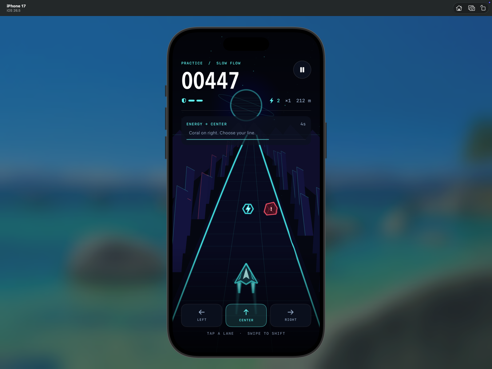

**Scope & limitations:** Simulator-only app artifact; not a signed physical iPhone or App Store release, Other device sizes, physical haptics, sustained performance and background auto-pause were not UI-tested, Initial endless targeting missed two fast waves before a successful collection; pause overlay obscured exact guide countdown while score/distance and visible scene freeze were verified, No audio or online services; portrait composition with fixed typography and no fully nonvisual gameplay mode, Stylized discrete-lane collision model; unfinished flights do not resume after process termination, while saved records persist

**Downloads:** [LumenDrift-iPhone-Simulator.zip](https://app.devin.ai/attachments/3ae1ae61-83b2-463e-bf20-5aa66ef7519d/LumenDrift-iPhone-Simulator.zip) · [lumen-drift-native-edited.mp4](https://app.devin.ai/attachments/db83832d-883c-4f4c-a039-38a8c40a8765/lumen-drift-native-edited.mp4)

### 02. Tidepool — Ready

Restore five miniature coastal ecosystems. Place marine life, balance habitat rules and watch illustrated tidepools come alive.

[Session](https://app.devin.ai/sessions/6f158651431d4c07a90de50c40b98754) · [Source PR](https://github.com/dabit3/experiments/pull/60) · [Build guide](https://github.com/dabit3/experiments/blob/a5258815bc7c1c27bfa3cd33f3cd079f1e6a47fd/native-demos/ios/tidepool/README.md) · [Demo 1](https://app.devin.ai/sessions/6f158651431d4c07a90de50c40b98754?testRecording=f34d2487-a077-4e78-be2d-d84a4b22f429) · [Demo 2](https://app.devin.ai/sessions/6f158651431d4c07a90de50c40b98754?testRecording=75d7eac2-7ab0-4b2f-b467-625ed07b10bb) · [Test report](https://app.devin.ai/attachments/c6db6fd3-18c2-4a89-94a5-860d9ca0ca1b/tidepool-test-report.md)

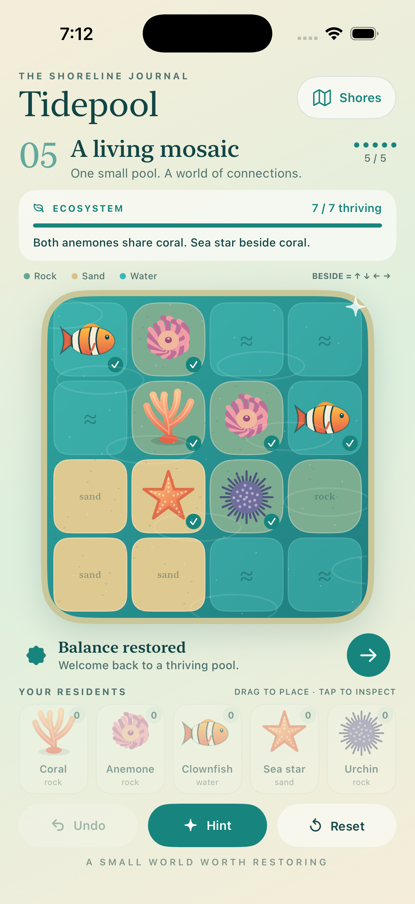

**Scope & limitations:** Unsigned Simulator-only artifact; not an installable physical-iPhone or App Store release., Full core recording is from 50fb51c; final a525881 recording is a focused relaunch addendum after the welcome-copy fix., Physical devices, alternate screen sizes, Dynamic Type, VoiceOver and adverse storage conditions were not tested., The partial-board welcome-copy branch was not separately tested through UI., Ecological relationships are simplified deterministic puzzle rules.

**Downloads:** [Tidepool-a525881-iOS-Simulator.app.zip](https://app.devin.ai/attachments/215c4f1b-a393-46cd-bd81-fc9e5a40e925/Tidepool-a525881-iOS-Simulator.app.zip) · [tidepool-actual-progress.json](https://app.devin.ai/attachments/37c5b9f6-3973-4e76-a360-ebacc67ed8ca/tidepool-actual-progress.json) · [tidepool-final-50fb51c-edited.mp4](https://app.devin.ai/attachments/9b13330c-e990-4cf0-994d-b3e1d4c3baad/tidepool-final-50fb51c-edited.mp4) · [tidepool-a525881-relaunch-edited.mp4](https://app.devin.ai/attachments/db293d7c-441e-4cf4-b16d-9d4a869fc6cb/tidepool-a525881-relaunch-edited.mp4)

### 03. Trailhead — Ready

Plan an expedition across illustrated trail maps. Explore elevation profiles, add waypoints, pack your gear and export a paginated field guide.

[Session](https://app.devin.ai/sessions/d0a707bcfef7439abf3f92a69810554c) · [Source PR](https://github.com/dabit3/experiments/pull/72) · [Build guide](https://github.com/dabit3/experiments/blob/80908dae29cc27720daf1785063ae1994ba749a9/native-demos/ios/trailhead/README.md) · [Demo 1](https://app.devin.ai/sessions/d0a707bcfef7439abf3f92a69810554c?testRecording=aea1765a-eda3-479a-ab69-3cf2f24f8507) · [Test report](https://app.devin.ai/attachments/7728e26e-2c08-4759-9e19-c00923f11730/report.md)

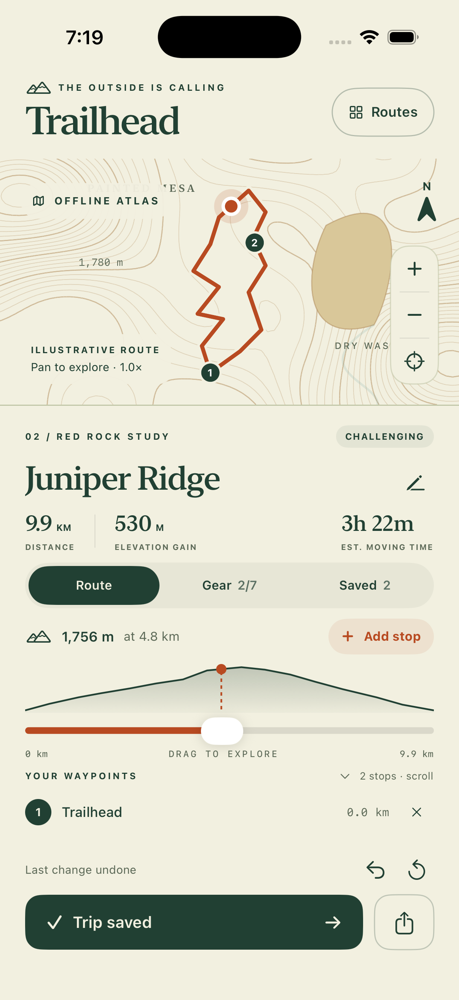

**Scope & limitations:** Coordinates and elevations are authored illustrative fixtures; contours and water features are decorative synthetic artwork, not navigation data., Duration uses a simplified distance/ascent estimate and excludes breaks, weather and individual fitness., App archive is an unsigned Simulator build, not a physical-device or App Store release., Native UI coverage used iPhone 17 / iOS 26.5; physical hardware, other screen sizes, VoiceOver, pinch gestures and long-export stress cases were not tested., Corrupt archive rejection is covered by model checks; native UI recovery from a corrupt archive was not exercised., Decorative map labels can sit beneath fixed map controls.

**Downloads:** [final-Ridge-escape.pdf](https://app.devin.ai/attachments/11dd904a-3626-4890-a439-d9a8386b400a/final-Ridge-escape.pdf) · [Trailhead-iOS-Simulator-80908da.zip](https://app.devin.ai/attachments/bd8ef025-7f46-4779-a9f3-d68622a7399b/Trailhead-iOS-Simulator-80908da.zip) · [trailhead-final-80908da-edited.mp4](https://app.devin.ai/attachments/46af31ef-fdad-4213-a5d9-458e05d19f81/trailhead-final-80908da-edited.mp4)

### 04. Mise — Ready

A quiet, illustrated cooking companion. Scale ingredients, follow preparation steps, run independent timers and keep your favorite recipes close.

[Session](https://app.devin.ai/sessions/28325f9132004954a8db89c8c0dac533) · [Source PR](https://github.com/dabit3/experiments/pull/69) · [Build guide](https://github.com/dabit3/experiments/blob/7f22d30bb27de726d287ac75be850410223813c3/native-demos/ios/mise/README.md) · [Demo 1](https://app.devin.ai/sessions/28325f9132004954a8db89c8c0dac533?testRecording=c4dc40ce-d05c-4e77-9a93-512f1006118e) · [Test report](https://app.devin.ai/attachments/67b71494-c44d-4ae0-bdc6-636fd235be34/acceptance-report.md)

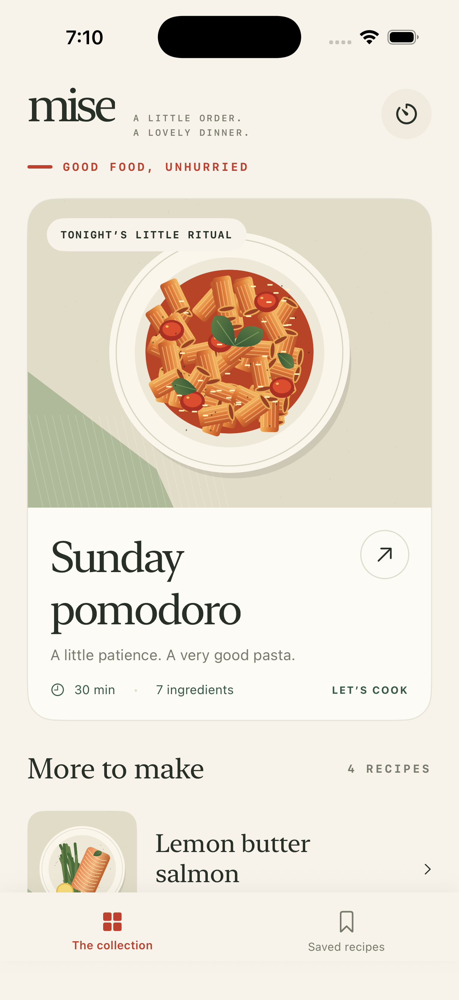

**Scope & limitations:** Timer completion is visual in-app only; no audible alarms, background notifications or Live Activities., App artifact is unsigned and Simulator-only, not a physical-iPhone or App Store release., Native UI acceptance covered one iPhone model and iOS version; exhaustive accessibility and all other recipe methods were not tested., Ingredient quantities scale linearly; heat, pan size and recipe cooking duration do not. Device-clock changes affect timer deadlines., Recipes are bundled editorial content, not user-editable recipe authoring. No actual-food preparation claims., Final recording resumes an existing cooking session; first-time Begin cooking was exercised in the earlier run.

**Downloads:** [Mise-iPhone-Simulator.zip](https://app.devin.ai/attachments/919ef32b-5eac-44ca-8793-a5d987c1a2bb/Mise-iPhone-Simulator.zip) · [exported-pomodoro-4-servings.txt](https://app.devin.ai/attachments/c13fa1fb-10a4-49ea-80df-18b83670ed0d/exported-pomodoro-4-servings.txt) · [mise-native-checks.log](https://app.devin.ai/attachments/faccc056-46b2-4a81-b1a5-fa4a8f01a320/mise-native-checks.log) · [mise-final-native-acceptance-edited.mp4](https://app.devin.ai/attachments/f4bda613-1c6a-4fc0-b44f-41c1cb662851/mise-final-native-acceptance-edited.mp4)

### 05. Tessera — Ready

Route light through six architectural puzzle chambers. Rotate optical elements, combine RGB beams and illuminate each room.

[Session](https://app.devin.ai/sessions/94adce8ad0784728b8a9d8d10248d5ca) · [Source PR](https://github.com/dabit3/experiments/pull/47) · [Build guide](https://github.com/dabit3/experiments/blob/1ce0a317d230a704a1013cbc96681a3c47655220/native-demos/ios/tessera/README.md) · [Demo 1](https://app.devin.ai/sessions/94adce8ad0784728b8a9d8d10248d5ca?testRecording=1907be52-8f22-45fb-81c5-1aad929ec5bb) · [Test report](https://app.devin.ai/attachments/d6deccb7-8c65-4eda-a85a-9b24a44fb81c/final-test-report.md)

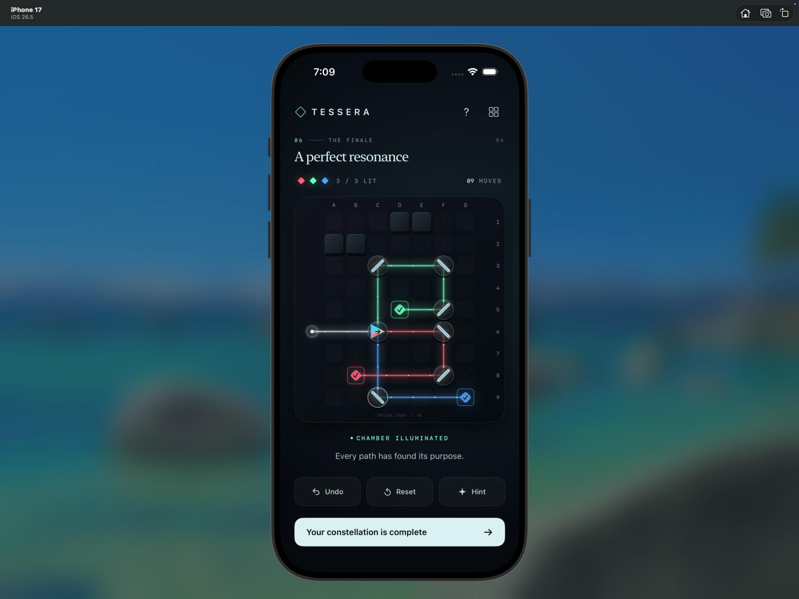

**Scope & limitations:** Unsigned Simulator-only artifact, not a signed physical iPhone/App Store release., Fixed cardinal grid and directional RGB puzzle rules rather than physical wave-optics simulation; optics rotate on fixed pedestals., Portrait iPhone app; no export feature, cloud sync or audio., UI tested on iPhone 17/iOS26.5 only; other devices/text sizes, physical haptics, VoiceOver, Reduce Motion and save-error/corruption UI not exercised., Persistence visually verified at 3/6 completion, not repeated after 6/6.

**Downloads:** [Tessera-iOS-Simulator.zip](https://app.devin.ai/attachments/82ed00b4-6075-46a3-9781-438add13bc35/Tessera-iOS-Simulator.zip) · [tessera-final-native-annotations.json](https://app.devin.ai/attachments/5e5a4993-3e13-456e-938a-48eb290d6311/tessera-final-native-annotations.json) · [tessera-final-native-edited.mp4](https://app.devin.ai/attachments/00c38d7b-4e5e-4bf2-b673-473b4109b19d/tessera-final-native-edited.mp4)

### 06. Afterglow — Ready

An intimate Core Image darkroom. Apply film-inspired looks, tune exposure, reframe photographs and develop real JPEG exports.

[Session](https://app.devin.ai/sessions/c5728553dae34eccb83ecca1167c50e1) · [Source PR](https://github.com/dabit3/experiments/pull/58) · [Build guide](https://github.com/dabit3/experiments/blob/6ff3271ef46fe30934ce0ff2367b358a02b31756/native-demos/ios/afterglow/README.md) · [Demo 1](https://app.devin.ai/sessions/c5728553dae34eccb83ecca1167c50e1?testRecording=1d879a11-946d-4c48-861b-e906362fb235) · [Demo 2](https://app.devin.ai/sessions/c5728553dae34eccb83ecca1167c50e1?testRecording=d753891b-3c2d-41a2-87c9-2a82fd8706b5) · [Test report](https://app.devin.ai/attachments/f502f7eb-f4e9-4aff-ac16-36685ecfc3c7/afterglow-6ff3271-report.md)

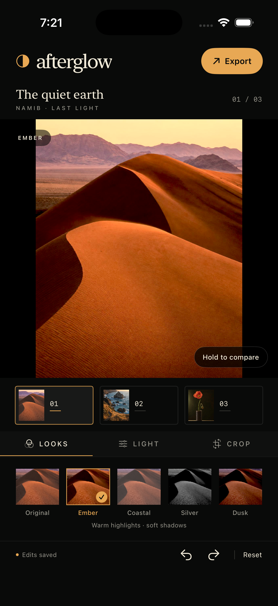

**Scope & limitations:** Simulator-only app archive; not a signed physical-iPhone or App Store release., Physical-device usability and VoiceOver were not tested; exhaustive Contrast/Color/Warmth ruler variations were not tested through UI., Bounded V1 edits three bundled original AI-generated photographic studies; no Photos-library import, RAW editing, camera or cloud sync., Film looks are explicit Core Image recipes rather than measured physical film emulations., Preview is downsampled to a 1000-pixel longest edge; exports preserve cropped source resolution as flattened sRGB JPEG without capture metadata.

**Downloads:** [Afterglow-iOS-Simulator-6ff3271.app.zip](https://app.devin.ai/attachments/4b129989-1c23-442a-8d09-4186acf26a1d/Afterglow-iOS-Simulator-6ff3271.app.zip) · [Afterglow-dunes-3F41BD75.jpg](https://app.devin.ai/attachments/ee6e1780-eec2-42c4-ba35-7be55dea830a/Afterglow-dunes-3F41BD75.jpg) · [afterglow-6ff3271-demo-edited.mp4](https://app.devin.ai/attachments/a01bf0df-694f-4914-a646-4069819b9fac/afterglow-6ff3271-demo-edited.mp4) · [afterglow-ruler-verification-edited.mp4](https://app.devin.ai/attachments/58772e54-d6ee-4221-bcac-af851a3e07eb/afterglow-ruler-verification-edited.mp4)

### 07. Pocket Press — Ready

Turn a journey into a pocket magazine. Compose illustrated pages, edit typography and themes, reorder a story and export a multipage PDF.

[Session](https://app.devin.ai/sessions/57a3a94161a1443899b7dabf04e52c6b) · [Source PR](https://github.com/dabit3/experiments/pull/65) · [Build guide](https://github.com/dabit3/experiments/blob/91a2470bb64025e86f6fc92d23b6ded2b9ed2021/native-demos/ios/pocket-press/README.md) · [Demo 1](https://app.devin.ai/sessions/57a3a94161a1443899b7dabf04e52c6b?testRecording=69bd0fb5-8ee8-4bc6-9fe8-76b5555baadf) · [Test report](https://app.devin.ai/attachments/2d34533f-9501-477a-8b45-29943fe34e17/pocket-press-final-test-report.md)

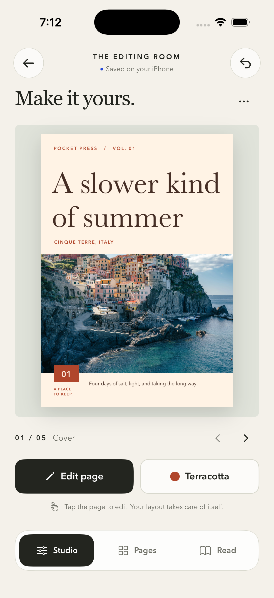

**Scope & limitations:** Unsigned Simulator-only app archive; not a physical iPhone or App Store release, Personal-photo import and external share delivery were not exercised, Fixed portrait RGB editorial pages; no CMYK, bleeds, printer imposition or automatic text flow into new pages, Editorial canvas typography does not expand with Dynamic Type; PDF reader supports zoom, Undo history and last-export shortcut are session-local; saved projects and PDF files persist, No CI checks are configured on the PR; validation was performed locally on native macOS

**Downloads:** [A-slower-kind-of-summer-CC237ED1.pdf](https://app.devin.ai/attachments/9d1524a6-33eb-4279-bb93-ae162d743f33/A-slower-kind-of-summer-CC237ED1.pdf) · [PocketPress-iOS-Simulator-91a2470.zip](https://app.devin.ai/attachments/5da6fd31-172b-41a2-b9aa-d9a4e5020eb1/PocketPress-iOS-Simulator-91a2470.zip) · [pocket-press-final-91a2470-edited.mp4](https://app.devin.ai/attachments/5f58a1ef-f9da-466e-8504-ab6714f6c4ee/pocket-press-final-91a2470-edited.mp4)

### 08. Groovebox — Ready

A pocket rhythm machine with four synthesized voices. Play live pads, program a 16-step beat, dial in swing, save patterns and export WAV audio.

[Session](https://app.devin.ai/sessions/bf33dd25df424ac1a901b925ffa9864c) · [Source PR](https://github.com/dabit3/experiments/pull/71) · [Build guide](https://github.com/dabit3/experiments/blob/de6c9cd8ae4af9533c1a123412114938a82d6472/native-demos/ios/groovebox/README.md) · [Demo 1](https://app.devin.ai/sessions/bf33dd25df424ac1a901b925ffa9864c?testRecording=b71ac36e-97f5-447e-ae68-e2992cf5c618) · [Demo 2](https://app.devin.ai/sessions/bf33dd25df424ac1a901b925ffa9864c?testRecording=2bc470af-773f-4063-8a6c-77ad5a0ebdb1) · [Test report](https://app.devin.ai/attachments/0df8e4db-f1a2-4872-90d6-1f4d63893fe6/groovebox-native-test-report.md)

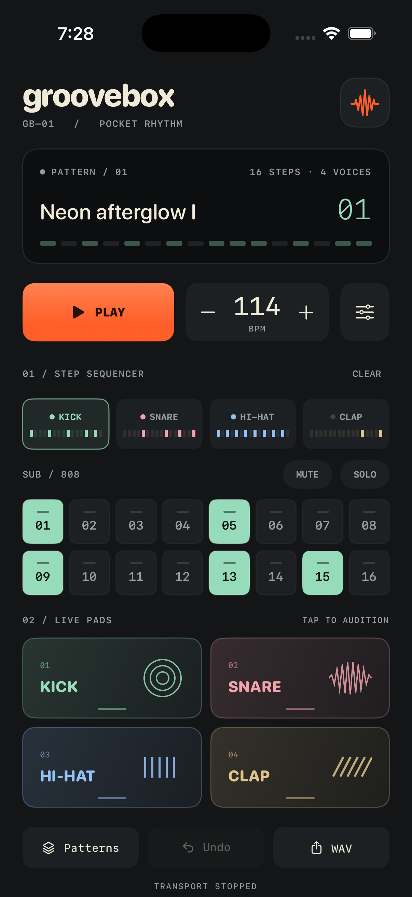

**Scope & limitations:** Unsigned Simulator-only artifact; physical-speaker output, physical-device latency and App Store distribution were not tested., The VM initially lacked an audio output route. BlackHole installation and Simulator bridge refresh restored playback; one route-transition startup abort did not recur during final testing., One-bar, four-voice V1 with no MIDI, microphone recording, velocity, effects, song chaining or background playback. Audio callbacks use a short bounded lock., The attached exported WAV contains the unmuted saved take before the final on-screen Clap mute., Workspace blueprint and reusable testing-skill suggestions were submitted for future sessions; their approval remains optional and pending.

**Downloads:** [Groovebox-iPhone-Simulator.zip](https://app.devin.ai/attachments/22d5c3a5-7ce0-4c63-95eb-b3b29187adab/Groovebox-iPhone-Simulator.zip) · [Neon-afterglow-I-114bpm.wav](https://app.devin.ai/attachments/7a9047fa-354f-44e5-a7d6-83d15afa62d6/Neon-afterglow-I-114bpm.wav) · [groovebox-de6c9cd-live.wav](https://app.devin.ai/attachments/c2b4865e-40dd-4a4e-8a6e-d7c4586a6ac6/groovebox-de6c9cd-live.wav) · [native-audio-setup.md](https://app.devin.ai/attachments/551b235c-06b2-403a-9dc0-1984c414e3fb/native-audio-setup.md) · [groovebox-de6c9cd-demo-edited.mp4](https://app.devin.ai/attachments/6579c674-3daf-42ee-a3ab-2240ba879cc5/groovebox-de6c9cd-demo-edited.mp4) · [groovebox-de6c9cd-input-check-edited.mp4](https://app.devin.ai/attachments/8dc82c7d-5524-42dd-998d-1c0405ff31be/groovebox-de6c9cd-input-check-edited.mp4)

### 09. Verdant — Ready

A personal conservatory with original botanical illustrations. Organize plants, manage watering schedules, write growth notes and export your garden journal.

[Session](https://app.devin.ai/sessions/ea0c39a7a072434fbaec0dbe5cff300c) · [Source PR](https://github.com/dabit3/experiments/pull/73) · [Build guide](https://github.com/dabit3/experiments/blob/d949ed876d60d60d9f16c92be9093d4a9fd649de/native-demos/ios/verdant/README.md) · [Demo 1](https://app.devin.ai/sessions/ea0c39a7a072434fbaec0dbe5cff300c?testRecording=fbf6f410-84e2-4c21-a8dc-a1d81d248199) · [Test report](https://app.devin.ai/attachments/5fc95147-003c-4dc6-ac48-0bb4146cae4d/TEST-REPORT.md)

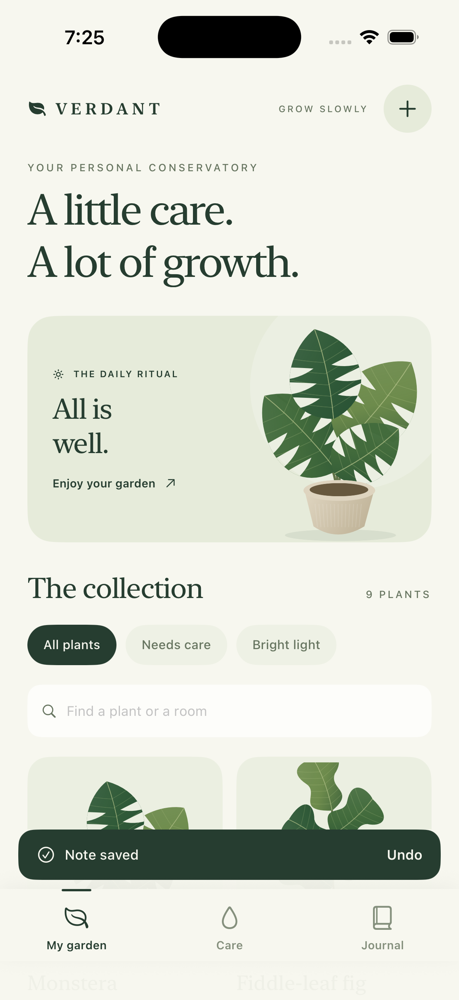

**Scope & limitations:** The attached unsigned arm64 .app archive is Simulator-only, not a physical iPhone or App Store release., UI testing used one portrait iPhone Simulator at default text size; physical hardware, larger accessibility text and VoiceOver were not certified., Calendar rollover and corrupt-storage behavior were covered by model tests rather than native UI scenarios., The native share sheet and actual Markdown file were verified; delivery to an external share destination was not tested., One intended capitalized phrase appeared lowercase after native entry. Pre-save editor text was not captured, so input/autocorrection versus typing mismatch remains inconclusive; UI, persisted JSON and export agree., Care schedules are local calendar-day reminders, not moisture sensing or botanical diagnosis. No push notifications, cloud sync, camera or automatic growth measurements are included.

**Downloads:** [Verdant-iPhone-Simulator.zip](https://app.devin.ai/attachments/3bd184ad-0228-4061-995e-5b6f688e3b8e/Verdant-iPhone-Simulator.zip) · [verdant-journal.md](https://app.devin.ai/attachments/689302b9-fd38-49f3-8295-79aeeae0d728/verdant-journal.md) · [TEST-REPORT.md](https://app.devin.ai/attachments/7e0e50c6-6fc6-4300-860f-9a9fea156aad/TEST-REPORT.md) · [verdant-d949ed8-final-edited.mp4](https://app.devin.ai/attachments/56e2b470-873a-42ad-9b58-c550e4f81bcd/verdant-d949ed8-final-edited.mp4)

### 10. Fairshare — Ready

Keep a shared trip balanced to the cent. Track expenses, customize splits, settle balances and explore category insights in an illustrated travel ledger.

[Session](https://app.devin.ai/sessions/2c17208418d64305bc2116ed76b2e12b) · [Source PR](https://github.com/dabit3/experiments/pull/75) · [Build guide](https://github.com/dabit3/experiments/blob/8fc4c15463dd1fda54b63f204bf7fa25a4d0f24b/native-demos/ios/fairshare/README.md) · [Demo 1](https://app.devin.ai/sessions/2c17208418d64305bc2116ed76b2e12b?testRecording=2dc85867-7ba4-45e3-a52c-de55e663e33d) · [Test report](https://app.devin.ai/attachments/9f5acb14-361f-4998-ab72-c0f227f4b263/TEST-REPORT.md)


**Scope & limitations:** Unsigned iPhone Simulator artifact; not a signed physical-device or App Store release., Fixed four-person roster, EUR only, portrait iPhone layout., Deterministic greedy settlement plan does not claim globally minimal transfer count for arbitrary groups., Native UI coverage limited to iPhone 17/iOS 26.5 at default text size., External sharing destinations, accessibility, corrupt-file UI recovery, very-large totals in UI and one-total-expense singular labels were not UI-tested; corruption and large amount formatting have core test coverage.

**Downloads:** [Fairshare-iPhone-Simulator-8fc4c15.zip](https://app.devin.ai/attachments/bc252e14-436f-48c7-bc07-76765047385a/Fairshare-iPhone-Simulator-8fc4c15.zip) · [Fairshare-Lisbon.csv](https://app.devin.ai/attachments/a29b2cfe-505b-40c0-822d-dab933c01470/Fairshare-Lisbon.csv) · [fairshare-8fc4c1-final-edited.mp4](https://app.devin.ai/attachments/c8e03dd0-83e2-47cd-bd25-a8aa02bef948/fairshare-8fc4c1-final-edited.mp4)

## iPad

### 11. Form Foundry — Ready

A tactile studio for everyday objects. Dimension rectangular and elliptical extrusions, arrange an assembly, explore it in 3D and export an OBJ mesh.

[Session](https://app.devin.ai/sessions/753702ca044c44bfb5316a6333788e8c) · [Source PR](https://github.com/dabit3/experiments/pull/67) · [Build guide](https://github.com/dabit3/experiments/blob/69c7cae0b4dfd7662ecf2292fb162a181e9f6a82/native-demos/ipad/form-foundry/README.md) · [Demo 1](https://app.devin.ai/sessions/753702ca044c44bfb5316a6333788e8c?testRecording=eb8e462e-6ff1-4b50-915c-b6e06d8b3e68) · [Test report](https://app.devin.ai/attachments/ba9d53aa-c8d3-4df3-8ad7-ec5070d399f0/final-report.md)

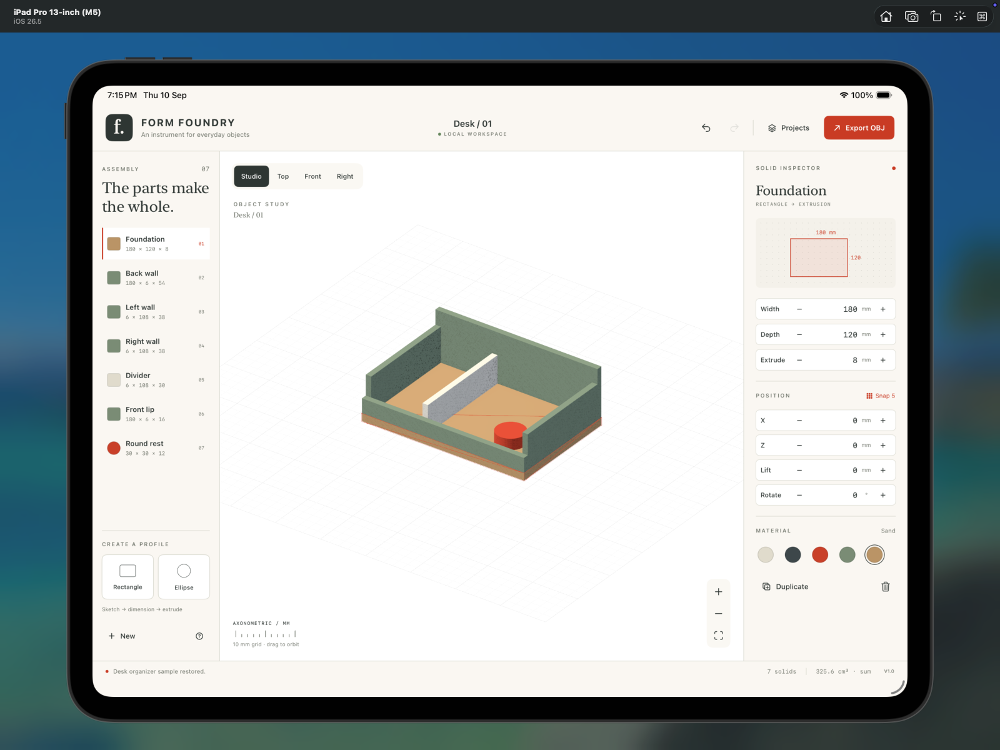

**Scope & limitations:** Primitive modeler: no Boolean unions, holes, fillets, arbitrary sketches or constraint solver. Overlapping solids remain independent shells., Ellipses use 64-segment tessellation; displayed volume is an analytic sum including overlaps. OBJ exports geometry without MTL materials., Simulator-only unsigned app artifact; physical iPads and other screen sizes were not tested., Multitouch pinch, external share transmission and downstream CAD import were not tested; native zoom buttons and share-sheet presentation were verified., Initial Simulator SpringBoard crash/install stall recovered with shutdown and rerun before the final passing recording.

**Downloads:** [FormFoundry-iPad-Simulator.zip](https://app.devin.ai/attachments/d6798b50-f2f0-4e0f-9fe5-b7a54eb313aa/FormFoundry-iPad-Simulator.zip) · [FormFoundry.obj](https://app.devin.ai/attachments/cf8c586d-27b9-4601-9c31-2b539291e27a/FormFoundry.obj) · [Atelier-02-workspace.json](https://app.devin.ai/attachments/924f5d9e-ac47-41ba-ab42-163ce5a894ee/Atelier-02-workspace.json) · [obj-validation.txt](https://app.devin.ai/attachments/5e9b87ad-843a-4ca7-a138-19f31181d9f3/obj-validation.txt) · [check.log](https://app.devin.ai/attachments/155def9f-7521-43ef-9054-2514243dd8d3/check.log) · [build.log](https://app.devin.ai/attachments/310e32ee-af90-42a5-bea6-f646d820e6a2/build.log) · [form-foundry-69c7cae-final-edited.mp4](https://app.devin.ai/attachments/1aafb9a2-8b8f-4d8a-ae30-6b03d956c94c/form-foundry-69c7cae-final-edited.mp4)

### 12. Roomlight — Ready

Compose a room in synchronized plan and 3D views. Place furniture, tune materials and dimensions, save variations and export a furnished floor plan.

[Session](https://app.devin.ai/sessions/56bd182cfa8d409bafac7da2906a91a7) · [Source PR](https://github.com/dabit3/experiments/pull/55) · [Build guide](https://github.com/dabit3/experiments/blob/7ad92b9f5166f7d93faff5b1c88eef7fa9a6e19b/native-demos/ipad/roomlight/README.md) · [Demo 1](https://app.devin.ai/sessions/56bd182cfa8d409bafac7da2906a91a7?testRecording=685673b5-cc22-4a0f-8a15-bb23a1fc5b0b) · [Demo 2](https://app.devin.ai/sessions/56bd182cfa8d409bafac7da2906a91a7?testRecording=a7c0398c-1c8c-4d82-bf49-3f512aad9f54) · [Test report](https://app.devin.ai/attachments/db9d0853-da6b-46d0-8284-465f719cf569/roomlight-final-test-report.md)

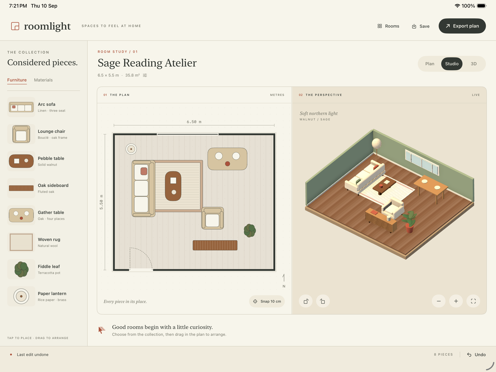

**Scope & limitations:** Simulator-only artifact and testing; not signed for physical iPad installation or App Store distribution., Only iPad Pro 13-inch Simulator layout was tested; smaller iPad layouts and physical hardware remain untested., Final revision received targeted regression after icon/PDF alignment polish; the comprehensive recording is from f5c2f09, with all eight individual additions verified in earlier runs., Rectangular concept rooms, decorative fixed openings, artistic lighting and procedural approximate furniture; overlaps are permitted and there is no collision/clearance solver., Export contains a high-resolution raster plan and native PDF text, not editable vector CAD., Corrupt archive parsing has logic coverage; storage-failure UI, disk failures, screen-reader behavior and external share delivery were not tested., Undo history and camera position reset on launch; saved rooms and current room persist locally without cloud synchronization.

**Downloads:** [Roomlight-iPad-Simulator-7ad92b9.zip](https://app.devin.ai/attachments/68d3d205-cb0f-4f0d-90ad-72452981c0fb/Roomlight-iPad-Simulator-7ad92b9.zip) · [Roomlight-plan-7ad92b9.pdf](https://app.devin.ai/attachments/455050b5-b557-4e82-b9f9-3c1cc678f32b/Roomlight-plan-7ad92b9.pdf) · [roomlight-rooms-7ad92b9.json](https://app.devin.ai/attachments/2e8ee375-408e-4c27-845f-f7f062e0b8d6/roomlight-rooms-7ad92b9.json) · [Roomlight-build-verification.md](https://app.devin.ai/attachments/7b5901e8-3e8d-48c0-a6ac-6d1f2878c843/Roomlight-build-verification.md) · [roomlight-7ad92b9-polish-edited.mp4](https://app.devin.ai/attachments/2d334a74-68a2-41b8-8b7a-3e0f27186a0c/roomlight-7ad92b9-polish-edited.mp4) · [roomlight-f5c2f09-demo-edited.mp4](https://app.devin.ai/attachments/c46e57f1-c46a-4fa4-b563-1fcdf990a7ad/roomlight-f5c2f09-demo-edited.mp4)

### 13. Ink Atlas — Ready

An expansive canvas for visual thinking. Combine freehand ink, cards, text, shapes and connected ideas, then export the board as PDF or SVG.

[Session](https://app.devin.ai/sessions/ed0c4f0667194c2ebb2ccaa5e4d6d5a7) · [Source PR](https://github.com/dabit3/experiments/pull/64) · [Build guide](https://github.com/dabit3/experiments/blob/7cd4993f65251a2ce907807471d18245304c6fdd/native-demos/ipad/ink-atlas/README.md) · [Demo 1](https://app.devin.ai/attachments/da388675-b032-4e4d-a2ef-d8fc30ae56b3/Ink-Atlas-native-annotated-7cd4993.mp4) · [Test report](https://app.devin.ai/attachments/959f948e-a829-4e4a-b1b8-cff5e055d239/test-report.md)

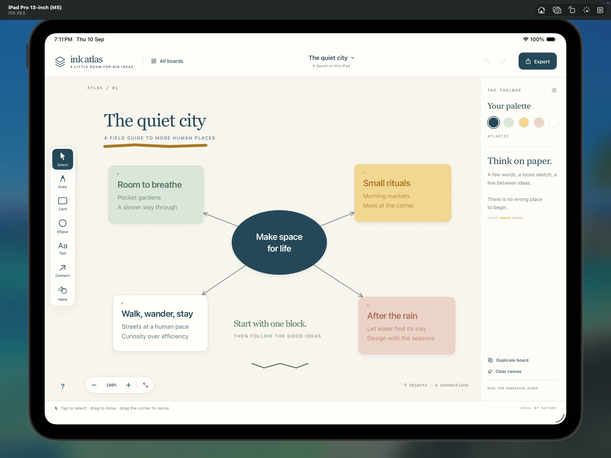

**Scope & limitations:** Simulator-only app artifact; no signed App Store release or physical iPad/Pencil validation. Intel execution was not tested., Alternative pen widths, pinch gestures, narrow layouts and external share delivery were not tested., Simulator typing initially altered punctuation/capitalization; corrected final wording was verified, but punctuation-input fidelity remains unestablished., SVG font metrics and approximate text wrapping may vary by viewer., Pencil pressure/tilt, collaboration, multi-selection and per-object VoiceOver navigation are outside V1., Undo history, selection and viewport are transient; board content and selected board persist.

**Downloads:** [InkAtlas-iPad-Simulator-7cd4993.zip](https://app.devin.ai/attachments/1460e063-1a4e-4fe0-8878-c13de749f471/InkAtlas-iPad-Simulator-7cd4993.zip) · [A-gentler-morning-2026-09-11T02-10-25Z.pdf](https://app.devin.ai/attachments/fd8cfe87-d587-4233-98ef-607ba39e1378/A-gentler-morning-2026-09-11T02-10-25Z.pdf) · [A-gentler-morning-2026-09-11T02-10-40Z.svg](https://app.devin.ai/attachments/8c8e6b21-2ee1-4e53-9256-b7640345f159/A-gentler-morning-2026-09-11T02-10-40Z.svg) · [Ink-Atlas-native-annotated-7cd4993.mp4](https://app.devin.ai/attachments/da388675-b032-4e4d-a2ef-d8fc30ae56b3/Ink-Atlas-native-annotated-7cd4993.mp4)

### 14. Frame Forge — Ready

A frame-by-frame animation studio. Draw and erase, work with onion skins, tune playback, organize frames and export a real animated GIF.

[Session](https://app.devin.ai/sessions/f89e769911b24e27a303f16e4667a30a) · [Source PR](https://github.com/dabit3/experiments/pull/48) · [Build guide](https://github.com/dabit3/experiments/blob/1dcc870f7cf791f912e47d59fe2f47057b016ee9/native-demos/ipad/frame-forge/README.md) · [Demo 1](https://app.devin.ai/sessions/f89e769911b24e27a303f16e4667a30a?testRecording=21da00ab-aaca-4afa-8834-a9a3c3ab767e) · [Test report](https://app.devin.ai/attachments/d16a7c99-a443-4b27-9448-51e1912e0439/frame-forge-final-report.md)

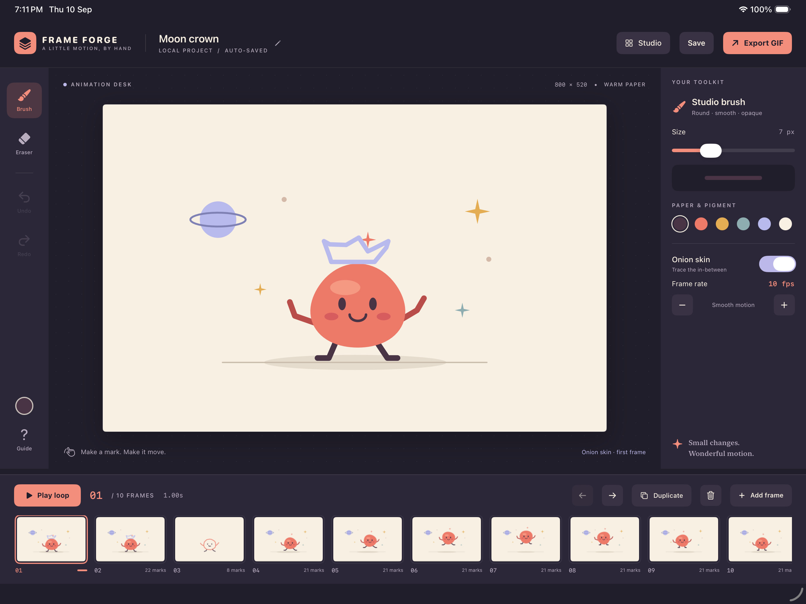

**Scope & limitations:** Unsigned Simulator-only .app; not a signed physical-device or App Store release., Physical-device/Pencil input, extreme frame counts and external share delivery remain untested., Landscape-first layout; portrait and narrow multitasking layouts are outside V1., Frame-by-frame animation without tweening, audio tracks or vector transforms; fixed 800x520 opaque GIF exports., Undo history is session-local and does not persist across relaunch.

**Downloads:** [FrameForge-84BC4623.gif](https://app.devin.ai/attachments/5fbab4c6-a3b6-405c-bb52-83ccd3d3fd88/FrameForge-84BC4623.gif) · [FrameForge-iPad-Simulator.zip](https://app.devin.ai/attachments/e0b16f5b-f38a-4325-9015-ea091fd3c3b5/FrameForge-iPad-Simulator.zip) · [frame-forge-final-1dcc870-edited.mp4](https://app.devin.ai/attachments/288cda1f-da2e-4077-8689-f8f2e0e46a8f/frame-forge-final-1dcc870-edited.mp4)

### 15. Circuit Garden — Ready

Build a working series circuit on an illustrated electronics bench. Connect terminals, change components and watch measurements and lamp brightness respond.

[Session](https://app.devin.ai/sessions/2633a64cce72461ebed254834adf1fa9) · [Source PR](https://github.com/dabit3/experiments/pull/50) · [Build guide](https://github.com/dabit3/experiments/blob/ceb6b2d70e8371e64d59310c4e58494f1ce20263/native-demos/ipad/circuit-garden/README.md) · [Demo 1](https://app.devin.ai/sessions/2633a64cce72461ebed254834adf1fa9?testRecording=e66b3e86-237d-48e5-86cf-4132e5fd597e) · [Test report](https://app.devin.ai/attachments/9527e9f6-c6a4-436d-8eab-72f689d94c41/native-ui-test-report.md)

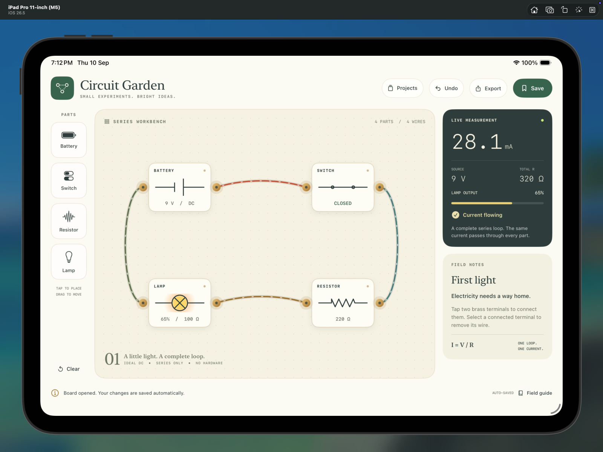

**Scope & limitations:** Supported model is one ideal DC battery and one connected unbranched series loop. Lamps are fixed 100 Ω loads with an illustrative power-to-brightness mapping; no nonlinear diode, thermal, transient, parallel-network or hardware simulation., App artifact is ad-hoc signed for Apple Silicon iPad Simulator only, not a physical-device or App Store release., Landscape full-screen iPad canvas; portrait and small multitasking windows are unsupported. Only iPad Pro 11-inch (M5) Simulator was UI-tested., Malformed-import UI, fine-tune boundaries, physical hardware, other display sizes and full accessibility auditing were not exercised. Model validation is covered by unit tests., Final UI run reused Simulator data; pristine first launch was verified on the initial V1 before visual fixes.

**Downloads:** [CircuitGarden-iPad-Simulator-only.zip](https://app.devin.ai/attachments/104d66d0-e123-47c9-bf3d-abf294a3a4a3/CircuitGarden-iPad-Simulator-only.zip) · [CircuitGarden-project.json](https://app.devin.ai/attachments/f34ef1ca-45c0-43e7-a67f-cdfa1c287382/CircuitGarden-project.json) · [CircuitGarden-readings.txt](https://app.devin.ai/attachments/967c0aa5-9f32-4de2-87f7-1278e2f2b468/CircuitGarden-readings.txt) · [circuit-garden-final-2f9c943-edited.mp4](https://app.devin.ai/attachments/afa3e7e0-88bb-4328-b0bb-99102d9c91a3/circuit-garden-final-2f9c943-edited.mp4)

### 16. Terra Table — Ready

Shape a small world with your fingertips. Raise mountains, carve valleys, flood the shore, inspect contours and export the actual terrain as an OBJ mesh.

[Session](https://app.devin.ai/sessions/27e37df92ff442a891eb0c3974301cac) · [Source PR](https://github.com/dabit3/experiments/pull/74) · [Build guide](https://github.com/dabit3/experiments/blob/103324981c2df86dc70ddf28a89726775688ee44/native-demos/ipad/terra-table/README.md) · [Demo 1](https://app.devin.ai/sessions/27e37df92ff442a891eb0c3974301cac?testRecording=a7774629-496f-476b-bf26-2f6bbac92805) · [Test report](https://app.devin.ai/attachments/9a1a48e4-3e0b-410f-9729-56fe6b5ab0a2/1033249-report.md)

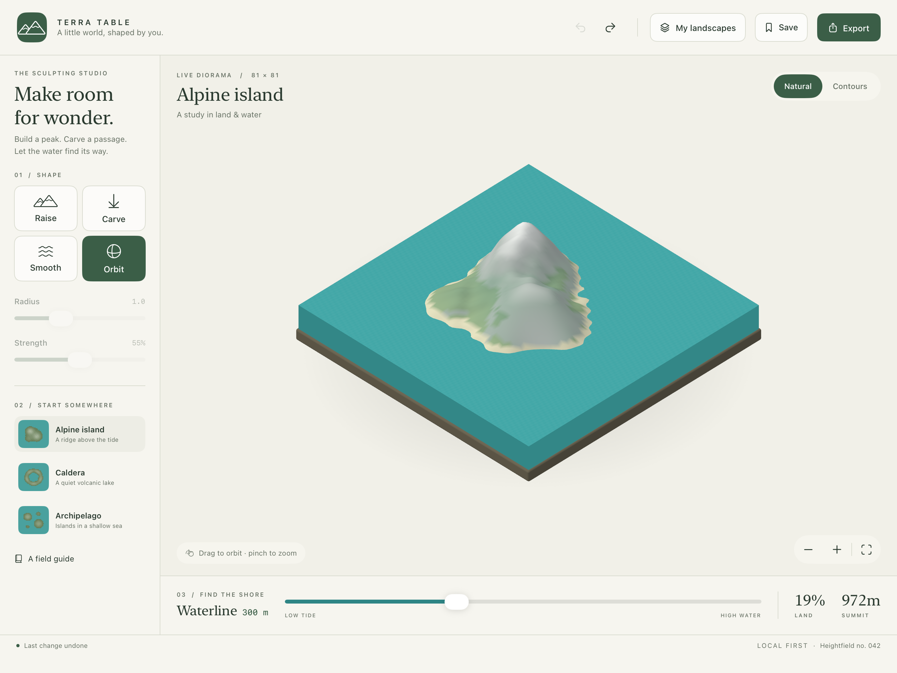

**Scope & limitations:** Simulator-only archive; no physical iPad or App Store signing validation., Multitouch pinch was not tested; plus/minus zoom buttons were tested., Native share preview and actual local exports were verified; external delivery and Files-provider round trips were not tested., Slider thumb dragging works; tapping the track alone did not change the value in native testing., Terrain is a bounded 81×81 heightfield without caves or overhangs; water is planar with no fluid or erosion simulation., UI metres are illustrative; OBJ exports the open terrain surface without water, plinth, colors or materials., SceneKit is deprecated in newer Apple SDKs but functional for this offline demo.

**Downloads:** [TerraTable-1033249-Simulator-only.zip](https://app.devin.ai/attachments/ae32c60c-cc89-4591-9533-80cfbb3b887c/TerraTable-1033249-Simulator-only.zip) · [TerraTable-1033249.obj](https://app.devin.ai/attachments/3363b060-1209-4f48-ae4a-ae6cc1d8190d/TerraTable-1033249.obj) · [TerraTable-1033249.png](https://app.devin.ai/attachments/1ad439b1-fbd3-42e9-895b-1ff8779aa10e/TerraTable-1033249.png) · [terra-1033249-acceptance-edited.mp4](https://app.devin.ai/attachments/c78c0e10-9eda-452a-881d-b10b1eef5766/terra-1033249-acceptance-edited.mp4)

### 17. Shotboard — Ready

A cinematic workspace for planning a film. Sketch frames, set camera metadata, arrange shots, play a timed presentation and export a storyboard PDF.

[Session](https://app.devin.ai/sessions/6b55bb0fb4374d0081b91fa41ad482eb) · [Source PR](https://github.com/dabit3/experiments/pull/62) · [Build guide](https://github.com/dabit3/experiments/blob/9501e1e31d7a55736e061d3d400d3fc00e387d1b/native-demos/ipad/shotboard/README.md) · [Demo 1](https://app.devin.ai/sessions/6b55bb0fb4374d0081b91fa41ad482eb?testRecording=8d8b6174-8100-4f49-9673-1f6b636a28e2) · [Test report](https://app.devin.ai/attachments/3eb0dfe8-8ff5-4085-81eb-334e7e51b6b1/test-report.md)

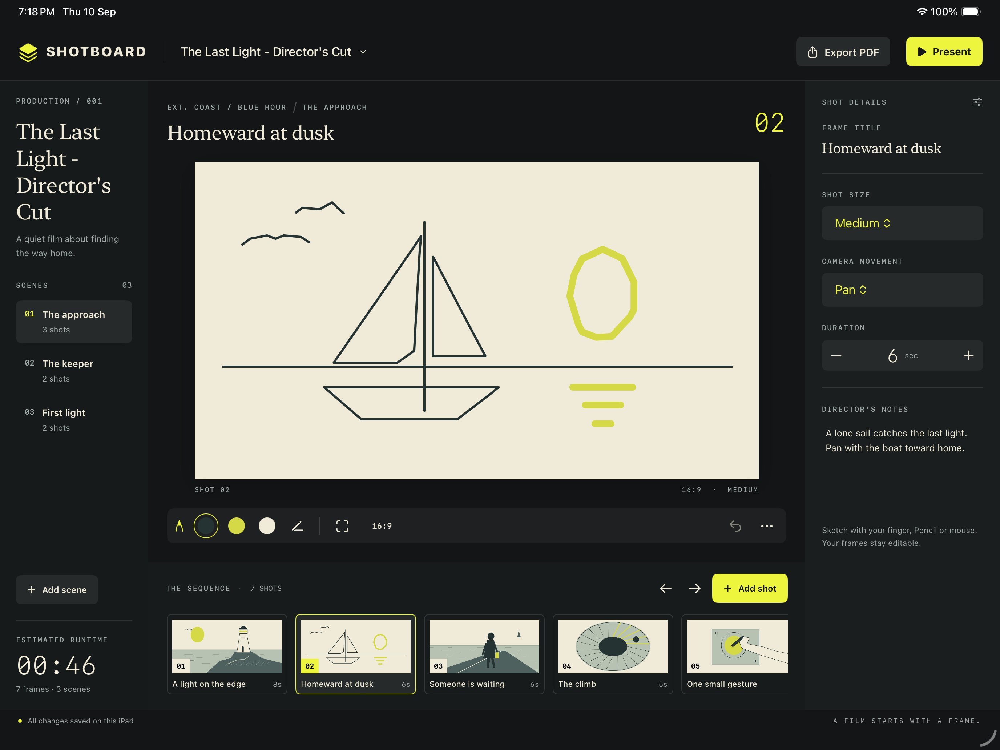

**Scope & limitations:** App archive is an unsigned Simulator-only development build, not a signed physical-device or App Store release., Landscape-only iPad workspace; changing aspect ratio stretches normalized artwork., Presentation has one-second timing resolution and does not export video., UI coverage excludes import/error flows, fresh sample-copy action, destructive shot deletion and extended-note PDF continuation; core tests cover invalid serialized input., Physical Apple Pencil input and delivery to an external share destination were not tested; the native Share sheet was tested.

**Downloads:** [Shotboard-iPad-Simulator-9501e1e.zip](https://app.devin.ai/attachments/e64f115b-a701-47ff-9b89-8531c1adb81f/Shotboard-iPad-Simulator-9501e1e.zip) · [The-Last-Light-Directors-Cut.pdf](https://app.devin.ai/attachments/05910a90-1b56-43d9-a199-5d042bc4c281/The-Last-Light-Directors-Cut.pdf) · [The-Last-Light-Directors-Cut.shotboard](https://app.devin.ai/attachments/8c3d2ae5-861f-4667-b44d-51c8aa0f74b0/The-Last-Light-Directors-Cut.shotboard) · [pdf-verification.log](https://app.devin.ai/attachments/efca024c-9fe5-4ace-bac0-692b1918642d/pdf-verification.log) · [VerifyPDF.swift](https://app.devin.ai/attachments/9ee1f933-9903-4a12-9687-d25c8f32a646/VerifyPDF.swift) · [shotboard-final-9501e1e-edited.mp4](https://app.devin.ai/attachments/3cad3ec2-e134-4942-b943-74b4df4b047f/shotboard-final-9501e1e-edited.mp4)

### 18. Patchwork — Ready

Patch a playable modular synthesizer. Connect oscillator and filter modules, sculpt sound, watch a live waveform and export the result as WAV.

[Session](https://app.devin.ai/sessions/0b00f6e743f1467caf5435075bad6fb8) · [Source PR](https://github.com/dabit3/experiments/pull/51) · [Build guide](https://github.com/dabit3/experiments/blob/e8ed228af88766adbac901b6ee6a357d8d0a5f5a/native-demos/ipad/patchwork/README.md) · [Demo 1](https://app.devin.ai/sessions/0b00f6e743f1467caf5435075bad6fb8?testRecording=96999d70-6412-4040-a118-70c208dd4dce) · [Test report](https://app.devin.ai/attachments/858219d3-5a67-44b3-918e-22f1304eacd2/report.md)

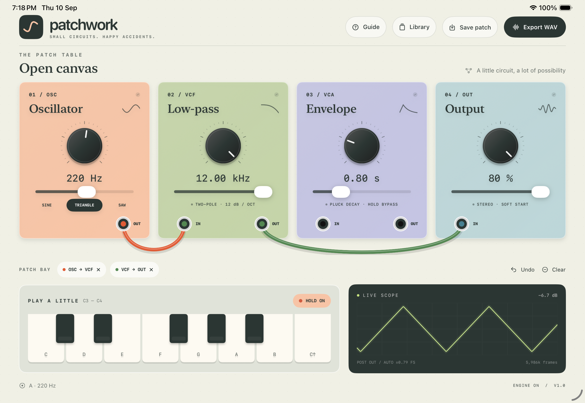

**Scope & limitations:** Unsigned Simulator-only iPad app; no physical device or App Store signing validation., Physical speaker output, hardware touch latency, accessibility audit and audio interruption behavior were not tested., Deliberately bounded graph and simplified two-pole low-pass/exponential envelope model; modeling and real-time constraints are documented in the README., Headless macOS audio required BlackHole and Core Audio/Simulator restart; workspace setup suggestion is pending approval.

**Downloads:** [Copper-bloom-e8ed228.wav](https://app.devin.ai/attachments/2b61e92c-8adc-4c12-99c8-a2b933a4a344/Copper-bloom-e8ed228.wav) · [Patchwork-iPad-Simulator-e8ed228.zip](https://app.devin.ai/attachments/0abe2c99-a0b1-42de-8f65-5bcd97e83c18/Patchwork-iPad-Simulator-e8ed228.zip) · [patchwork-e8ed228-final-edited.mp4](https://app.devin.ai/attachments/a538ab4f-1ad7-475f-92b5-715a15c0ee24/patchwork-e8ed228-final-edited.mp4)

### 19. Celestia — Ready

Plan an evening under the stars. Explore a site- and time-dependent sky, inspect altitude curves and save an observing list with field notes.

[Session](https://app.devin.ai/sessions/6b311a0d9a45462db114448b34acd989) · [Source PR](https://github.com/dabit3/experiments/pull/66) · [Build guide](https://github.com/dabit3/experiments/blob/778ed743752908d51b691f993a8ee08babaf10e2/native-demos/ipad/celestia/README.md) · [Demo 1](https://app.devin.ai/sessions/6b311a0d9a45462db114448b34acd989?testRecording=94bcd3d7-64fc-4e1e-9f85-fb052b612cf7) · [Test report](https://app.devin.ai/attachments/ff52d1fb-05b3-424f-b8e5-4704d4b5ed26/Celestia-test-report.md)

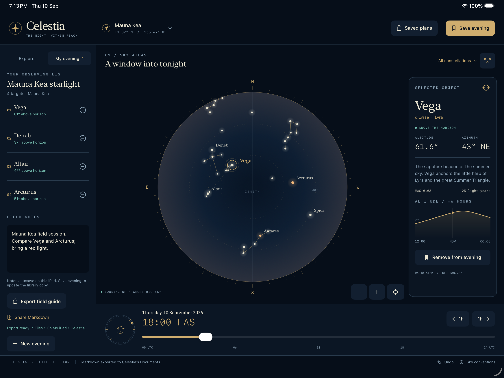

**Scope & limitations:** Exact automated slider endpoint placement remains inconclusive: the final thumb sometimes differs from the requested pointer endpoint, including after Simulator resizing. Actual dragging updates time and sky coherently, and precise ±1h controls passed. Cause unresolved., Fixed rounded J2000 coordinates and geometric horizon omit precession, nutation, proper motion, refraction, parallax, terrain, weather, darkness and solar-system objects. Horizon glow is decorative., The ZIP is an unsigned Simulator-only build, not a signed physical-iPad or App Store release., Physical devices, other iPad screen sizes, pinch gesture, external share delivery and damaged-archive recovery through UI were not exercised.

**Downloads:** [Celestia-iPad-Simulator-only.zip](https://app.devin.ai/attachments/1dc5ab25-5610-4288-bc41-f8d531b016fc/Celestia-iPad-Simulator-only.zip) · [Celestia-observing-plan.md](https://app.devin.ai/attachments/a4eba6b9-2b74-43fe-9463-300ae613a767/Celestia-observing-plan.md) · [celestia-final-778ed74-edited.mp4](https://app.devin.ai/attachments/65510e22-6fd2-4f9e-8401-fb9d47ef15fb/celestia-final-778ed74-edited.mp4)

### 20. Archipelago — Ready

Connect five illustrated islands with a working ferry network. Assign boats, move resources, balance your budget and bring a distant lighthouse to life.

[Session](https://app.devin.ai/sessions/2f9f2efd858a48288c376abde6cb2aa0) · [Source PR](https://github.com/dabit3/experiments/pull/70) · [Build guide](https://github.com/dabit3/experiments/blob/24e1bcba115fc4e3e4a42486b41a06eb150b03fa/native-demos/ipad/archipelago/README.md) · [Demo 1](https://app.devin.ai/sessions/2f9f2efd858a48288c376abde6cb2aa0?testRecording=c16fa938-20bd-4734-997c-63ed3f450ece) · [Demo 2](https://app.devin.ai/sessions/2f9f2efd858a48288c376abde6cb2aa0?testRecording=007b671a-8602-4665-ae3a-2a99342c8219) · [Test report](https://app.devin.ai/attachments/1ea36e31-33df-4c10-8382-8ad06e51e5c7/final-test-report.md)

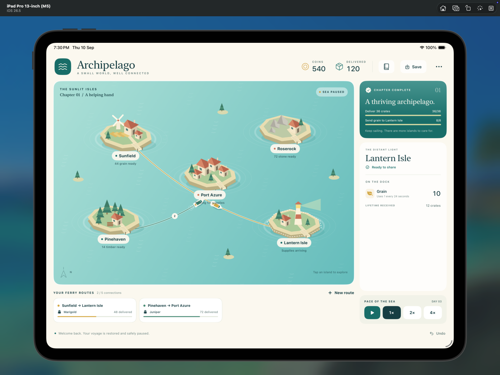

**Scope & limitations:** App archive is Simulator-only, not a signed physical-device or App Store release., Native UI coverage is one 13-inch iPad Simulator at default text sizing; other devices and large Dynamic Type remain untested., External share delivery, exhaustive route combinations and corrupt-save UI were not exercised. Corrupt-save rejection is covered by logic tests., Peaceful bounded model: no collisions, pathfinding, fluctuating markets, background catch-up or cloud sync; documented production/consumption rules and normalized travel distances., Initial Simulator migration encountered a recoverable SpringBoard crash before testing; subsequent final runs succeeded.

**Downloads:** [Archipelago-iPad-Simulator.zip](https://app.devin.ai/attachments/6c024c0e-481e-4af6-82e7-01f77a4c21e8/Archipelago-iPad-Simulator.zip) · [final-Archipelago-voyage.json](https://app.devin.ai/attachments/c0c318cf-9249-41dc-accf-f9c9fa40d828/final-Archipelago-voyage.json) · [archipelago-final-8d76241-edited.mp4](https://app.devin.ai/attachments/f03112fa-09ce-46b7-a6be-5ca8042e68b5/archipelago-final-8d76241-edited.mp4) · [archipelago-icon-final-24e1bc-edited.mp4](https://app.devin.ai/attachments/9978235c-9917-49e3-bfcf-327ebcd5e92b/archipelago-icon-final-24e1bc-edited.mp4)

## Mac

### 21. Kerf — Ready

Design a sheet for laser fabrication. Draw in physical units, organize cut and engraving layers, inspect overlaps and export kerf-adjusted SVG geometry.

[Session](https://app.devin.ai/sessions/4f30154e56be4da29a2836697895b351) · [Source PR](https://github.com/dabit3/experiments/pull/54) · [Build guide](https://github.com/dabit3/experiments/blob/ecd728e780c09ee28bf3ab4bc28bb4d868add0fe/native-demos/macos/kerf/README.md) · [Demo 1](https://app.devin.ai/sessions/4f30154e56be4da29a2836697895b351?testRecording=be3b4839-e332-4c82-92e8-907991886817) · [Test report](https://app.devin.ai/attachments/6c451605-3bb1-4c96-a6c0-4621c94264aa/test-report.md)

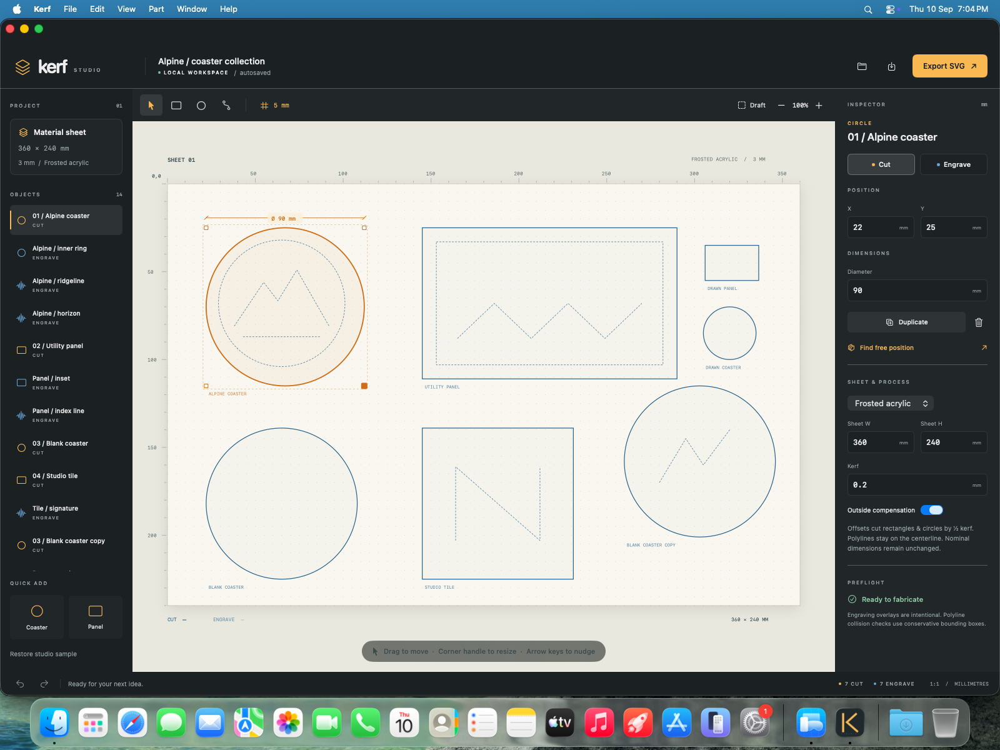

**Scope & limitations:** App archive is Apple Silicon macOS and ad-hoc signed; not notarized or an App Store release., Outside compensation supports rectangle/circle exterior silhouettes only. Open polylines export centreline paths; their collision checks conservatively use bounds., Free placement is deterministic single-object grid search. No optimized nesting, grouping, rotation, boolean paths or inside-hole offsets., No physical laser run or machine/material calibration performed., Saved editable kerf-demo.kerf precedes final kerf edits and has kerf0.15 with compensation off; compensated SVG uses0.2mm kerf., Draft/material view mode resets on relaunch; document material and geometry persist., Input-tool retries were needed for drag sequencing, rapid vertex clicks and native folder navigation; successful real interactions are recorded.

**Downloads:** [Kerf-macOS-arm64.zip](https://app.devin.ai/attachments/978d4fd5-943c-4483-bab9-515bf08edb2d/Kerf-macOS-arm64.zip) · [kerf-demo.kerf](https://app.devin.ai/attachments/91f901b9-8bc8-4e76-8138-1236b17aed66/kerf-demo.kerf) · [kerf-nominal.svg](https://app.devin.ai/attachments/cefef570-5b3e-46c6-a13e-83b743392060/kerf-nominal.svg) · [kerf-compensated.svg](https://app.devin.ai/attachments/6d8e8375-7855-4cf5-ac21-b1be7e7ab789/kerf-compensated.svg) · [kerf-native-e2e-edited.mp4](https://app.devin.ai/attachments/d520b759-60c0-4d26-8c84-448748474376/kerf-native-e2e-edited.mp4)

### 22. Prism — Ready

Build an image with a visible processing graph. Wire Core Image operations, blend procedural artwork, adjust the result and export a rendered PNG.

[Session](https://app.devin.ai/sessions/caaafdfa2d1c4c3a88cd941d4a9d3ecd) · [Source PR](https://github.com/dabit3/experiments/pull/49) · [Build guide](https://github.com/dabit3/experiments/blob/43eb44060d72622e11b9e07aee056a08130412f7/native-demos/macos/prism/README.md) · [Demo 1](https://app.devin.ai/sessions/caaafdfa2d1c4c3a88cd941d4a9d3ecd?testRecording=d43be269-1531-424f-9509-8cadc2b45e4d) · [Test report](https://app.devin.ai/attachments/c80490ad-0237-4998-b568-34118dcc9de5/TEST-REPORT.md)

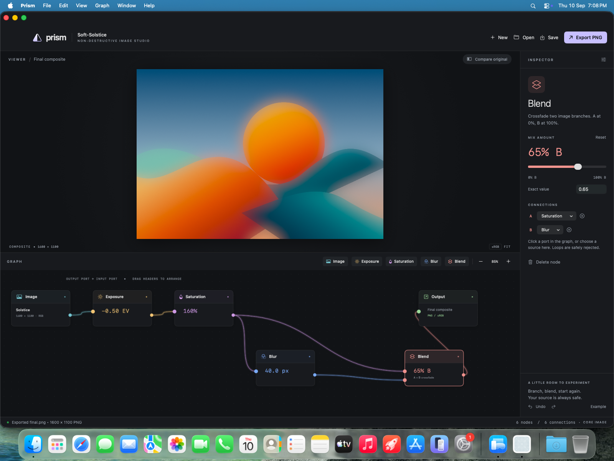

**Scope & limitations:** Local Apple Silicon development build is ad-hoc signed, not notarized or an App Store release., V1 supports two bundled equal-size original sources and crossfade blending; arbitrary image import, masks and additional blend modes are not implemented., Rendering is synchronous; large-graph performance and minimum-size window layout were not UI-tested., Copied-app launch was tested outside the repository while the original checkout remained present; a separate clean Mac was not tested., Malformed project handling was covered by logic tests rather than native UI., Original comparison refers to the project's first image node. Undo history, selection, zoom and manually saved file URL do not persist across launches.

**Downloads:** [Prism-macOS-arm64.zip](https://app.devin.ai/attachments/35430075-563e-425d-9bda-ca2bad44fd06/Prism-macOS-arm64.zip) · [baseline.png](https://app.devin.ai/attachments/23bdfe99-2e92-4298-8700-11e8e7d64d5c/baseline.png) · [final.png](https://app.devin.ai/attachments/dfded7f0-e87f-4465-8dda-580d4d76ca73/final.png) · [Soft-Solstice.prism](https://app.devin.ai/attachments/00d92cd7-1648-475d-abc7-3085faf8ce0c/Soft-Solstice.prism) · [prism-final-43eb440.mp4](https://app.devin.ai/attachments/b62d18c1-cce3-4c1e-9888-1301feb32fa0/prism-final-43eb440.mp4)

### 23. Cutline — Ready

Make a short travel film in a native editing suite. Trim and arrange animated clips, compose an opening title and export a real MP4.

[Session](https://app.devin.ai/sessions/3bb2775767ed4018a92ffb5c3d36628a) · [Source PR](https://github.com/dabit3/experiments/pull/61) · [Build guide](https://github.com/dabit3/experiments/blob/b9d756a9e69e915ccf9784e20f0e4c36c21363eb/native-demos/macos/cutline/README.md) · [Demo 1](https://app.devin.ai/sessions/3bb2775767ed4018a92ffb5c3d36628a?testRecording=54873e8c-f6d1-4b47-9bce-204a0447bff4) · [Test report](https://app.devin.ai/attachments/d3af32ed-325c-4955-86be-d06b71426e08/Cutline-Test-Report.md)

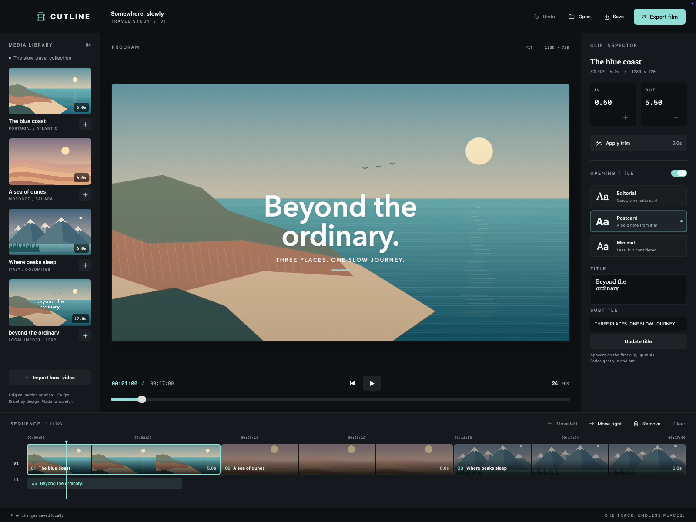

**Scope & limitations:** Silent single video track, hard cuts, 720p/24fps; no audio, transitions, grading or long-form editing., Sample videos are original procedurally animated travel illustrations, not photographic location footage., Saved projects reference app-managed local media and are not portable archives; undo history is session-local., App ZIP is a local ad-hoc signed Apple Silicon macOS build, not notarized or an App Store release., Compiler emits one AVVideoComposition initializer deprecation warning; native build and real rendering pass., Import/remove/undo and untouched-default save submission were verified in prior runs rather than repeated in the final recording.

**Downloads:** [Cutline-macOS-arm64.zip](https://app.devin.ai/attachments/6872f5e3-23f6-4a8f-9b8c-b966a723e943/Cutline-macOS-arm64.zip) · [Cutline Acceptance b9d756a.mp4](https://app.devin.ai/attachments/a3bedaea-72c0-48d6-8589-c154a99126bc/Cutline%20Acceptance%20b9d756a.mp4) · [cutline-final-b9d756a-annotations.json](https://app.devin.ai/attachments/44a1c8eb-b7fb-4a5d-bc3f-5adfb11a2a71/cutline-final-b9d756a-annotations.json) · [cutline-final-b9d756a-edited.mp4](https://app.devin.ai/attachments/d42175b6-c877-4f76-b620-fa969728c2ed/cutline-final-b9d756a-edited.mp4)

### 24. Wavecraft — Ready

A focused stereo audio workbench. Inspect waveforms, select and trim passages, shape fades and gain, recover with undo and export edited audio.

[Session](https://app.devin.ai/sessions/e27f2aac6aae4809b3027d1016cbf385) · [Source PR](https://github.com/dabit3/experiments/pull/46) · [Build guide](https://github.com/dabit3/experiments/blob/0c3ca70e833b02b4282b5385efac066f7103e509/native-demos/macos/wavecraft/README.md) · [Demo 1](https://app.devin.ai/sessions/e27f2aac6aae4809b3027d1016cbf385?testRecording=e0edd6af-fb52-499f-8336-ad8abca9efe8) · [Test report](https://app.devin.ai/attachments/9661b78e-eaca-4e35-b920-3e3fa983819b/Wavecraft-Test-Report.md)

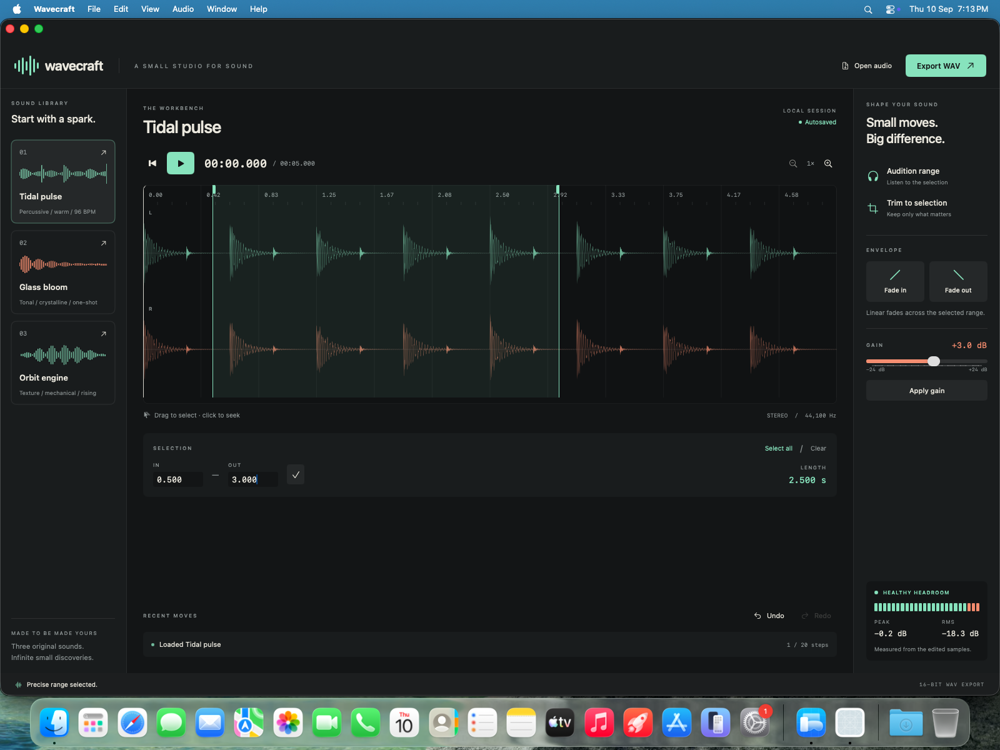

**Scope & limitations:** Playback verified through virtual output; physical speaker/headphone fidelity not assessed., Slider-track clicks passed; knob dragging not conclusively verified with the computer tool., Native file paths used clipboard paste because direct tool typing dropped some characters., App ZIP is ad-hoc signed for local macOS arm64 use, not notarized or an App Store release., Bounded V1 supports mono/stereo WAV/AIFF up to 120 seconds; no resampling, multitrack engine or guaranteed gapless looping. Undo history resets at exit.

**Downloads:** [Wavecraft-macOS-arm64.zip](https://app.devin.ai/attachments/76e3704d-59eb-489b-a5bd-7bd6b4cef8f6/Wavecraft-macOS-arm64.zip) · [Wavecraft-Final-0c3ca70.wav](https://app.devin.ai/attachments/8b10d073-6549-4b05-96cf-0c8c9a5b35ae/Wavecraft-Final-0c3ca70.wav) · [Wavecraft-Final-0c3ca70.wavecraft](https://app.devin.ai/attachments/5b2bd990-e3eb-406f-a26e-451e01e718e7/Wavecraft-Final-0c3ca70.wavecraft) · [verify_demo.swift](https://app.devin.ai/attachments/27df08c0-1f4c-457e-9b2a-573bd87991bc/verify_demo.swift) · [wavecraft-final-0c3ca70-edited.mp4](https://app.devin.ai/attachments/efd20c11-c5a2-46e2-9dc1-d808387a02a0/wavecraft-final-0c3ca70-edited.mp4)

### 25. Railway — Ready

Dispatch two trains through a miniature forest railway. Set switches and signals, respect route interlocking and complete station deliveries.

[Session](https://app.devin.ai/sessions/059a558c5ba04f06817254a2498a8d63) · [Source PR](https://github.com/dabit3/experiments/pull/53) · [Build guide](https://github.com/dabit3/experiments/blob/6f02a8eaa2fcc03cbb3ed08bd74fcd4e3d285149/native-demos/macos/railway/README.md) · [Demo 1](https://app.devin.ai/sessions/059a558c5ba04f06817254a2498a8d63?testRecording=99f1c579-4ba3-4245-87da-b339ce89c46a) · [Test report](https://app.devin.ai/attachments/5fd8f05c-a11f-4367-9feb-90bac8840a4d/report.md)

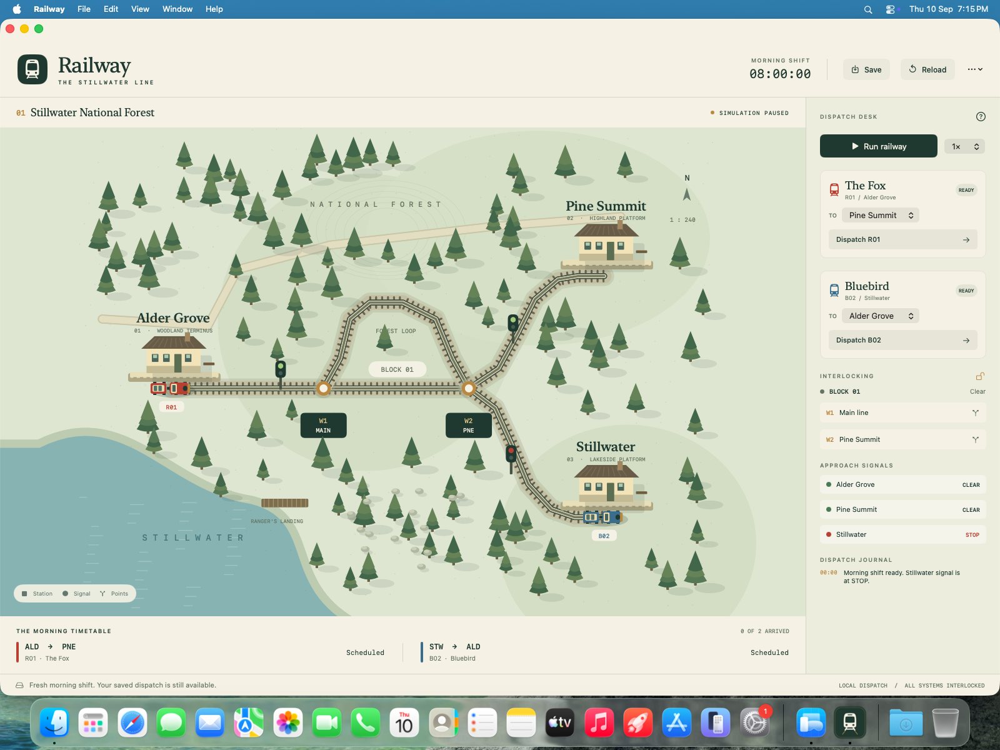

**Scope & limitations:** Conservative whole-junction Block 01 allows one train in the conflict zone at a time; no automatic deadlock solver, arbitrary track editor or service cancellation., Train consists are decorative rigid bodies moving at constant speed; locomotive reversal, wheel physics and acceleration are not modeled., Attached app is local ad-hoc-signed arm64, not notarized or an App Store release., Abrupt-kill recovery was not exercised; autosave may lose up to two simulated seconds., Quantitative speed scaling, malformed saves and all route permutations are covered by logic tests rather than exhaustive native UI tests. Earlier UI regression coverage is labeled by revision in the report.

**Downloads:** [Railway-macOS-arm64-6f02a8e.zip](https://app.devin.ai/attachments/4481235d-ba76-4176-980b-38744a6a66c3/Railway-macOS-arm64-6f02a8e.zip) · [Railway-timetable.csv](https://app.devin.ai/attachments/0593598d-6c5e-4edb-aa38-d432e54285ed/Railway-timetable.csv) · [railway-6f02a8e-final-edited.mp4](https://app.devin.ai/attachments/4a3b9a06-fe1d-449c-8d8b-c1679710ecec/railway-6f02a8e-final-edited.mp4)

### 26. Aster — Ready

A hands-on orbital laboratory. Explore a two-body simulation, plan burns, inspect predicted trajectories and use time warp to complete a mission.

[Session](https://app.devin.ai/sessions/dd3f54bd5f314dc78be191aba19bb2b7) · [Source PR](https://github.com/dabit3/experiments/pull/56) · [Build guide](https://github.com/dabit3/experiments/blob/364dc482dffaa6edda2208bec1a3fc4b1185ba06/native-demos/macos/aster/README.md) · [Demo 1](https://app.devin.ai/sessions/dd3f54bd5f314dc78be191aba19bb2b7?testRecording=5c111119-3c9d-4ddd-ac47-6e1de3703e0d) · [Test report](https://app.devin.ai/attachments/8a187cbf-8cc7-484a-afe8-656f189523ed/Aster-native-test-report.md)

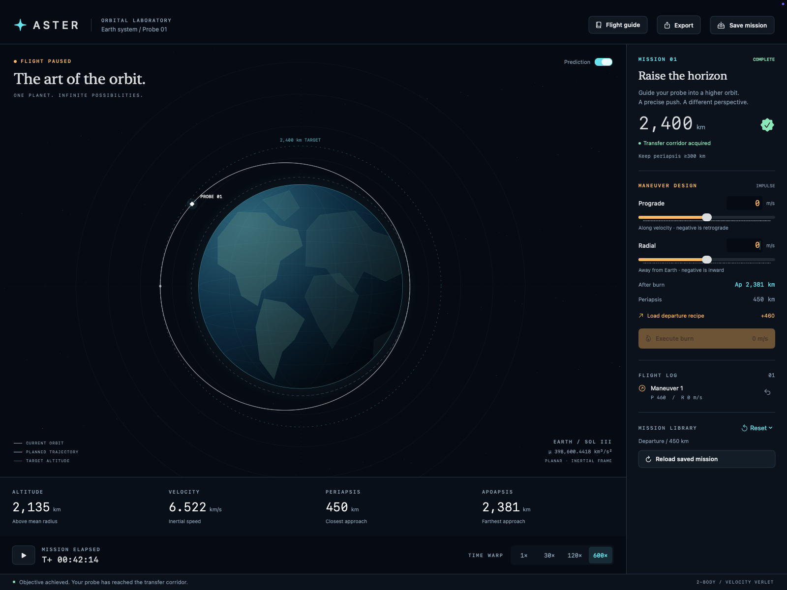

**Scope & limitations:** Educational planar Earth-only gravity with instantaneous impulses; no atmosphere, fuel, finite thrust, attitude or other bodies. Schematic globe and capped viewport; impact resolved within an integration substep., Impact/escape and malformed persistence covered by logic tests rather than UI. Filesystem failures, input extremes and100-burn cap were not exercised through native UI., Download is a locally ad-hoc-signed Apple silicon macOS app, not notarized or an App Store release.

**Downloads:** [Aster-macOS-arm64.zip](https://app.devin.ai/attachments/bab7c8d0-819b-47f9-88e3-505aaa5d03db/Aster-macOS-arm64.zip) · [Aster-trajectory-final.csv](https://app.devin.ai/attachments/3aa9c6d9-fb13-42b2-8ec9-3226ebc32006/Aster-trajectory-final.csv) · [Aster-build-verification.md](https://app.devin.ai/attachments/b297623b-38f1-4019-b34b-1b44b933374d/Aster-build-verification.md) · [aster-final-native-edited.mp4](https://app.devin.ai/attachments/4ddcda43-9881-4ff6-b2c7-ad79e2577d3f/aster-final-native-edited.mp4)

### 27. Margin — Ready

Read, collect and write in one research studio. Search a source PDF, preserve cited excerpts, develop a brief and export finished documents.

[Session](https://app.devin.ai/sessions/625a0e5108d941fa867f3e276b1d2331) · [Source PR](https://github.com/dabit3/experiments/pull/68) · [Build guide](https://github.com/dabit3/experiments/blob/fe9ed9008155c2bf2ff08988946630c5f768bb26/native-demos/macos/margin/README.md) · [Demo 1](https://app.devin.ai/sessions/625a0e5108d941fa867f3e276b1d2331?testRecording=a8066e3f-3a9c-4d28-a66b-00f180e481cd) · [Test report](https://app.devin.ai/attachments/e70e0a98-fb29-4d00-ab53-7272fa9f6ffc/Margin-Test-Report.md)

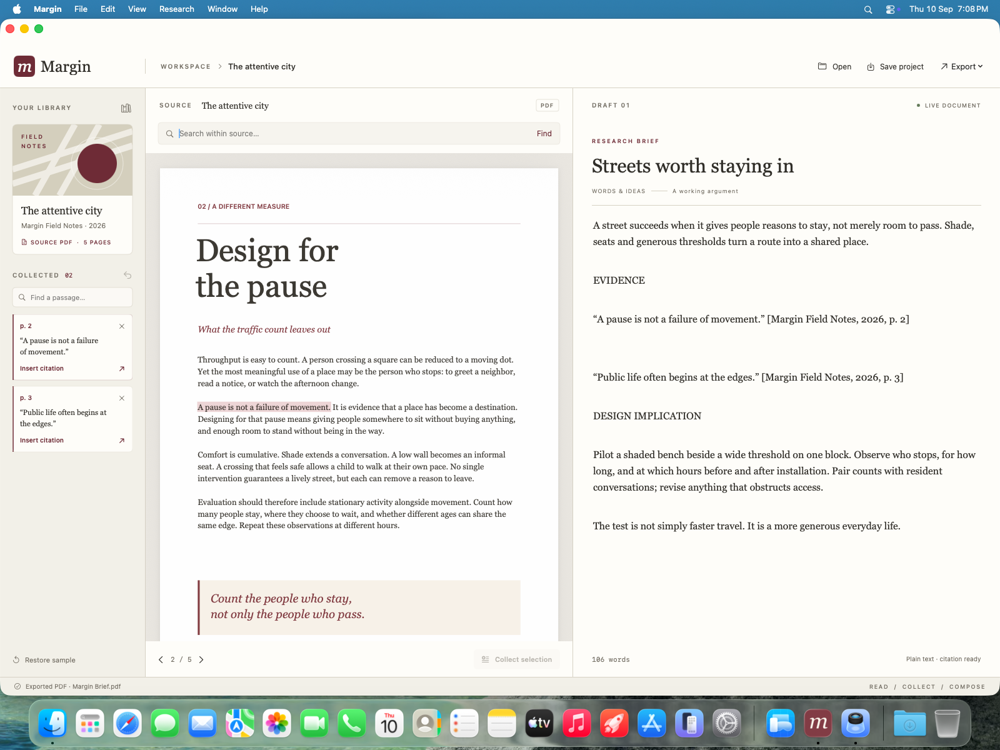

**Scope & limitations:** The attached arm64 macOS app is an ad-hoc-signed local development build, not notarized or an App Store release., V1 uses one bundled original illustrative source essay; arbitrary PDF import, OCR, cloud sync and collaboration are outside scope., The editor stores plain text; PDF export typesets prose rather than interpreting Markdown markup., Minimum-size windows and multi-page mouse selections were not exercised in native UI; long multipage exports were covered by logic tests., Computer typing altered capitalization/path separators during testing; native clipboard paste recovered exact input. No application failures remained.

**Downloads:** [Margin-macOS-arm64.app.zip](https://app.devin.ai/attachments/3957b67f-0cf3-4756-873b-b06826047aa7/Margin-macOS-arm64.app.zip) · [Attentive City.margin](https://app.devin.ai/attachments/dfb5dc5f-0b80-4ac2-af8b-b5fe6b838e3d/Attentive%20City.margin) · [Margin Brief.md](https://app.devin.ai/attachments/12f032e9-f3c3-4c78-99c3-66581be77284/Margin%20Brief.md) · [Margin Brief.pdf](https://app.devin.ai/attachments/e06a06ee-3305-412d-be69-e5b55d19c6f4/Margin%20Brief.pdf) · [exported-pdf-text.txt](https://app.devin.ai/attachments/b886e30b-1349-4d50-bf0b-78d43a8cf967/exported-pdf-text.txt) · [margin-native-e2e-edited.mp4](https://app.devin.ai/attachments/5b554ecb-cae2-441e-8d81-3b95cffd84c9/margin-native-e2e-edited.mp4)

### 28. Loom — Ready

Turn CSV data into an editorial chart. Map fields, filter and aggregate values, explore bar, line and scatter views, then export PNG or vector PDF.

[Session](https://app.devin.ai/sessions/7d69681bb3f74a5cbc5215ee17d02615) · [Source PR](https://github.com/dabit3/experiments/pull/52) · [Build guide](https://github.com/dabit3/experiments/blob/bd5501907246874e59269a11fb7bbe06864aaadf/native-demos/macos/loom/README.md) · [Demo 1](https://app.devin.ai/sessions/7d69681bb3f74a5cbc5215ee17d02615?testRecording=62376428-68a4-41a4-9447-d278a5bafbca) · [Test report](https://app.devin.ai/attachments/28934aa2-f2bb-4db5-ac2e-421f4a3ed1be/final-test-report.md)

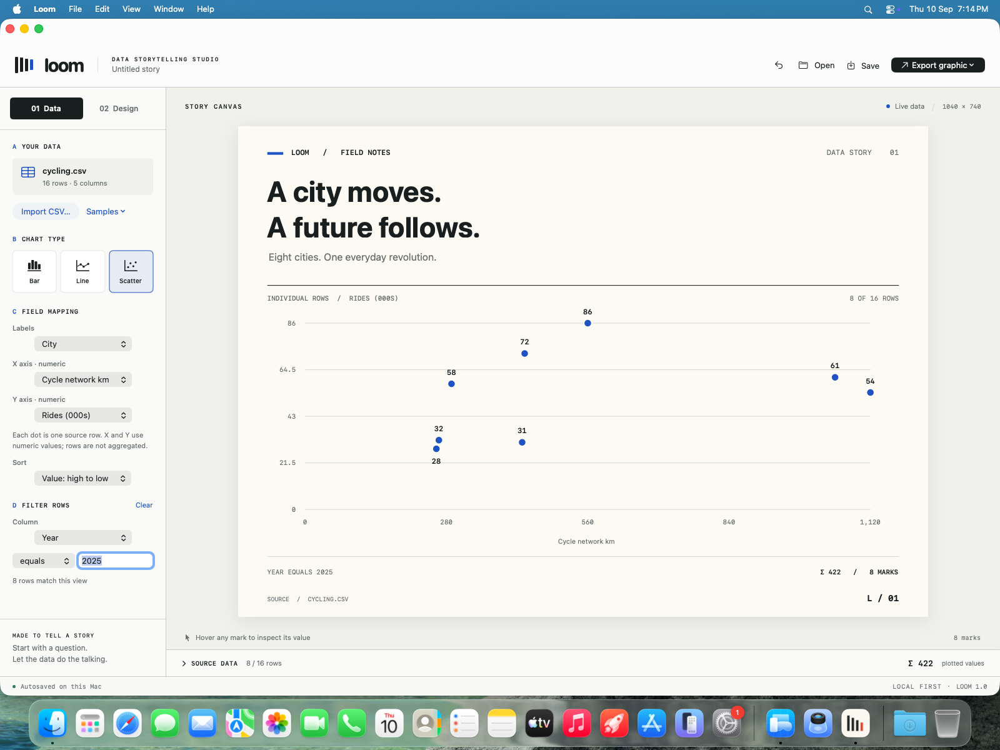

**Scope & limitations:** Comprehensive import/error/persistence UI coverage ran on 3cff104; subsequent menu-contrast and label-placement changes received targeted native regression. Final media and exports are from bd55019., App archive is a local Apple Silicon ad-hoc-signed macOS build, not notarized or an App Store release., Bundled datasets are synthetic illustrative data. Line charts use categorical spacing. Other bounded V1 data/rendering limits are documented in the app README., Dense-data label omission was not exhaustively UI-tested; horizontal table overflow was not exercised because tested columns fit., Exports support PNG and vector PDF; SVG is not implemented.

**Downloads:** [Loom-macOS-arm64-bd55019.zip](https://app.devin.ai/attachments/34d69ae6-0df8-45f1-b60e-61d9f8fe4f18/Loom-macOS-arm64-bd55019.zip) · [bd55019-Cities.loom](https://app.devin.ai/attachments/081f9b0e-7281-4dc2-9b66-a6e18d7ffb7f/bd55019-Cities.loom) · [bd55019-Cities.png](https://app.devin.ai/attachments/3e655a15-cc47-46a1-8787-77838230cb4f/bd55019-Cities.png) · [bd55019-Cities.pdf](https://app.devin.ai/attachments/b9b7a02c-f499-46d3-8652-7db48f39b6eb/bd55019-Cities.pdf) · [bd55019-Scatter.pdf](https://app.devin.ai/attachments/e4276981-712a-4c83-940c-6c9c989b16ab/bd55019-Scatter.pdf) · [loom-final-bd55019-edited.mp4](https://app.devin.ai/attachments/03741137-e2dc-43b4-83ea-8c00ae3923fc/loom-final-bd55019-edited.mp4)

### 29. Keystone — Ready

Design and analyze a miniature truss bridge. Edit joints and members, inspect stresses and deflection, compare material costs and export an engineering report.

[Session](https://app.devin.ai/sessions/9dc52a8bfd7c4216b6226909a4f3bc23) · [Source PR](https://github.com/dabit3/experiments/pull/63) · [Build guide](https://github.com/dabit3/experiments/blob/7b8acdb2707d453d730e2ac9b41b86b235ef83fa/native-demos/macos/keystone/README.md) · [Demo 1](https://app.devin.ai/sessions/9dc52a8bfd7c4216b6226909a4f3bc23?testRecording=d2530fe6-e903-449e-a8c3-6adaf4d35403) · [Test report](https://app.devin.ai/attachments/83e45432-392d-4655-9951-d1cb097dc68e/runtime-report.md)

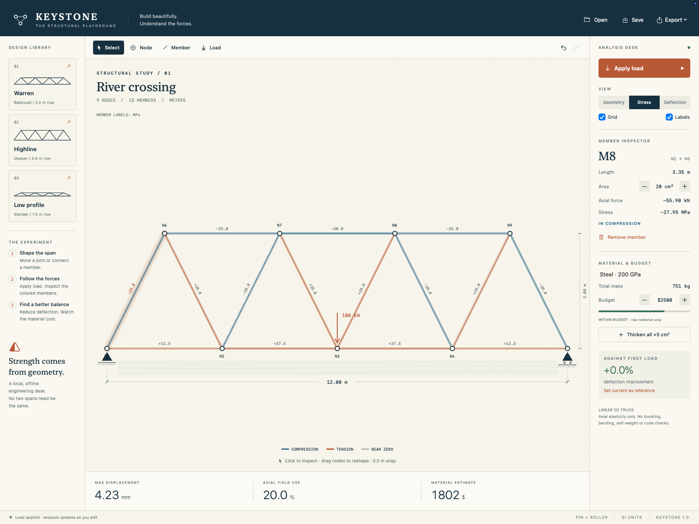

**Scope & limitations:** Educational small-displacement, linear-elastic, axial-only 2D truss model. Excludes buckling, bending, self-weight, joint capacity, dynamics, geometric nonlinearity and design-code checks; yield utilization is not safety certification., Material pricing is illustrative raw-material cost only. Deflection drawing is magnified ×100., Exported HTML/SVG contents and SVG XML were verified; browser rendering was not tested because no browser was installed., Download is a native macOS arm64 .app with local ad hoc signing, not notarized or an App Store release., Undo history, view preferences and comparison reference are session-only; saved geometry, loads, materials and supports persist.

**Downloads:** [Keystone-macOS-arm64.app.zip](https://app.devin.ai/attachments/d27a8821-f168-4a5e-b14e-4169cbba3cb6/Keystone-macOS-arm64.app.zip) · [improved span.keystone](https://app.devin.ai/attachments/6d1c57d8-01bb-41ab-b3c4-9e73d87ea461/improved%20span.keystone) · [Keystone Report.html](https://app.devin.ai/attachments/7315a19b-9e6f-4c30-a056-518d1f196ffc/Keystone%20Report.html) · [Keystone Drawing.svg](https://app.devin.ai/attachments/673e0eda-89e3-4945-9c30-7340e62d03e5/Keystone%20Drawing.svg) · [keystone-final-7b8acdb-edited.mp4](https://app.devin.ai/attachments/a8708a80-cd56-44d5-8132-719e299e16ea/keystone-final-7b8acdb-edited.mp4)

### 30. Nightjar — Ready

Compose light for a virtual stage. Aim colored fixtures, record and arrange looks, run timed crossfades and export the cue sheet.

[Session](https://app.devin.ai/sessions/52757d60255345389a32b453a5734ec2) · [Source PR](https://github.com/dabit3/experiments/pull/59) · [Build guide](https://github.com/dabit3/experiments/blob/b533b6af066925690874cfff72b40bfd10f309fd/native-demos/macos/nightjar/README.md) · [Demo 1](https://app.devin.ai/sessions/52757d60255345389a32b453a5734ec2?testRecording=3be13896-d274-4e53-8945-8fc994461d1c) · [Test report](https://app.devin.ai/attachments/c9f78c8f-4fb6-47c9-b26f-390f65ee6754/TEST-REPORT.md)

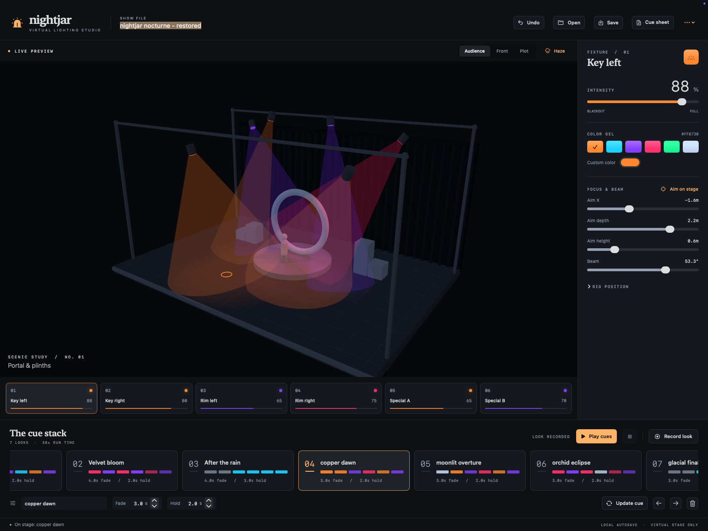

**Scope & limitations:** App archive is an ad-hoc-signed Apple Silicon macOS build; not notarized or an App Store release., Haze uses additive translucent cones rather than volumetric scattering; intensity is artistic rather than calibrated lux, and colors interpolate in sRGB., Entirely virtual: no physical DMX, Art-Net or sACN output., One stage, six fixtures and up to 100 cues; sequences play once. Camera/haze/playback position are not restored as show data., Exhaustive shortcuts, custom color picker, timing bounds and maximum cue capacity were not UI tested; frame-time performance was not benchmarked., Rig/aim-height edits, delete/Undo, malformed-file recovery and minimum-window tests passed on729cdbc and were not repeated after the native-panel-only b533b6a change.

**Downloads:** [Nightjar-macOS-arm64-b533b6a.zip](https://app.devin.ai/attachments/97ab3339-4ad6-41ec-9df3-2b099f12cc92/Nightjar-macOS-arm64-b533b6a.zip) · [nightjar nocturne - restored.nightjar](https://app.devin.ai/attachments/e2be4fc7-07af-4863-837e-f26692cf5d7d/nightjar%20nocturne%20-%20restored.nightjar) · [nightjar nocturne - restored — cue sheet.csv](https://app.devin.ai/attachments/a20a13b9-aa1d-4d8f-8fce-b7a84d237f0a/nightjar%20nocturne%20-%20restored%20%E2%80%94%20cue%20sheet.csv) · [nightjar-final-b533b6a-edited.mp4](https://app.devin.ai/attachments/0b0ae11b-ff46-4dcc-a99d-fb85f3f61ba3/nightjar-final-b533b6a-edited.mp4)
