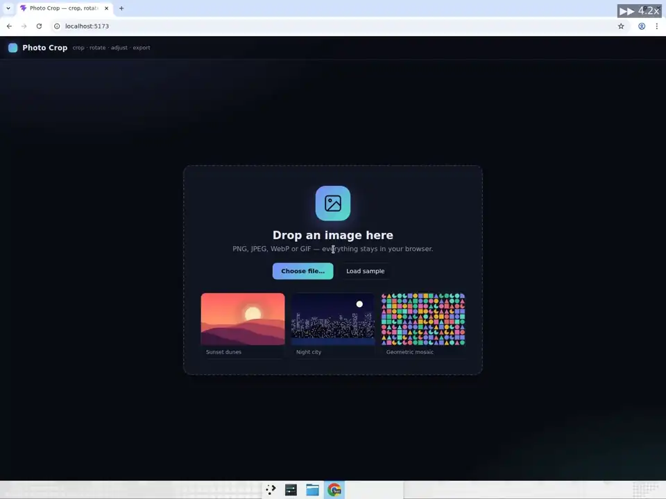
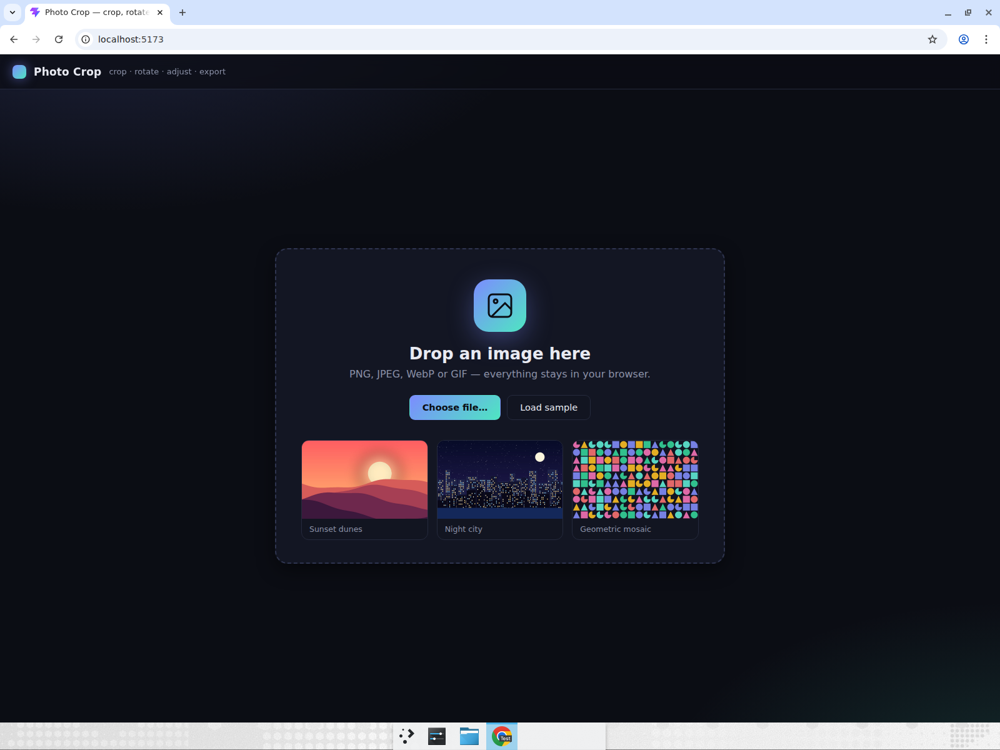
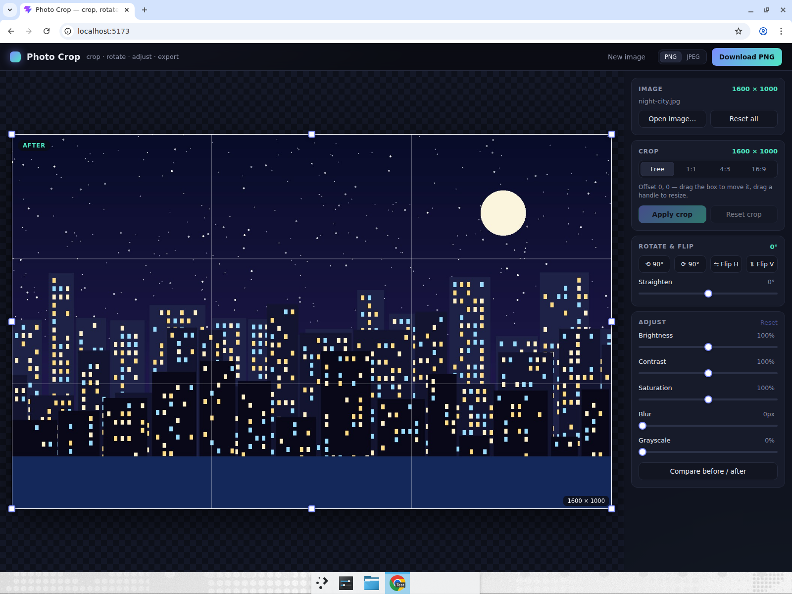
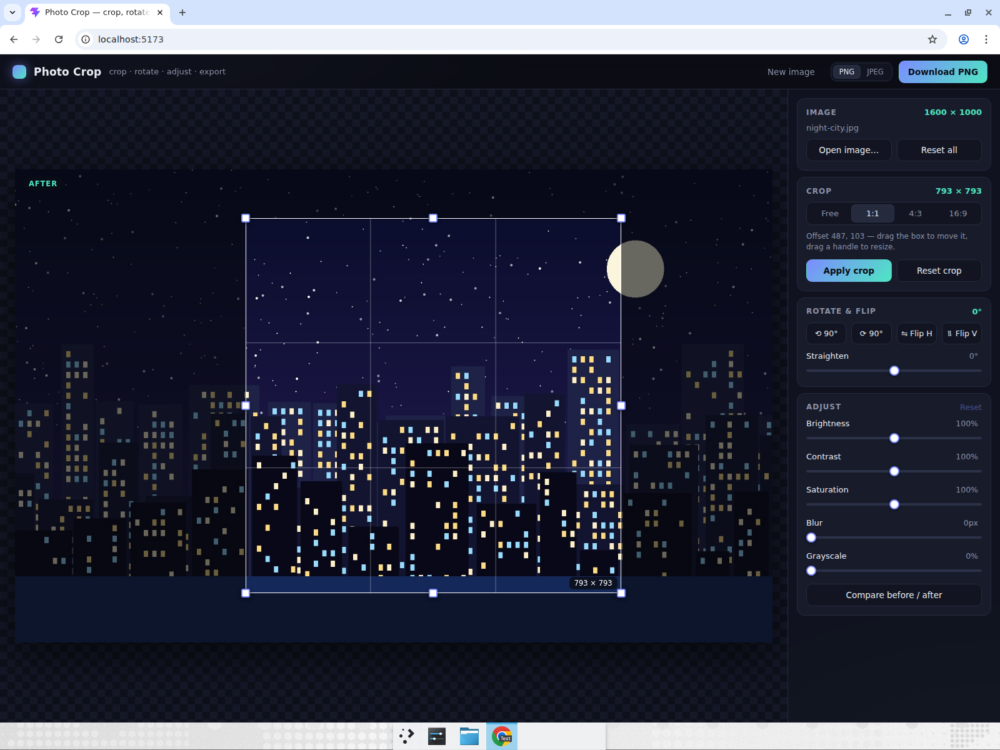
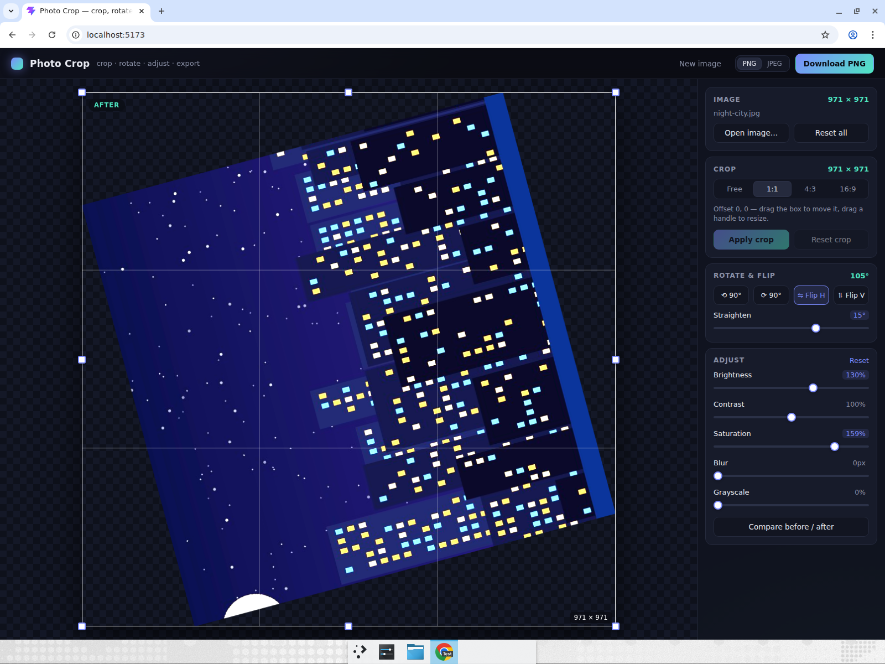
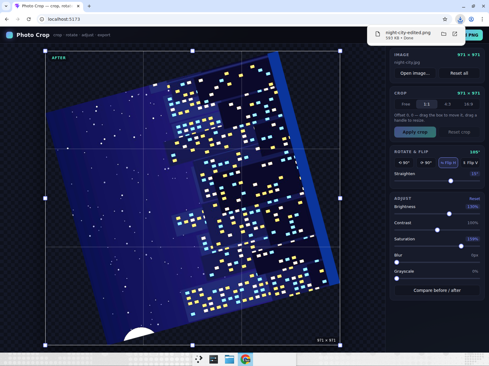
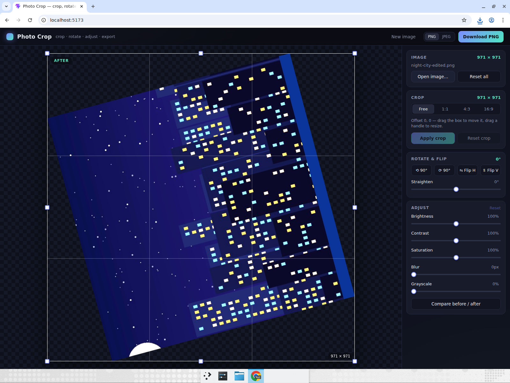

# photo-crop — Image crop, rotate & filter tool

A small in-browser image editor built with Vite + React + TypeScript. Drop or pick an image
(or load one of the three bundled samples), then crop it with a draggable box that has eight
resize handles and Free / 1:1 / 4:3 / 16:9 presets, rotate it in 90° steps or straighten it
with a free-rotation slider, flip it horizontally or vertically, tweak brightness, contrast,
saturation, blur and grayscale with live preview, toggle a before/after compare, apply the
crop, and download the result as PNG or JPEG. Everything happens on a `<canvas>` in the
browser — no server, no accounts.

## Run it

```bash
cd photo-crop
npm install
npm run dev      # http://localhost:5173
```

`npm run build` type-checks and produces a static bundle in `dist/`; `npm run lint` runs oxlint.

## How it works

- `src/lib/crop.ts` — pure geometry: resizing a rect from any of the 8 handles while keeping an
  optional aspect ratio, moving it, and clamping it inside the image.
- `src/lib/image.ts` — the render pipeline. Rotation and flips are drawn onto a canvas whose
  size is the rotated bounding box; filters are a CSS `filter` string used both for the live
  preview and via `ctx.filter` when exporting. "Apply crop" bakes the current transform into a
  new `ImageBitmap` and cuts out the crop region.
- `src/components/` — `DropZone` (upload + samples), `Stage` (canvas + `CropOverlay`),
  `Sidebar` (presets, rotate/flip, adjustment sliders, compare toggle).

## Computer-use showcase

Devin built this app, opened it in a real Chrome window and drove it like a person would —
including the OS file chooser, pixel-precise handle dragging and a real file download.
The recording and screenshots below come from that session.

Scenario performed step by step:

1. **Upload through the native file dialog** — clicked "Choose file…", which opens the OS file
   chooser, navigated to an image on disk and selected it. Asserted the image rendered and the
   `Image` readout showed its real pixel dimensions.
2. **Drag the crop handles and box** — dragged the bottom-right corner handle inward to shrink
   the crop, then dragged the box itself to reposition it, asserting the live `Crop` readout and
   the badge inside the box changed each time. Switched to the **1:1** preset and asserted the
   box became square.
3. **Apply crop** — clicked "Apply crop" and asserted the image dimensions became the crop size.
4. **Rotate & flip** — clicked "⟳ 90°", dragged the *Straighten* slider to a free angle, then
   toggled *Flip H*; asserted the rotation readout and the visible orientation.
5. **Adjustments & compare** — dragged the *Brightness* and *Saturation* sliders and toggled
   *Compare before / after*, asserting the preview and the BEFORE/AFTER badge switched.
6. **Download & round-trip** — clicked "Download PNG", asserted the file appeared in the downloads
   folder, then re-uploaded it through the file dialog to prove the export is a valid image.

### Recording



Full-resolution recording (MP4, ~61 s):
[photo-crop-showcase-edited.mp4](https://app.devin.ai/attachments/663e37e8-c4cb-4f7e-a42a-291a75f7cdc8/photo-crop-showcase-edited.mp4)

### Screenshots

| | |
|---|---|
|  |  |
| Landing page: drop zone, file input and bundled samples | Uploaded through the native file dialog — `Image 1600 × 1000` |
|  |  |
| After dragging the SE handle and the box, then picking **1:1** — `Crop 793 × 793` | Applied crop → ⟳ 90° + Straighten 15° → Flip H → Brightness 130 % / Saturation 159 % |
|  |  |
| `night-city-edited.png` saved to disk | Exported PNG re-uploaded through the file dialog to prove the round-trip |
