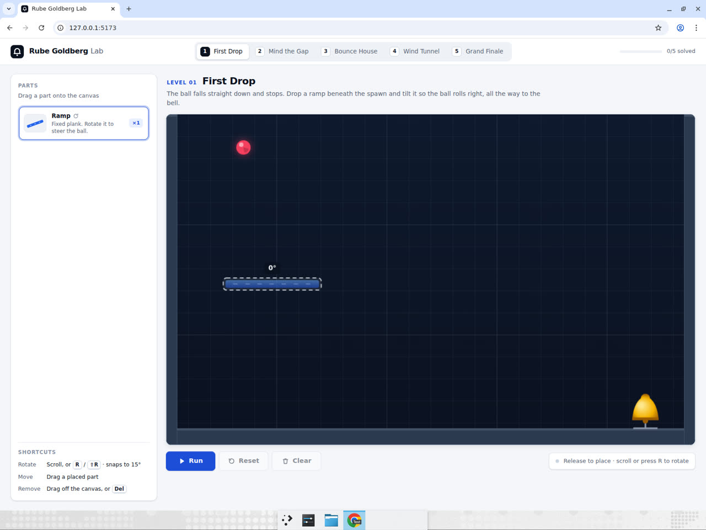
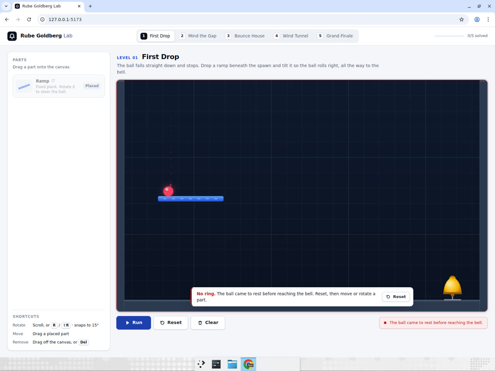
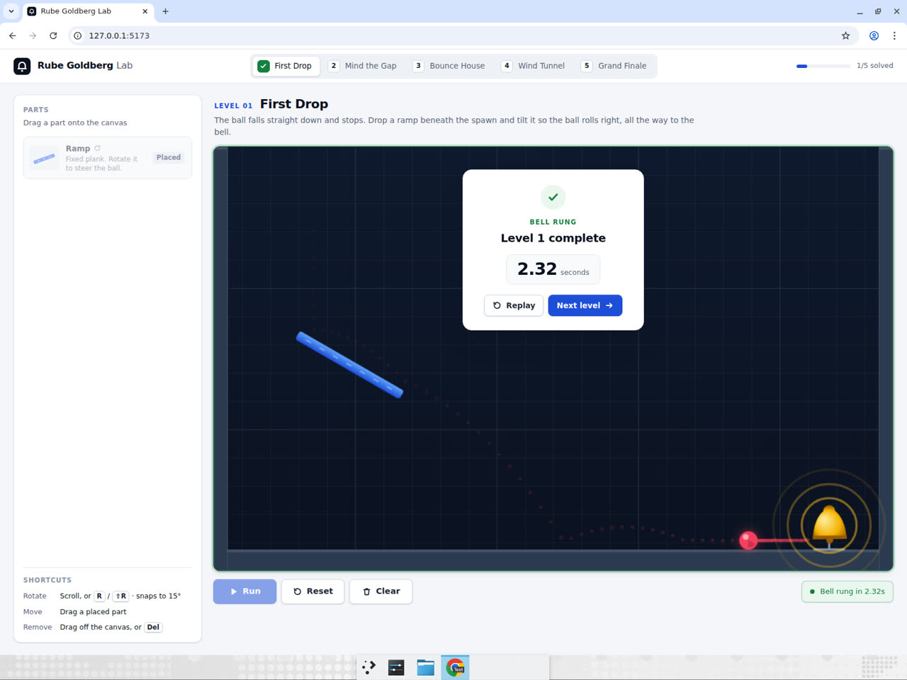
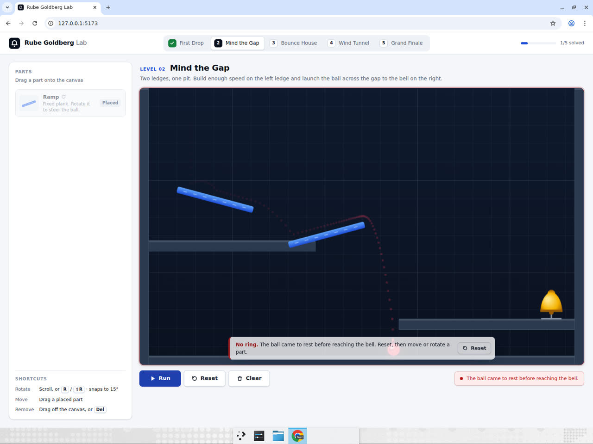
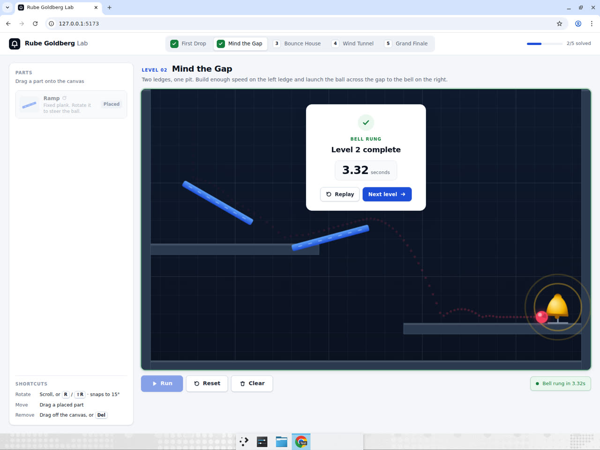
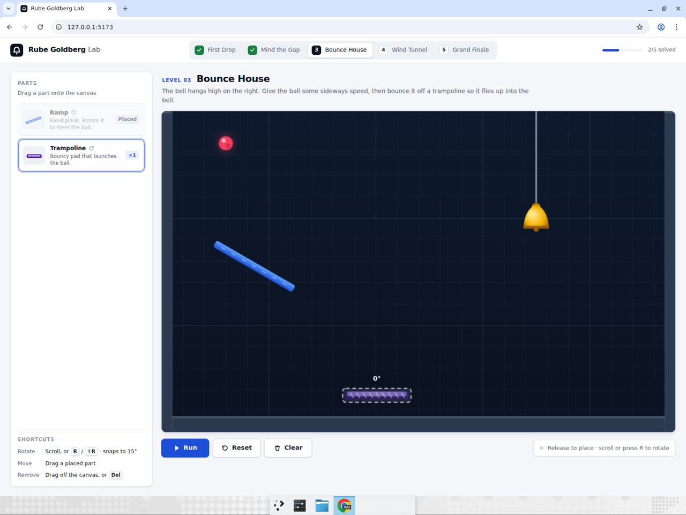
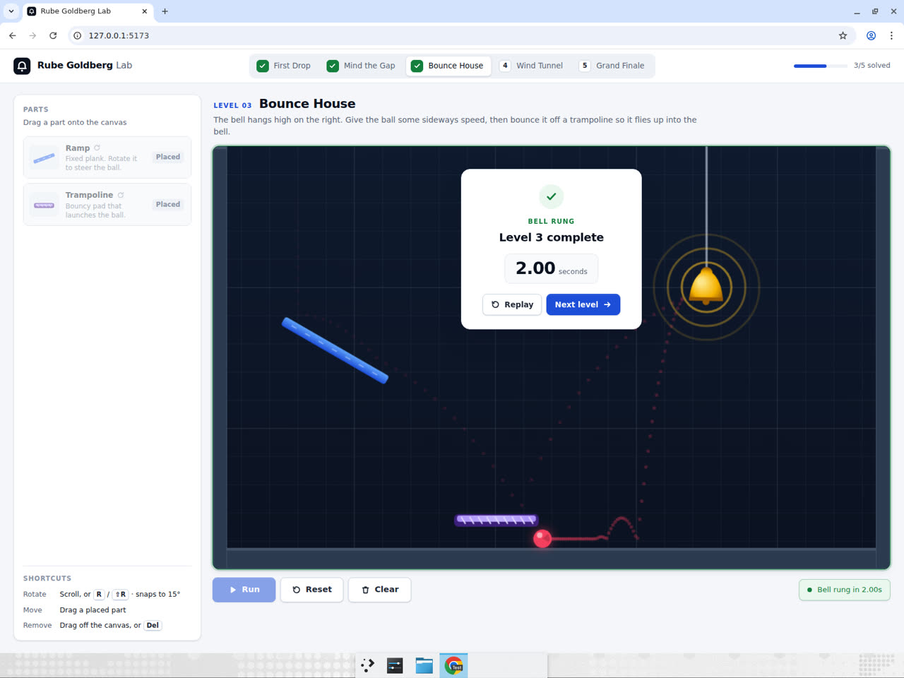

# physics-rube-goldberg

**Rube Goldberg Lab: place parts so the ball rings the bell.**

A Matter.js physics sandbox built with Vite, React and TypeScript. Each of the
five levels has a fixed ball spawn, a bell target, fixed obstacles and a parts
tray with a limited inventory of placeable parts:

| Part | Behaviour |
|------|-----------|
| Ramp | Fixed plank. Rotatable, snaps to 15°. |
| Domino | Standing block that topples and carries momentum. |
| Trampoline | Bouncy pad that launches the ball (rotatable). |
| Fan | Pushes anything inside its wind zone (rotatable). |
| Seesaw | Pivoting plank that tips under weight. |

Drag a part from the tray into the scene: a dashed **ghost outline** follows
the cursor and shows the part's angle. Rotate it with the **mouse wheel** or the
**R** key (Shift+R rotates the other way) while dragging or while hovering a
placed part. Placed parts can be dragged to a new position, dragged out of the
scene to remove them, or deleted with Del/Backspace.

- **Run** starts the simulation.
- **Reset** returns the ball to its spawn and keeps all placed parts.
- **Clear** removes every placed part on the level.

The level is complete when the ball touches the bell. A run fails when the ball
comes to rest, stops covering new ground for four seconds, or after 30 seconds.

The physics is deterministic: the engine steps at a fixed 60 Hz timestep with a
fixed-step accumulator, so the same layout always produces the same trajectory.
Part placement per level and solved levels persist in `localStorage`.

## Run it

```bash
cd physics-rube-goldberg
npm install
npm run dev
```

Then open http://localhost:5173. Other scripts: `npm run build`, `npm run lint`,
and `node --experimental-strip-types scripts/solve-check.ts` runs every level's
reference layout through the simulation headlessly to prove it is solvable.

## Computer-use skill

**Drag-placing objects into a physics scene, running a simulation, observing
and iterating.** Solving a level means dragging a part from the tray to a
specific spot in a canvas, adjusting its angle with the wheel or keyboard,
running the sim, watching where the ball actually goes, and then moving or
rotating the part based on what happened.

## Browser test scenario

Solve levels 1, 2 and 3, showing at least one failed run, an adjustment
(moving or rotating a ramp), and then success.

| # | Step | Expected result |
|---|------|-----------------|
| 1 | Open the app in a maximized Chrome window. | Level 1 "First Drop" is shown with the ball top-left, the bell bottom-right and one Ramp in the tray. |
| 2 | Drag the Ramp from the tray under the spawn and release without rotating it. | A dashed ghost with a `0°` label follows the cursor; on release the flat ramp is placed and the tray shows `×0`. |
| 3 | Press **Run**. | The ball lands on the flat ramp and stays there; the run ends with a red "No ring" banner and Reset becomes available. |
| 4 | Press **Reset**, hover the ramp and press **R** twice (or scroll twice). | The ramp rotates to `30°`, clockwise, tilting down to the right. |
| 5 | Press **Run**. | The ball rolls down the ramp, bounces along the floor and rings the bell. A "Bell rung · Level 1 complete" card appears and the level tab shows a check. |
| 6 | Click **Next level →**. | Level 2 "Mind the Gap" loads: a left ledge, a pit and a bell on the right ledge; two Ramps in the tray. |
| 7 | Drag one Ramp above the left ledge, rotate it to `15°` and Run. | The ball rolls off the ledge too slowly, falls into the pit and the run fails ("stopped making progress"). |
| 8 | Reset, hover the ramp and press **R** once, then Run. | At `30°` the ball leaves the ledge fast enough to fly over the pit and ring the bell. |
| 9 | Click **Next level →**. | Level 3 "Bounce House" loads with a hanging bell high on the right and a Ramp plus Trampoline in the tray. |
| 10 | Place the Ramp at `30°` under the spawn and the Trampoline on the floor roughly under the bell's left, then Run. | The ball rolls off the ramp, hits the trampoline and is launched up into the bell. Levels 1–3 all show checks. |

## Showcase run

Devin drove the app in a maximized Chrome window with real mouse and keyboard
input (drags, wheel, `R`, button clicks — no scripted events). All three levels
were solved as recorded, including the deliberate failed runs.

**Recording:** [rube-goldberg-showcase-v2-edited.mp4](https://app.devin.ai/attachments/358ea67e-4230-43e7-85f5-c074d8b52881/rube-goldberg-showcase-v2-edited.mp4) (72 s, annotated)

1. **Level 1, flat ramp fails** — dragged the ramp under the spawn; the ghost
   outline showed `0°`. Run: the ball landed on the plank and came to rest,
   "No ring".

   
   

2. **Level 1, rotate and retry** — Reset, hovered the ramp and scrolled the
   wheel twice (→ `30°`). Run: the ball rolled down and rang the bell in 2.32 s.

   

3. **Level 2, too shallow** — placed a ramp above the left ledge at `15°`
   (rotated with `R` mid-drag). The trail shows the ball leaving the ledge too
   slowly and dropping into the pit.

   

4. **Level 2, steeper** — Reset, one more `R` (→ `30°`). The ball cleared the
   gap and rang the bell in 3.32 s.

   

5. **Level 3, ramp + trampoline** — rotated the ramp ghost with two wheel
   clicks (→ `30°`), then dragged the trampoline onto the floor under the
   bell's left. The ball bounced up into the hanging bell in 2.00 s; levels 1–3
   show checks and the header reads 3/5 solved.

   
   
