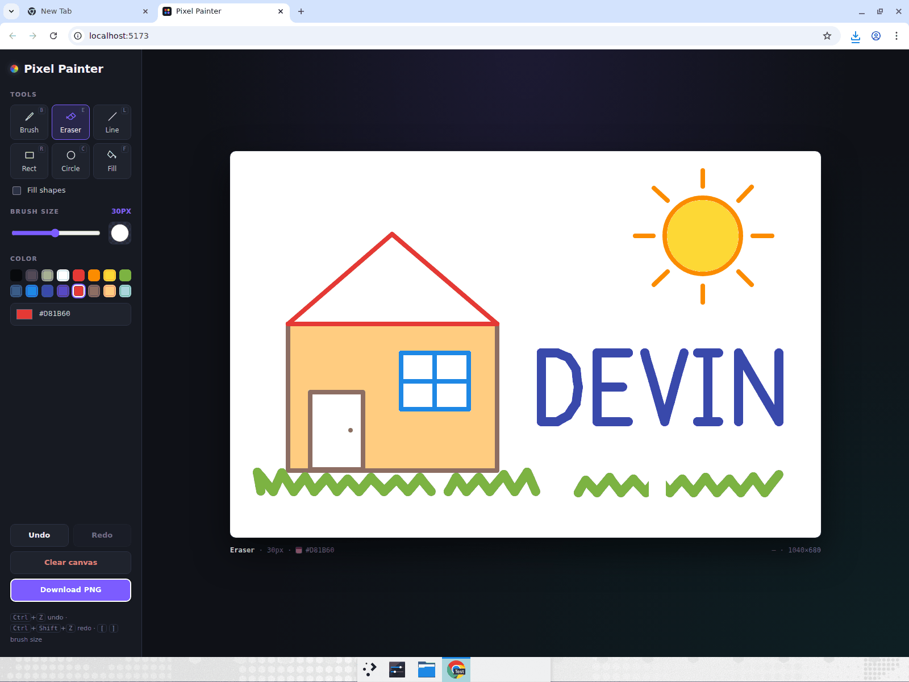
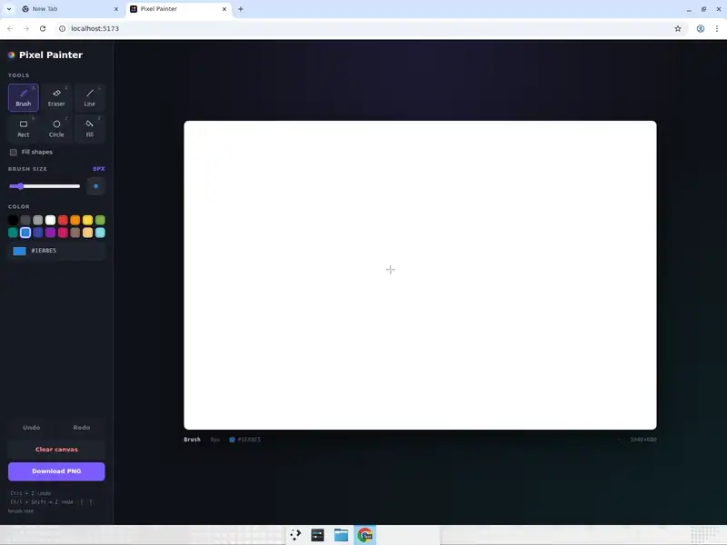
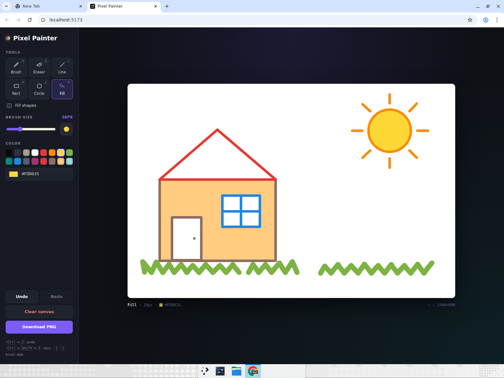
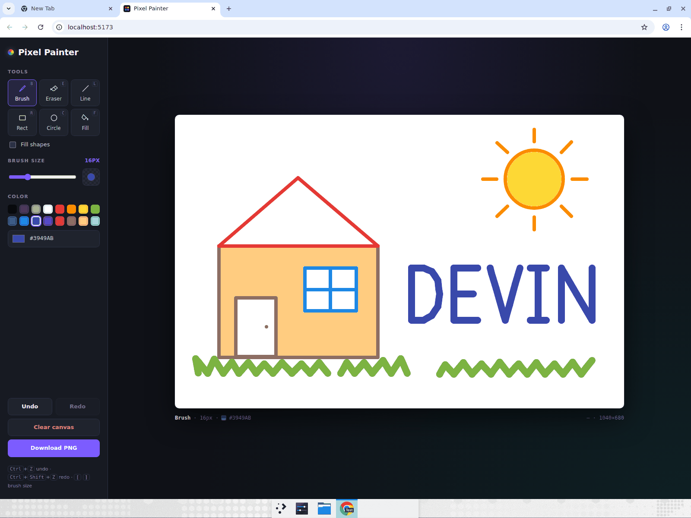
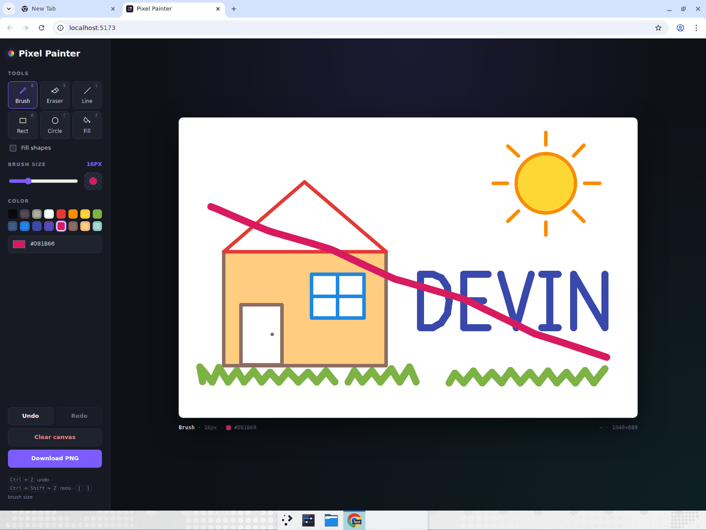

# Pixel Painter

A browser paint app built on a 1040×680 HTML canvas with Vite + React + TypeScript. It has a
brush with a size slider, an eraser, a 16-color palette plus a custom color picker, line /
rectangle / circle tools (outline or filled), a scanline flood-fill bucket, undo/redo
(`Ctrl+Z` / `Ctrl+Shift+Z`, up to 40 steps), clear canvas, and "Download PNG". The toolbar sits
on the left so the canvas stays large and clearly visible in a recording; a live brush-size
cursor and a status bar showing tool, size, color and cursor coordinates round it out.

## Run it

```bash
cd pixel-painter
npm install
npm run dev
```

Then open the printed `http://localhost:5173` URL. `npm run build` type-checks and produces a
static bundle in `dist/`; `npm run lint` runs oxlint.

Keyboard: `B` brush · `E` eraser · `L` line · `R` rectangle · `C` circle · `F` fill ·
`[` / `]` brush size · `Ctrl+Z` undo · `Ctrl+Shift+Z` / `Ctrl+Y` redo.

## Computer-use showcase

This app exists to demonstrate Devin driving a real browser with precise freehand mouse paths
and verifying the result visually. After building it, Devin opened the app in Chrome, maximized
the window, and performed the following scenario end to end while recording:

1. Picked colors from the palette and drew a house freehand: a rectangle body, a triangular
   roof with the line tool, a door and a window, a circular sun and grass strokes — switching
   colors and brush sizes along the way.
2. Used the fill (bucket) tool to fill the house body and the sun.
3. Wrote the word **DEVIN** freehand with the brush in large, legible letters.
4. Made a deliberate stray stroke, undid it with `Ctrl+Z` and verified it vanished, redid it with
   `Ctrl+Shift+Z` and verified it came back, then undid it again.
5. Switched to the eraser and erased part of the drawing.
6. Clicked **Download PNG** and confirmed `pixel-painter.png` landed in the downloads folder.

All six steps passed on the first recorded run; no app defects were found.

### Finished drawing



### Recording

**[Watch the full recording (mp4, ~85s)](https://app.devin.ai/attachments/8fb40cf5-c7e3-4299-85cf-0f0b5443a8e2/pixel-painter-showcase-edited.mp4)**



### Key moments

| House and sun after the fill tool | Freehand "DEVIN" lettering |
|---|---|
|  |  |

| Stray stroke brought back by redo (removed again with Ctrl+Z right after) |
|---|
|  |

## Project layout

```
src/
  App.tsx                 state, undo/redo wiring, keyboard shortcuts, PNG export
  components/
    PaintCanvas.tsx       pointer handling, brush/shape preview, flood fill dispatch
    Toolbar.tsx           tools, brush size, palette, actions
    ToolIcon.tsx          inline SVG tool icons
  hooks/useHistory.ts     ImageData-based undo/redo stack
  lib/floodFill.ts        tolerant scanline flood fill
  lib/shapes.ts           stroke/shape drawing helpers
  types.ts                tool definitions, palette, canvas constants
```
