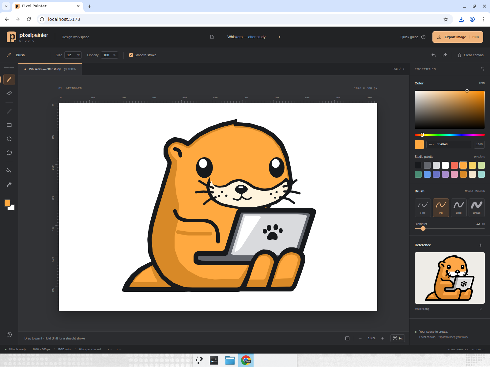
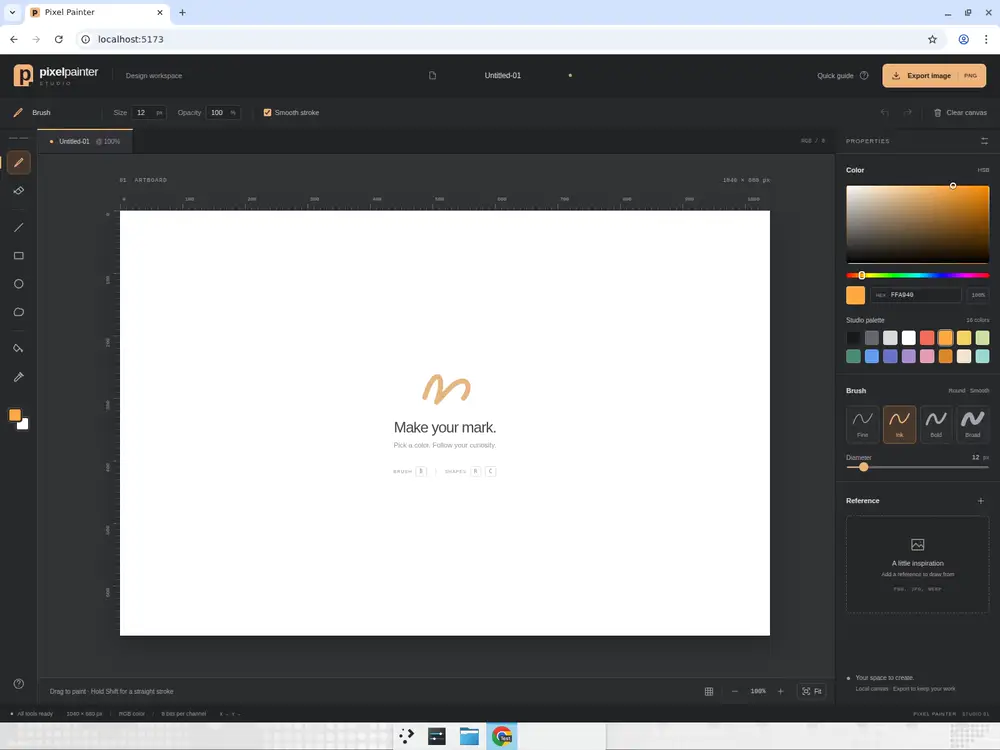
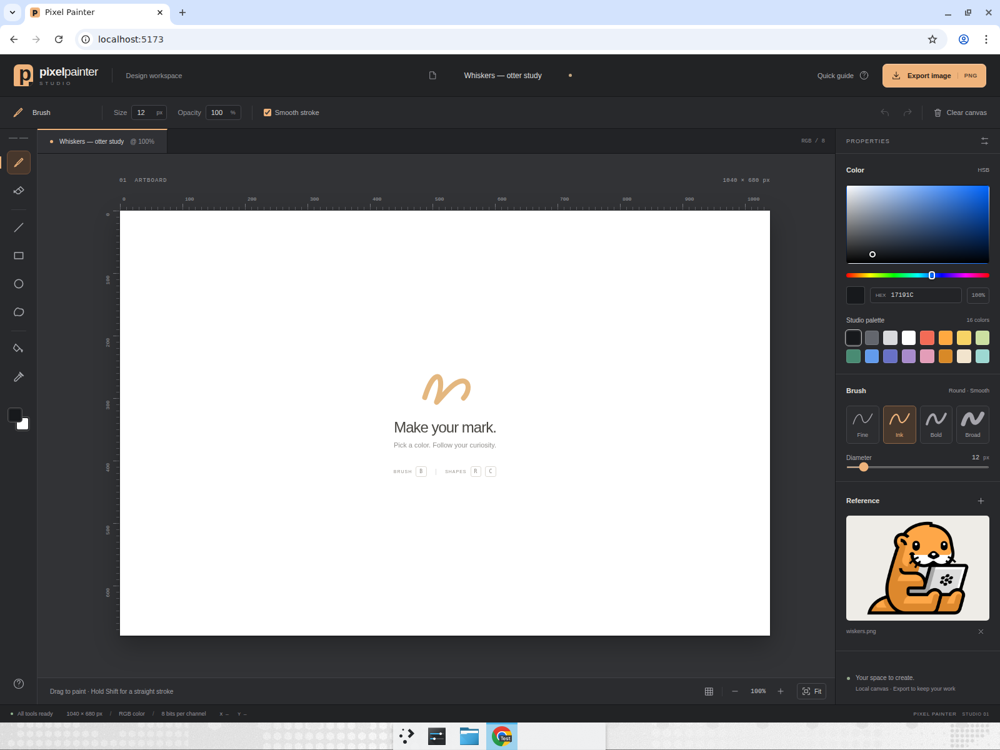
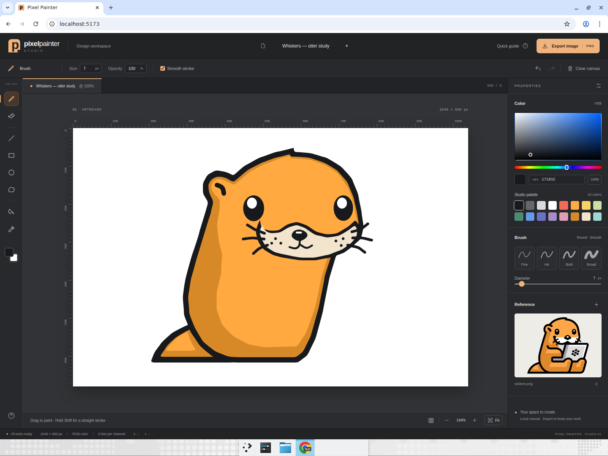

# Pixel Painter Studio

A focused illustration workspace built with Vite, React and TypeScript around a 1040×680
HTML canvas. A charcoal tool rail, contextual controls, measured artboard rulers and warm
color accents frame the drawing; the inspector brings together a color field, editable HEX
values, brush presets and a local reference-image panel. Smooth freehand strokes, closed
freeform fills, geometric shapes, a paint bucket, eyedropper, per-stroke opacity and 40-step
undo/redo support detailed illustrations without a backend, account or external service.
Zoom and grid guides affect only the workspace; **Export image** downloads a native-resolution PNG.



## Run it

```bash
cd pixel-painter
npm install
npm run dev
```

Then open the printed `http://localhost:5173` URL. `npm run build` type-checks and produces a
static bundle in `dist/`; `npm run lint` runs oxlint. `npm run test` runs the color conversion,
constrained-geometry and flood-fill regression tests using Node's built-in test runner.
Node 24 is recommended.

| Action | Shortcut |
|---|---|
| Brush / Eraser | `B` / `E` |
| Line / Rectangle / Ellipse | `L` / `R` / `C` |
| Freeform fill / Paint bucket / Eyedropper | `P` / `F` / `I` |
| Brush size | `[` / `]` |
| Undo / Redo | `Ctrl+Z` / `Ctrl+Shift+Z` or `Ctrl+Y` |
| Square, circle, or 45° line | Hold `Shift` while dragging |
| Fit the artboard / Quick guide | `0` / `?` |

On macOS, `Cmd` also works for undo and redo. Freeform fill closes the contour when the
pointer is released. Load PNG, JPG or WebP images under 20 MB into **Reference** to draw
alongside them; they are never pasted into the canvas. Rename the document in the header
to set the exported filename. The document lives in the current tab: export before
refreshing or leaving.

## Computer-use showcase — Whiskers

**[Watch the annotated otter drawing recording (2m 51s)](https://app.devin.ai/attachments/66bcc9fa-afeb-4008-bbfd-7f5a8d4a7993/whiskers-otter-showcase-edited.mp4)**



Devin tested the redesigned workspace in maximized Chrome at 1600×1200 and drew the
user-supplied otter reference using mouse input through the application. The reference was
loaded into its separate panel, never imported into the artwork; no canvas-script injection
was used.

1. Named the document **Whiskers — otter study**, loaded the reference, and selected custom
   colors with the HEX field and palette.
2. Drew the otter's outlined silhouette with freeform fills, then added warm orange shading,
   an ear, tail, arm and feet with layered shapes and brush strokes.
3. Drew shiny eyes, a cream muzzle, a nose and whiskers, then constructed the gray laptop
   with a bezel, reflection and paw logo.
4. Used the paint bucket with `#FFF4DD` to fill only the enclosed muzzle; the surrounding
   face remained unchanged.
5. Added a deliberate coral stray stroke, removed it with `Ctrl+Z`, restored it with
   `Ctrl+Shift+Z`, then removed it again.
6. Erased through part of the tail with a 32px eraser, verified the white erased area,
   then undid the edit to restore the finished illustration.
7. Enabled the grid and exported the named PNG. Verified that the 89,156-byte download was
   a valid **1040×680 RGBA PNG**, matching the artwork and excluding both grid and reference
   panel. Disabled the grid and left the final illustration visible in the studio.

| Blank workspace with reference | Illustration in progress |
|---|---|
|  |  |

**[Open the exported otter artwork](docs/whiskers-artwork.png)**

### Controls verification

The [separate controls recording](https://app.devin.ai/attachments/fbf1864b-84c3-4730-af43-54111f9c1a6f/studio-controls-edited.mp4)
also checks HEX editing and focus release, reference isolation, filled and outlined shapes,
Shift constraints, consistent 50% stroke/dot opacity, smooth/direct drawing, brush controls,
eyedropper, hue/saturation, grid, zoom/Fit, modal keyboard isolation, and clear/undo.
No material application defects were observed. Invalid/oversize uploads, the 40-entry history
limit, alternate `Ctrl+Y`, the native color-picker dialog, and other viewport sizes were not
covered by this browser run.

## Original house showcase

This app exists to demonstrate Devin driving a real browser with precise freehand mouse paths
and verifying the result visually. After building it, Devin opened the app in Chrome, maximized
the window, and performed the following scenario end to end while recording:

1. Picked colors from the palette and drew a house freehand: a rectangle body, a triangular
   roof with the line tool, a door and a window, a circular sun and grass strokes — switching
   colors and brush sizes along the way.
2. Used the fill (bucket) tool to fill the house body and the sun.
3. Wrote the word **DEVIN** freehand with the brush in large, legible letters.
4. Made a deliberate stray stroke, undid it with `Ctrl+Z` and verified it vanished, redid it with
   `Ctrl+Shift+Z` and verified it came back, then undid it again.
5. Switched to the eraser and erased part of the drawing.
6. Clicked **Download PNG** and confirmed `pixel-painter.png` landed in the downloads folder.

All six steps passed on the first recorded run; no app defects were found.

### Finished drawing


### Recording

**[Watch the full recording (mp4, ~85s)](https://app.devin.ai/attachments/8fb40cf5-c7e3-4299-85cf-0f0b5443a8e2/pixel-painter-showcase-edited.mp4)**


### Key moments

| House and sun after the fill tool | Freehand "DEVIN" lettering |
|---|---|
|  |  |

| Stray stroke brought back by redo (removed again with Ctrl+Z right after) |
|---|
|  |

## Project layout

```
src/
  App.tsx                 state, undo/redo wiring, keyboard shortcuts, PNG export
  components/
    PaintCanvas.tsx       pointer handling, brush/shape preview, flood fill dispatch
    Toolbar.tsx           tool rail and shortcuts
    ColorPanel.tsx        saturation/value field, hue, HEX, swatches
    ReferencePanel.tsx    local reference-image loading and preview
    Icon.tsx              interface icons
    ToolIcon.tsx          inline SVG tool icons
  hooks/useHistory.ts     ImageData-based undo/redo stack
  lib/floodFill.ts        tolerant scanline flood fill
  lib/shapes.ts           stroke/shape drawing helpers
  lib/color.ts            HSV/RGB conversion for the color inspector
  lib/drawing.test.mjs    geometry, color and fill regression tests
  types.ts                tool definitions, palette, canvas constants
```
