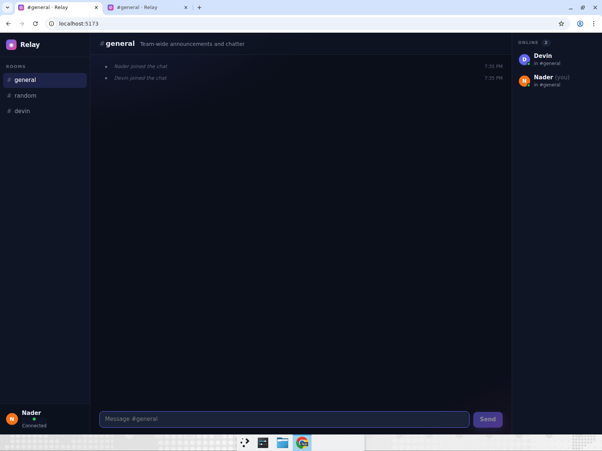
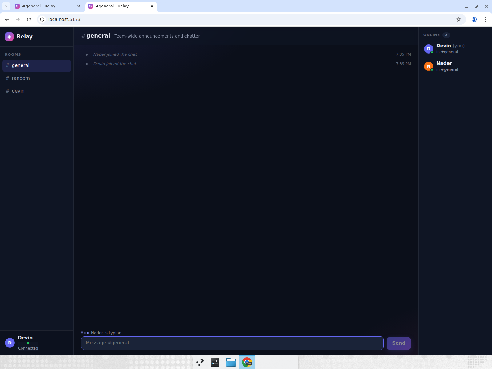
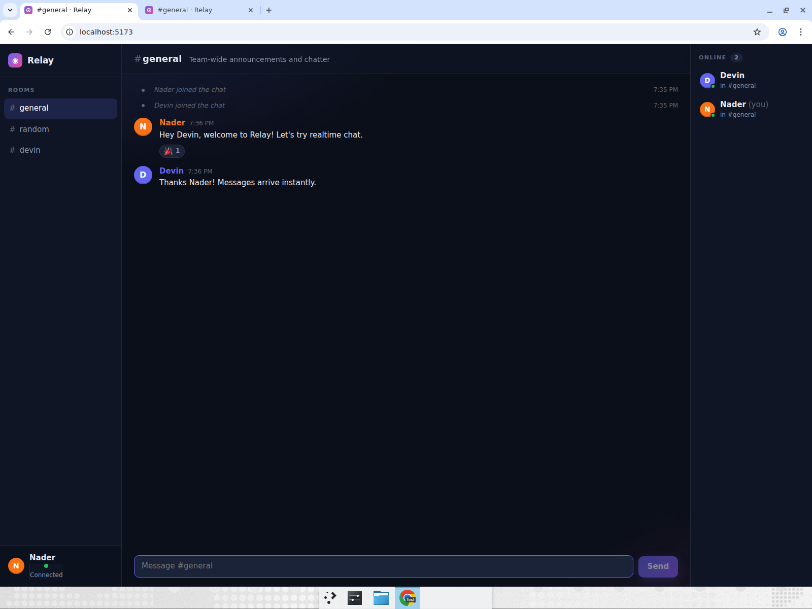
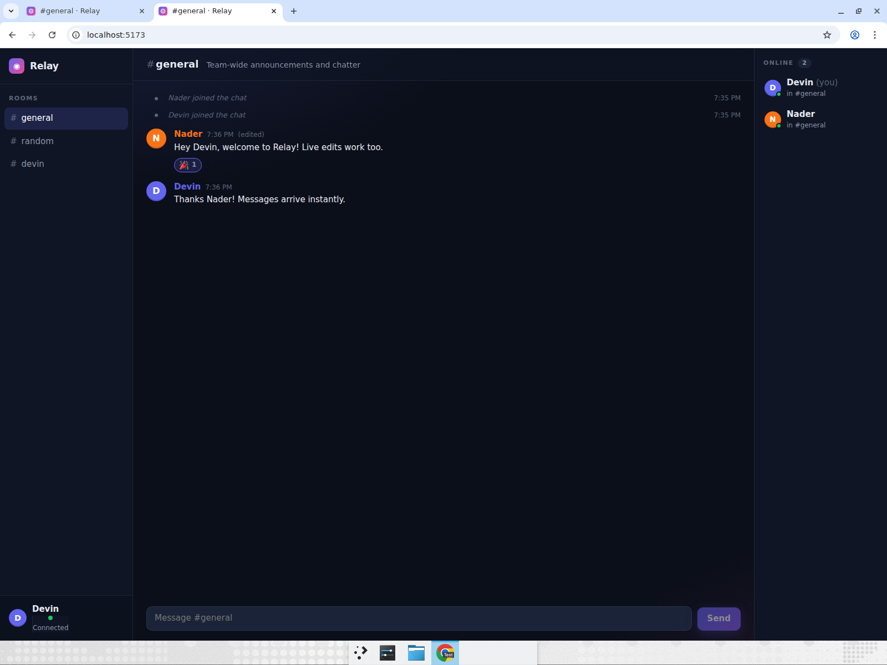
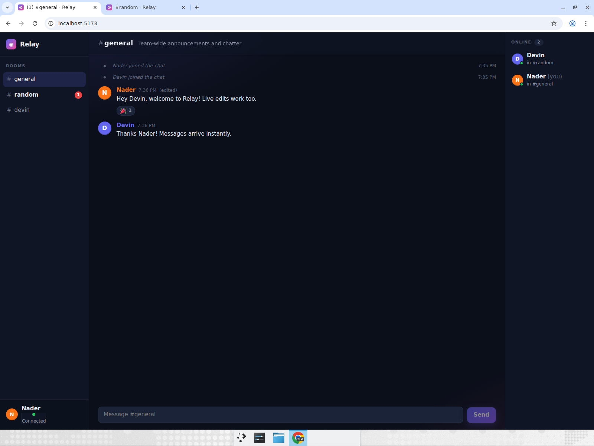
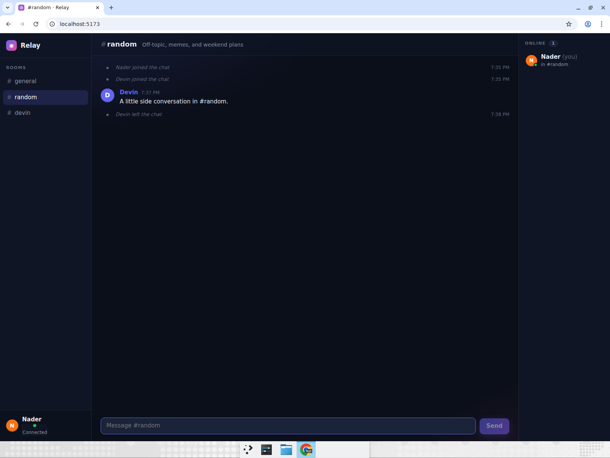

# realtime-chat — "Relay"

Relay is a Slack-style chat room that runs entirely in memory: a ~200-line Node
WebSocket server (`ws`) fans every event out to a Vite + React + TypeScript
client. Pick a display name and avatar color, then hop between `#general`,
`#random` and `#devin` — each room keeps its own history and shows an unread
badge when someone posts while you're elsewhere. Messages carry timestamps and
can be edited or deleted by their author (everyone sees the change live), hover
any message to add an emoji reaction, and the composer broadcasts a
"Nader is typing…" indicator. A live "Online" panel shows who is connected and
which room they're in, and system messages announce joins and leaves.

## Run it

```bash
cd realtime-chat
npm install
npm run dev
```

`npm run dev` uses [`concurrently`](https://github.com/open-cli-tools/concurrently)
to start both halves:

| Script           | What it does                                                            |
| ---------------- | ----------------------------------------------------------------------- |
| `npm run server` | WebSocket server on `ws://127.0.0.1:3001/ws` (`tsx watch server/index.ts`) |
| `npm run web`    | Vite dev server on `http://localhost:5173`, proxying `/ws` to the server |
| `npm run dev`    | Both of the above, in one terminal                                      |
| `npm run smoke`  | Protocol smoke test: two headless clients replay the whole scenario     |
| `npm run build`  | Type-check every project (`client`, `server`, `shared`) and build the client |
| `npm run lint`   | `oxlint`                                                                |

Open `http://localhost:5173` in two tabs (or two browsers) to see it in action.

The server binds to `127.0.0.1` and honours `PORT` (default `3001`) and `HOST`;
the Vite dev server honours `WEB_PORT` (default `5173`) and proxies the
WebSocket to whatever `PORT` is, so the client never needs to know the server
address. `GET /health` returns `{ ok, online }` for readiness checks. Set
`VITE_WS_URL` to point the client at a server that isn't behind the proxy.

## How it's put together

```
shared/protocol.ts   Room list, reaction set, and the ClientEvent / ServerEvent unions
server/index.ts      In-memory users + per-room history, broadcast helpers, event handlers
src/lib/useChat.ts   WebSocket hook: reducer over ServerEvent, auto-reconnect, unread counts
src/components/      JoinScreen, Sidebar (rooms + badges), MessageList/MessageItem
                     (hover toolbar, emoji picker, inline edit), Composer (typing), OnlineList
```

Everything the client and server exchange is a typed JSON event from
`shared/protocol.ts`, so the two sides can't drift. The server is the source of
truth: clients send intents (`message`, `edit`, `react`, …) and render whatever
comes back, which is what keeps two tabs perfectly in sync.

Reaction emoji are rendered from bundled [Twemoji](https://github.com/jdecked/twemoji)
SVGs (CC-BY 4.0) so they look identical on every platform.

## Computer-use showcase

After building the app, Devin opened it in a real, maximized Chrome window and
drove it as **two different users in two tabs**, switching back and forth with
`Ctrl+Tab` to prove every event crossed the WebSocket. Nothing was mocked — the
server was restarted with empty history right before the run.

**Recording:** [relay-two-users-showcase.mp4](https://app.devin.ai/attachments/2c95a9eb-3a7f-447b-8c8d-3aa4fe2bf421/relay-two-users-showcase-edited.mp4)
(annotated with setup / test / assertion callouts).

### Steps Devin performed

1. **Two users, two tabs.** Opened `http://localhost:5173` in tab 1 and joined as
   **Nader** (orange). Pressed `Ctrl+T`, opened the same URL in tab 2 and joined
   as **Devin** (indigo). Asserted the Online panel in *both* tabs reads
   "Online 2" and lists Nader and Devin, with `(you)` on the right person.

   

2. **Typing indicator, then delivery.** In tab 1 Nader started typing without
   sending. Switched to tab 2 and asserted "Nader is typing…" was showing above
   Devin's composer. Switched back, finished the sentence, pressed `Enter`, and
   asserted the message appeared in tab 2 immediately.

   

3. **Reply and react.** Devin replied from tab 2; asserted it arrived in tab 1.
   In tab 2, hovered Nader's message, opened the reaction picker and chose 🎉.
   Asserted the 🎉 ×1 pill appeared under the same message in tab 1.

   

4. **Edit and delete.** In tab 1 Nader hovered his own message, clicked the
   pencil, changed the text and pressed `Enter`. Asserted tab 2 showed the new
   text with an "(edited)" tag (reaction preserved). Nader then sent a second
   message, confirmed it was visible in tab 2, deleted it from tab 1 via the
   trash icon, and asserted it was gone from tab 2.

   

5. **Rooms and unread badges.** In tab 2 Devin clicked `#random` and posted a
   message. In tab 1 (still on `#general`) asserted a red **1** badge appeared
   on `#random` in the sidebar and the tab title picked up "(1)". Clicked
   `#random` in tab 1 and asserted Devin's message was there and the badge
   cleared.

   

6. **Leave.** Pressed `Ctrl+W` on tab 2. In tab 1 asserted a "Devin left the
   chat" system message appeared and the Online panel dropped to "Online 1"
   with only Nader.

   

All nine assertions passed on the recorded run; `npm run smoke` replays the same
sequence headlessly for CI.
