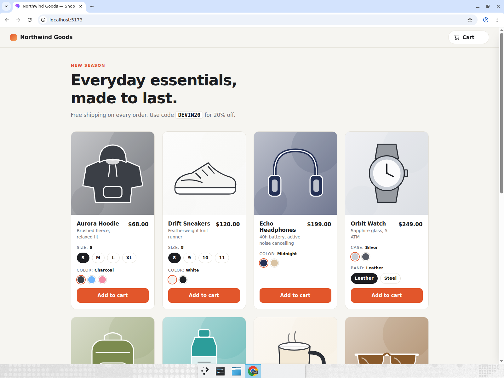
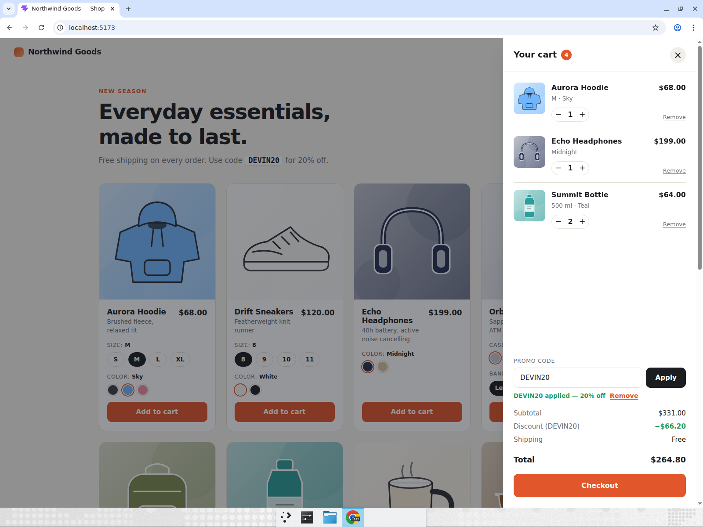
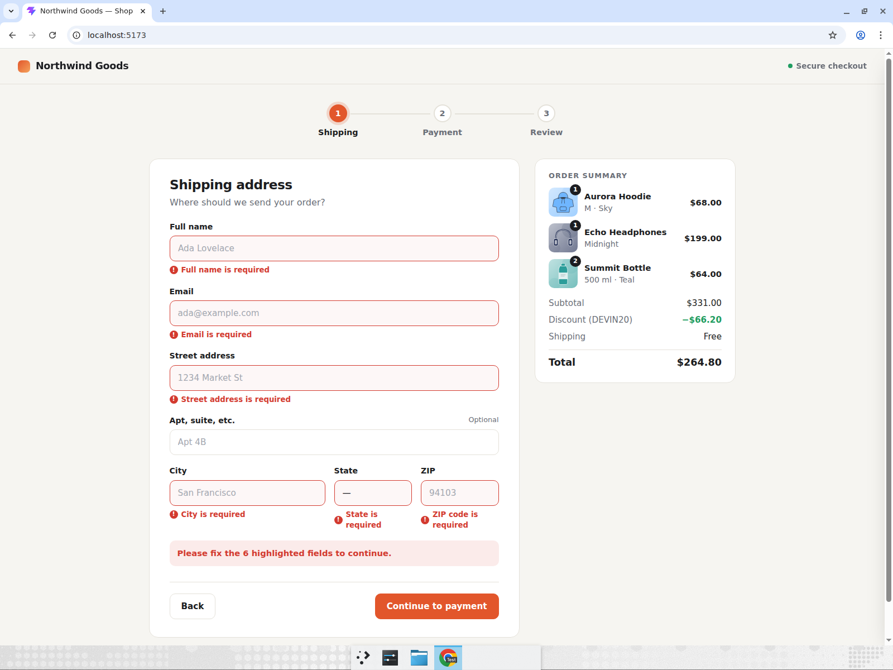
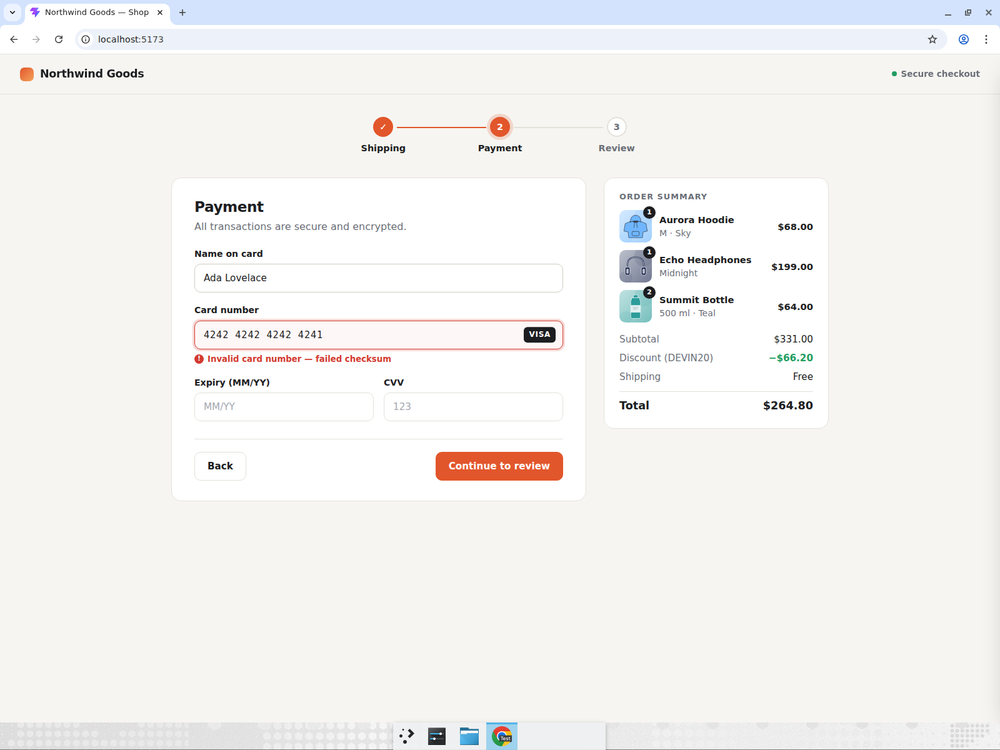
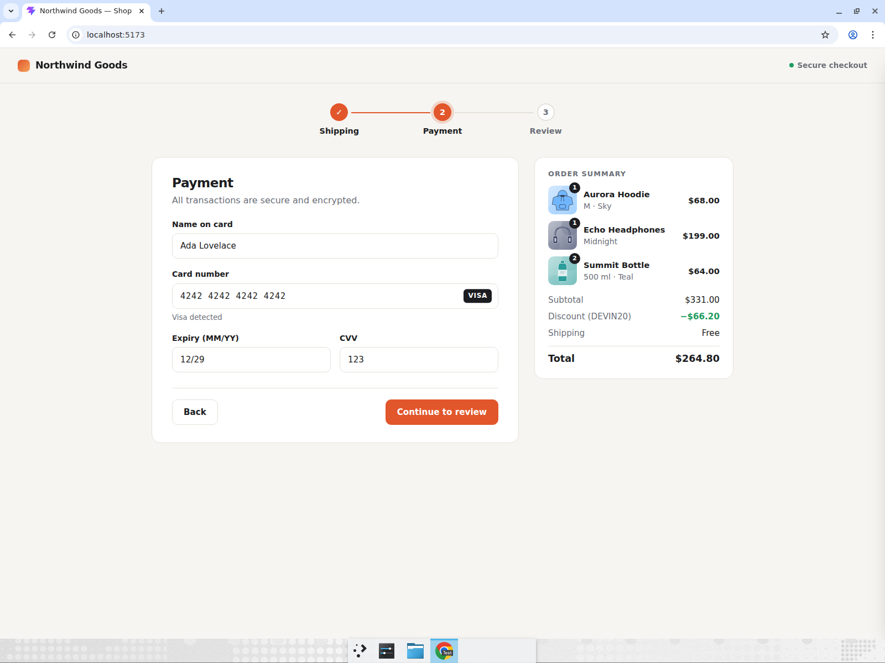
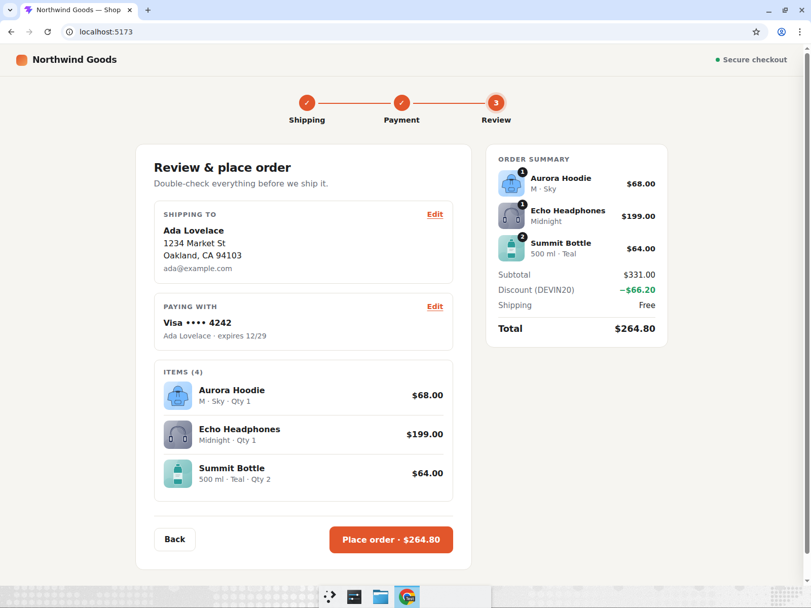
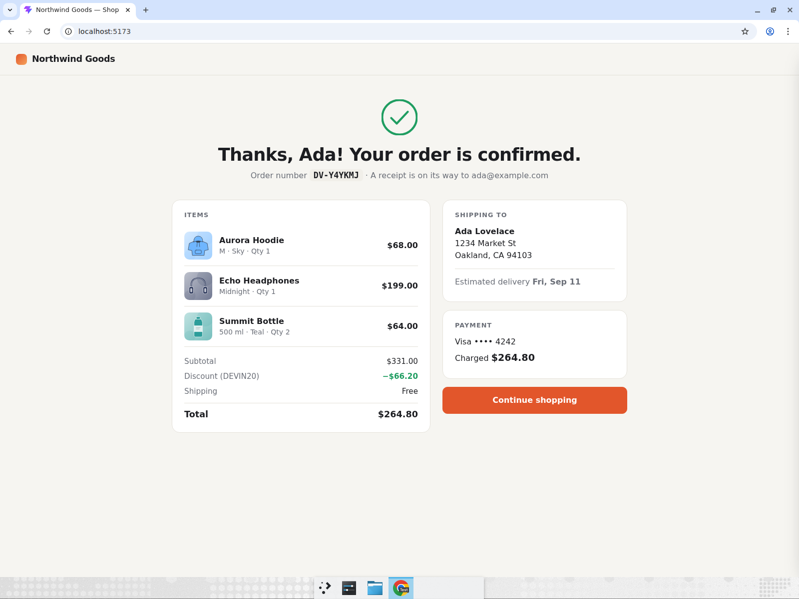

# shop-checkout — Multi-step e-commerce checkout

**Northwind Goods** is a small online store built with Vite + React + TypeScript (plain CSS, no UI kit, no backend). It has a nine-product grid with generated SVG artwork that re-tints to the selected color, size/color variant pickers, a slide-out cart with quantity steppers and a promo-code field (`DEVIN20` = 20% off), and a three-step checkout wizard — Shipping → Payment → Review — with a progress indicator and realistic inline validation: required fields, email and ZIP format, Luhn card-number check with auto-spacing every 4 digits, MM/YY expiry that must be in the future, and a 3-digit CVV. The Review step has "Edit" links that jump back to a form and return you straight to Review on save; placing the order produces a confirmation page with a generated order number (`DV-XXXXXX`).

## Run it

```bash
cd shop-checkout
npm install
npm run dev
```

Then open the URL Vite prints (default http://localhost:5173). `npm run build` type-checks and bundles; `npm run lint` runs oxlint.

## Computer-use showcase

Devin built the app, opened it in a real Chrome window, and drove the entire purchase flow with mouse and keyboard — clicking variant swatches, typing into forms, deliberately triggering validation errors, and reading values off the page to assert them.

**Recording:** [northwind-checkout-showcase.mp4](https://app.devin.ai/attachments/63718362-afbe-48eb-81ec-56d9fb60eda9/northwind-checkout-showcase-edited.mp4)

### Scenario performed

1. **Build a cart with variants.** Picked the non-default **Size M** and **Color Sky** on the Aurora Hoodie (artwork turned blue), added it, then added Echo Headphones and a Summit Bottle. Opened the cart drawer and clicked **+** on the bottle to make it quantity 2. Asserted 3 cart lines, quantity 2, and a header badge of 4.

   

2. **Apply a promo code.** Typed `DEVIN20`, clicked Apply, and asserted "DEVIN20 applied — 20% off" with Subtotal $331.00 → Total **$264.80**.

   

3. **Trigger and fix shipping validation.** Clicked Checkout, then submitted the empty shipping form and asserted all six inline errors (Full name, Email, Street address, City, State, ZIP) plus the summary banner. Filled in Ada Lovelace / ada@example.com / 1234 Market St / San Francisco, CA 94103 and continued.

   

4. **Card validation and auto-formatting.** Typed `4242424242424241` and asserted the live "Invalid card number — failed checksum" error. Cleared it and typed `4242424242424242`, asserting it rendered as `4242 4242 4242 4242` with a VISA badge and no error. Typed `1229` → `12/29` and CVV `123`, then continued.

   
   

5. **Edit from Review.** Clicked **Edit** on the "Shipping to" card, asserted the button now read "Save & return to review", changed City to Oakland, saved, and asserted Review showed **Oakland, CA 94103**.

   

6. **Place the order.** Clicked "Place order · $264.80" and asserted the confirmation page showed order number **DV-Y4YKMJ** and "Charged **$264.80**".

   

## Project layout

```
src/
  App.tsx                    view switching (shop / checkout / confirmation), header, toast
  data/products.ts           catalogue, variant groups, color swatches, promo codes
  hooks/useCart.ts           cart state: add, quantity, remove, promo
  lib/cart.ts                totals, item keys, money formatting
  lib/validation.ts          shipping/payment validators, Luhn, formatters
  lib/order.ts               order creation + order-number generator
  components/ProductArt.tsx  generated SVG artwork per product
  components/ProductCard.tsx variant pickers + add to cart
  components/CartDrawer.tsx  slide-out cart, steppers, promo field
  components/checkout/       Checkout wizard, ShippingForm, PaymentForm, ReviewStep, Confirmation
```
