# Snake Arcade

A cabinet-inspired Snake game built with Vite + React + TypeScript: sculpted
lime-green snakes, warm coral apples, a custom illustrated mascot, a chunky
marquee, and a softly textured 20×20 canvas playfield. Steer with arrows or WASD,
start/restart with Space, and pause with P; touch steering and clickable controls
work on smaller screens. Personal bests persist locally, speed rises 10% every
five apples, and Chill / Normal / Fast modes start at 4 / 6 / 9 cells per second.
Optional synthesized arcade sounds, fullscreen mode, a live speed meter, and
collapsible diagnostics complete the cabinet. Fonts and artwork are bundled;
there are no external services or runtime network dependencies.

## Run it

```sh
cd snake-arcade
npm install
npm run dev
```

Then open the URL Vite prints (http://localhost:5173 by default).

Other scripts: `npm run build` (type-check + production build), `npm run lint`.

## Project layout

```
src/
  game/engine.ts        pure game logic: reducer, collision, apple spawning, speed-ups
  game/useSnakeGame.ts  keyboard handling + fixed-rate game loop
  game/types.ts         shared types
  components/           GameCanvas (canvas renderer), Overlay (start/pause/over), Telemetry
```

## Computer-use showcase

### Arcade redesign — live fullscreen play

**[Watch the 59-second, original-speed annotated recording](https://app.devin.ai/attachments/052c4628-5d3d-4125-ac81-5616a768db28/snake-redesign-fullscreen-realtime-annotated.mp4)**

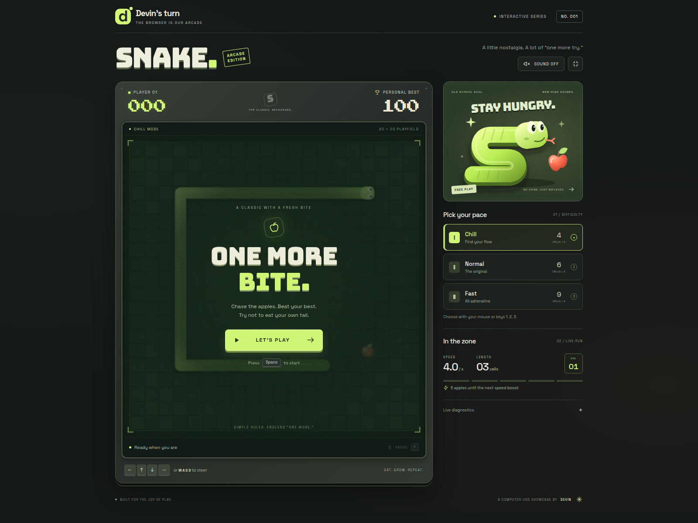

Devin drove maximized, fullscreen Chrome with native keyboard input and observed
game telemetry. No game state was injected.

1. Selected **Chill**, then pressed **Space**: score 000, length 3, speed 4.0.
2. Steered continuously to **eight apples in 22.44 seconds**, with **zero deaths
   or pauses before the target**. The fifth apple increased speed to 4.4 cells/s;
   the eighth produced length 11 and level 02.
3. Pressed **P**, verified the paused overlay and frozen movement, then resumed
   after **0.82 seconds**.
4. Deliberately hit a wall; verified **Game Over**, final score **008**, and the
   existing personal best **100** retained.
5. Restarted with **Space** and ate **two more apples in 4.51 seconds**, without
   pausing.

| Eight apples, live | Game over |
|---|---|
| 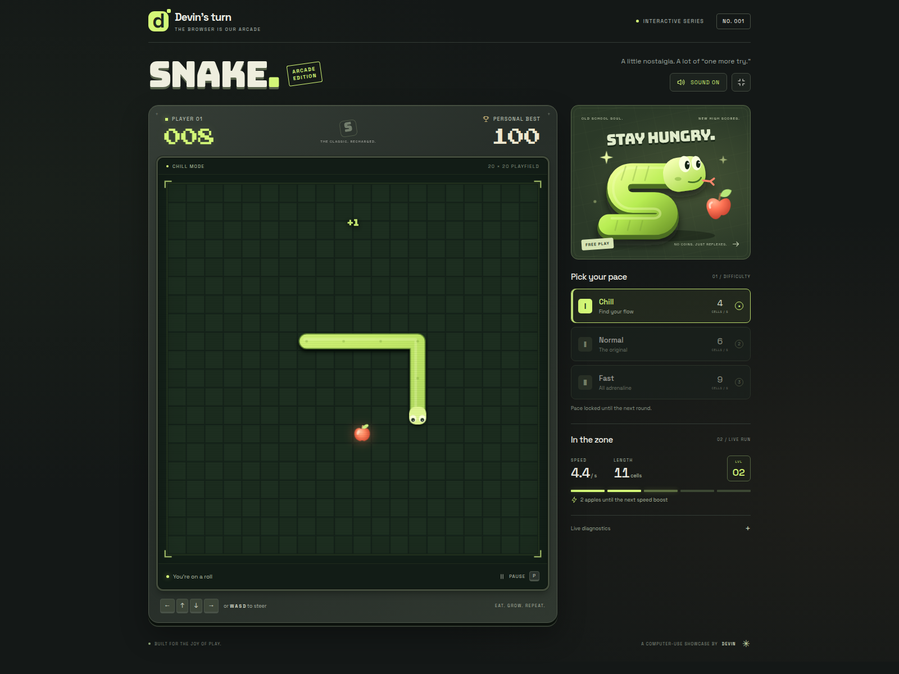 | 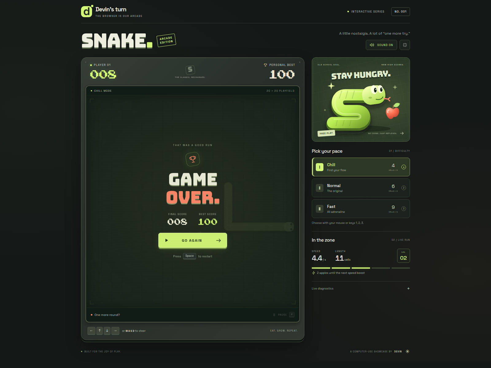 |

Additional browser checks passed: difficulty keys and buttons, locked difficulty
during a run, clickable start/pause/resume/restart, all four WASD directions,
Space/Enter on focused buttons, holding P without repeat toggles, fullscreen,
diagnostics, enabled audio graph activity and muted silence. A separate origin
verified the new-record badge and reload persistence without changing the
legitimate 100-point record. No console errors were observed.

Portrait checks used **390px browser touch emulation**, including all four D-pad
turns, disabled controls while paused, and no horizontal overflow in any game
phase. Physical mobile hardware was not tested. Sound was checked through actual
Web Audio events; speaker quality was not assessed, and the recording is silent.

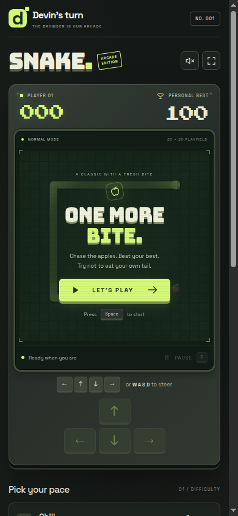

Validation: `npm run lint`, `npm run build` (including TypeScript), and the browser
checks above passed on the redesign.

## Earlier recordings (original design)

This app exists to show Devin playing a real-time game in a real browser. Devin
drove a maximized Chrome window with genuine keyboard input only (no game-state
injection), steering **live while the snake was moving** — reading the canvas and
telemetry panel every tick and sending the next arrow key, with zero pauses on
the way to score 8.

**Recording (real time, unedited, 2:02):**
[snake-showcase-live-realtime-annotated.mp4](https://app.devin.ai/attachments/58777683-824f-4fa6-bc97-75f45089fd2e/snake-showcase-live-realtime-annotated.mp4)


### Scenario Devin performed

1. **Start** — Loaded http://localhost:5173, confirmed the start screen ("Press
   Space to start", "Devin's turn" badge, score 0 / high score 0), pressed `1`
   to select Chill (4 cells/s) and `Space` to start. Telemetry read *Playing*,
   length 3.
2. **Play to 8 apples, live** — Ran a tight read-then-steer loop against the
   moving game: each tick, read head / heading / apple / length from the
   telemetry panel, pick the next non-reversing turn toward the apple that
   avoids the body and walls, and press that arrow key. No `P` presses at all.
   Reached score 3, score 5 (speed ticked up from 4.0 to 4.4 cells/s) and score
   8 with length 11 in 27 seconds, never dying.
3. **Pause / resume** — Only after score 8: pressed `P`, asserted the *Paused*
   overlay and that the head froze; pressed `P` again ~1 s later and asserted
   status back to *Playing*.
4. **Wall crash** — Steered left into the x = 0 wall on purpose. Asserted the
   *Game Over* overlay, final score 8 matching the HUD, the "New high score!"
   badge, and the HUD high score updated from 0 to 8.
5. **Restart** — Pressed `Space`; asserted score 0, length 3, status *Playing*
   and high score still 8. Ate two more apples live (score 2, length 5) in 14
   seconds, again without pausing.

### Screenshots

| Start screen | Score 3 |
|---|---|
|  | 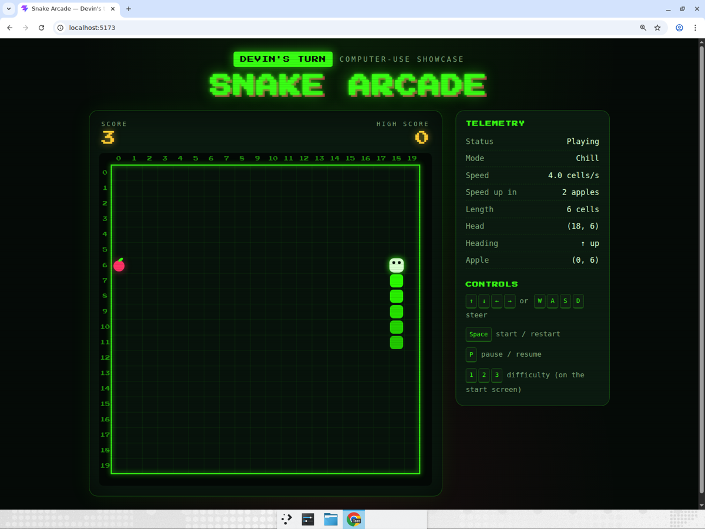 |

| Score 5, speed-up to 4.4 cells/s | Score 8, length 11 |
|---|---|
|  |  |

| Brief pause after score 8 | Game over with new high score |
|---|---|
|  |  |

| Restarted run, 2 more apples |
|---|
|  |

### Bonus: 2-minute high-score run

Devin then played one continuous two-minute run on Chill with the same live
controller — no pauses, no deaths, real keyboard input — and reached **score 38**
(length 41, speed ramped from 4.0 to 7.8 cells/s) before deliberately crashing
after the clock ran out to bank the new record.

**Recording (real time, unedited, 2:26):**
[snake-highscore-realtime-annotated.mp4](https://app.devin.ai/attachments/d66bd4c1-8e8c-4d08-b2db-64acf9518dd3/snake-highscore-realtime-annotated.mp4)

| Score 20 | Score 35 | Final: 38, new high score |
|---|---|---|
| 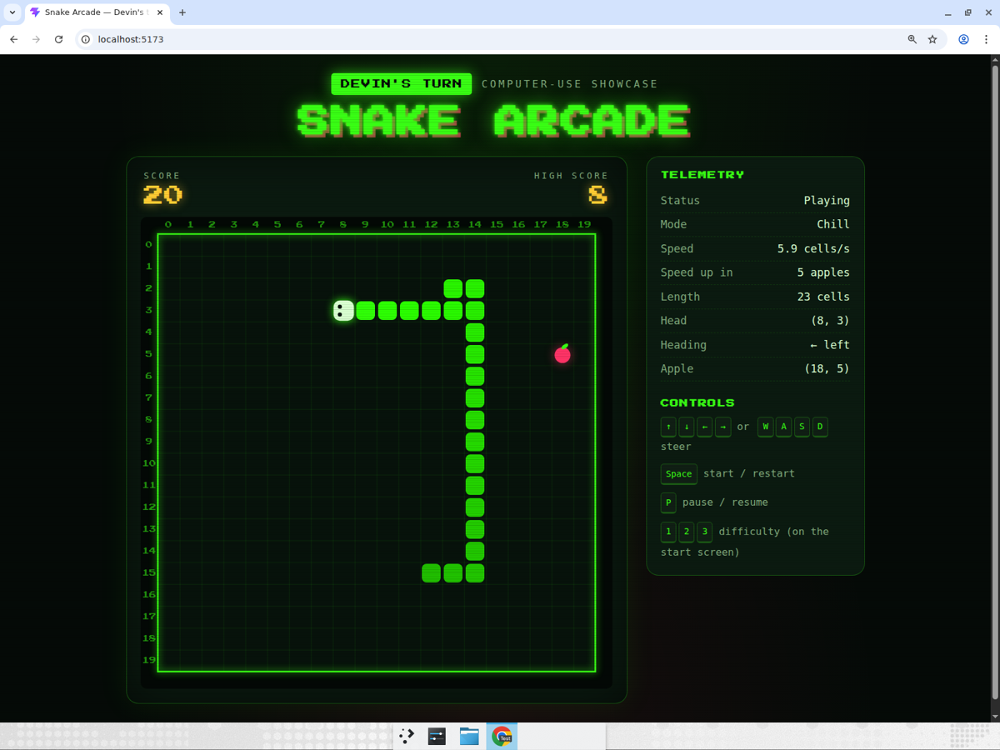 | 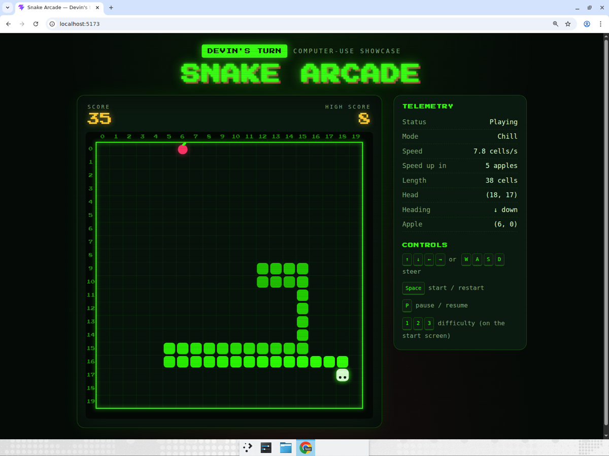 | 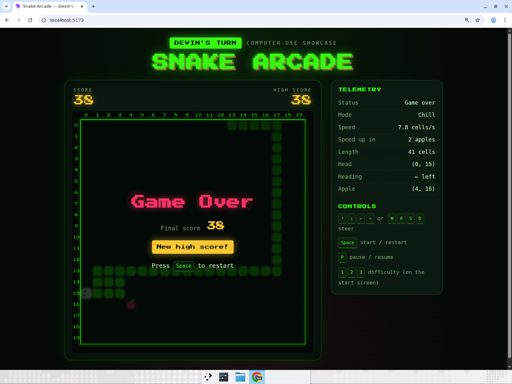 |

### Bonus: 10-minute high-score run — score 100

A ten-minute continuous session on Chill, again live keyboard input with zero
pauses. The first life ran ~6 minutes and reached **score 100** (length 103) at
the 20 cells/s speed cap before dying; Devin restarted instantly and the second
life reached 52 when the clock ran out. High score went 38 → 100.

**Recording (real time, unedited, 10:28):**
[snake-highscore-10min-realtime-annotated.mp4](https://app.devin.ai/attachments/86d5c3ff-8ff6-46df-a1fa-e8d34764c3d7/snake-highscore-10min-realtime-annotated.mp4)

| Score 50 | Score 100, length 103, 20 cells/s | Final: high score 100 |
|---|---|---|
| 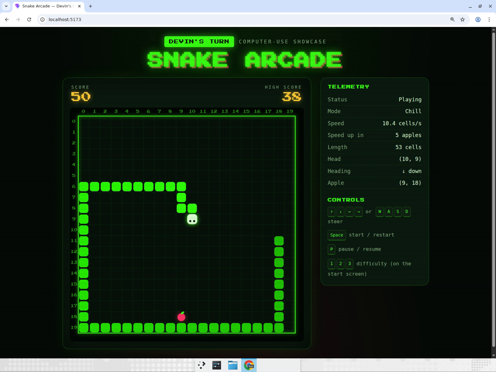 | 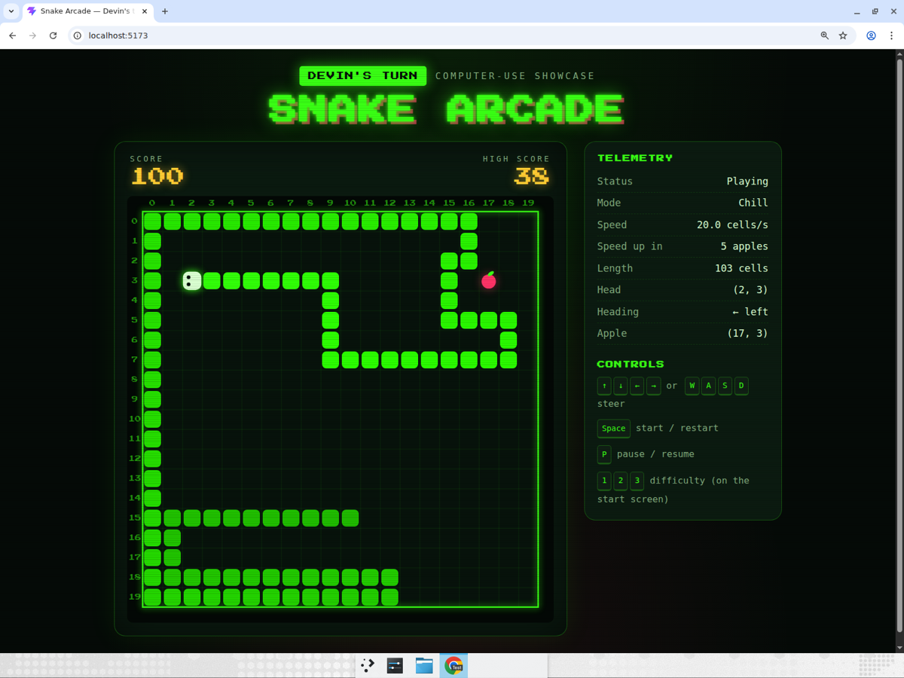 | 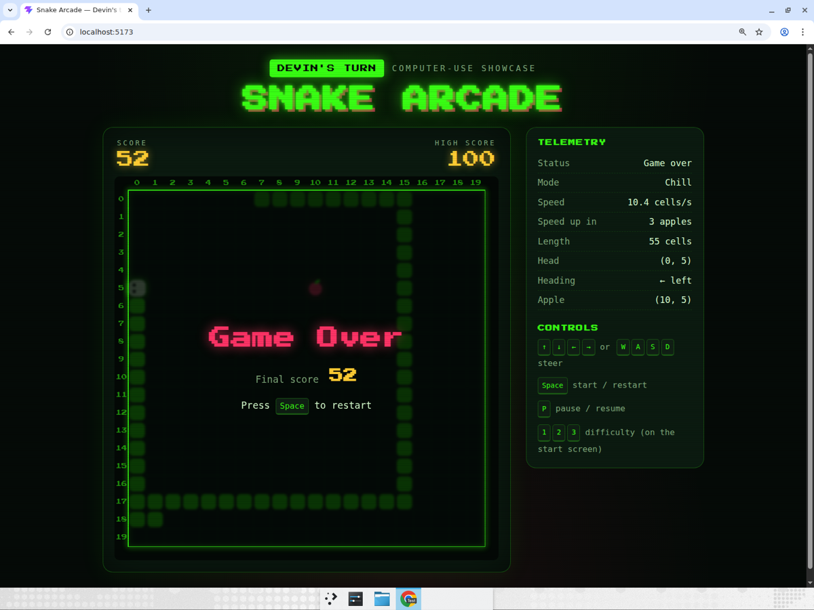 |
