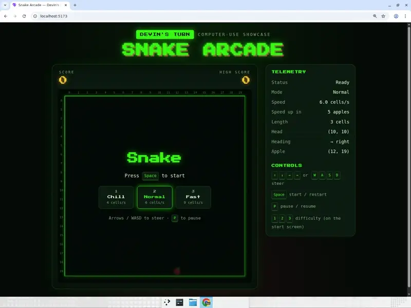
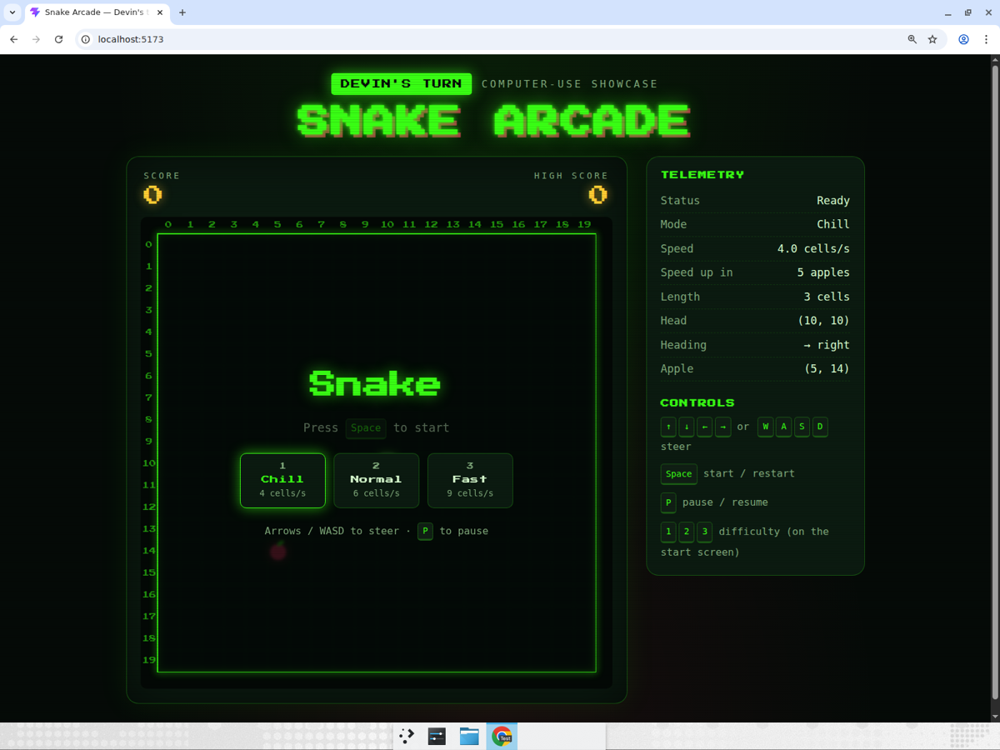
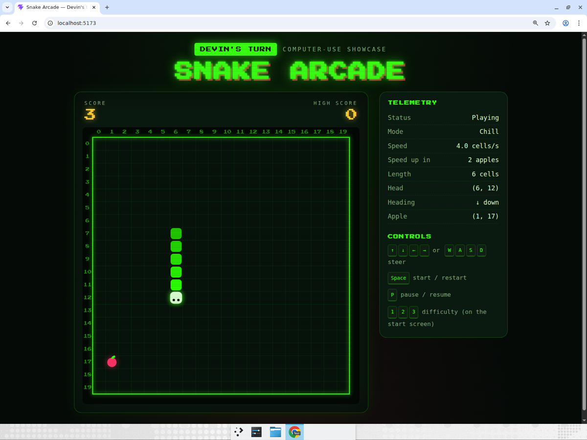
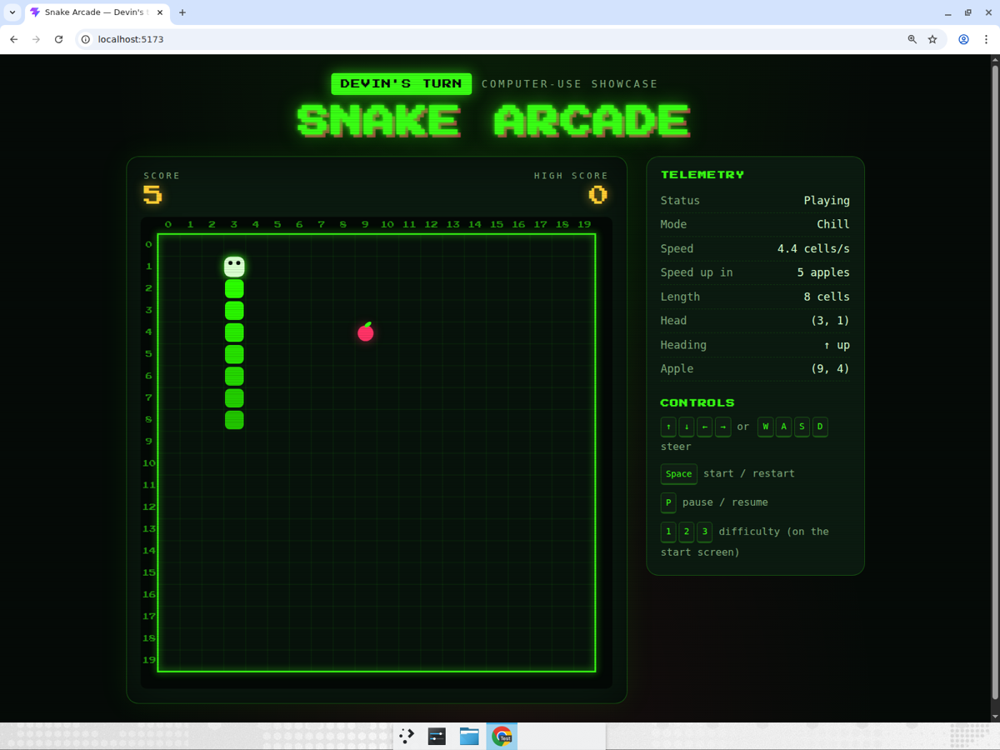
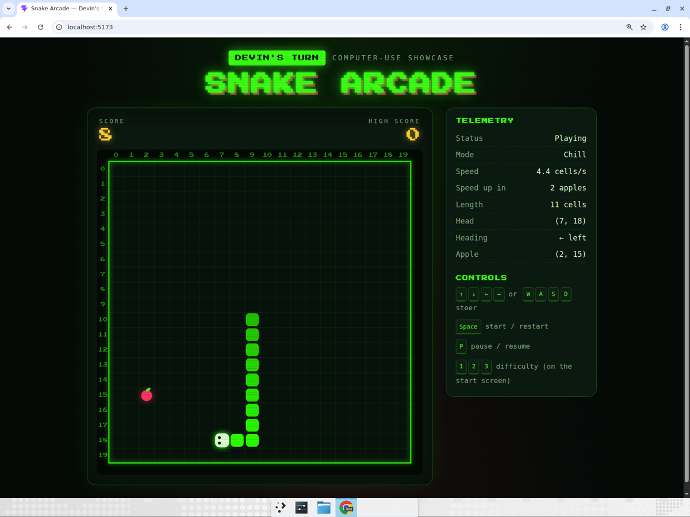
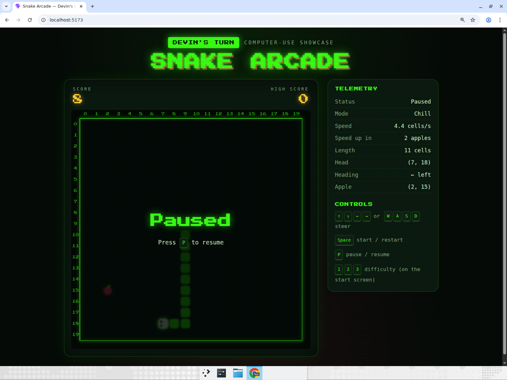
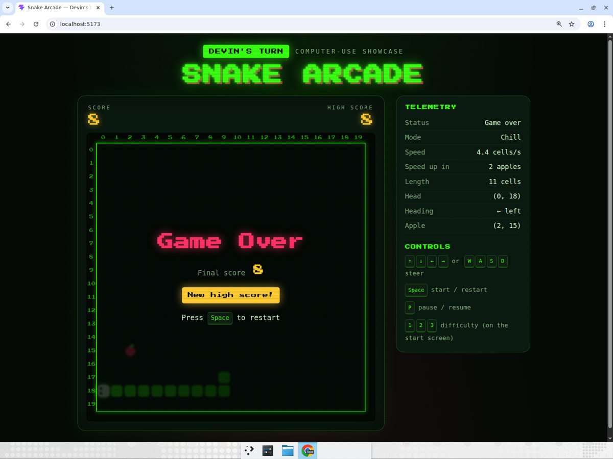
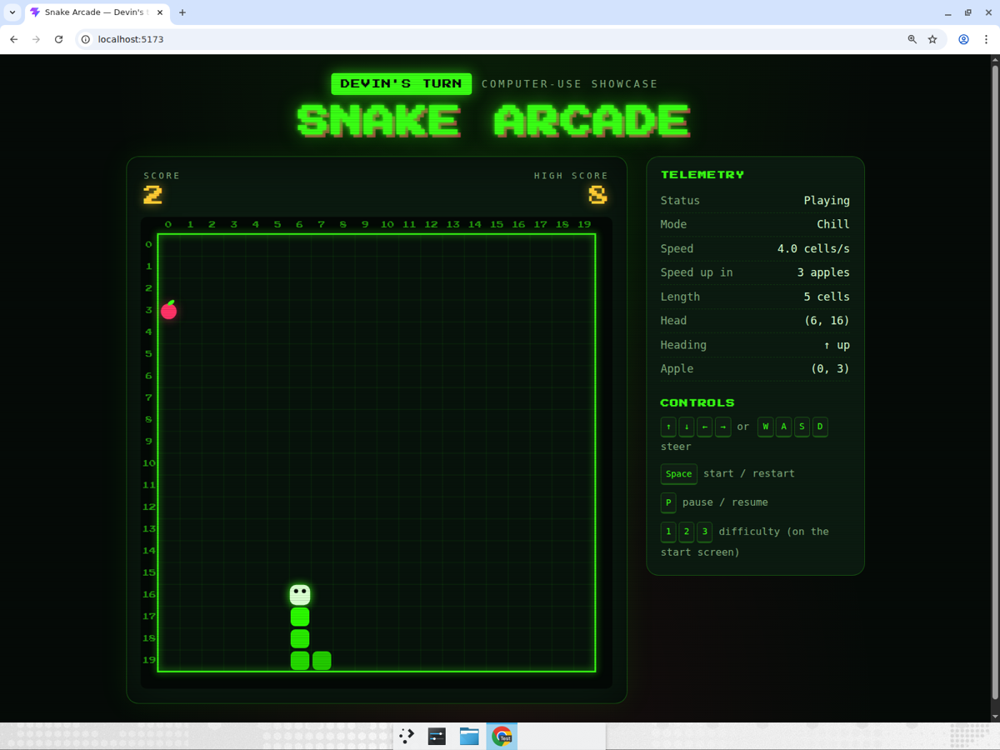

# Snake Arcade

A retro, CRT-styled Snake game built with Vite + React + TypeScript. The 20x20
board is rendered on a `<canvas>`; you steer with the arrow keys or WASD, start
and restart with Space, and pause with P. Score and a localStorage-backed high
score sit above the board, the snake speeds up 10% every 5 apples, and a
"telemetry" side panel exposes the live game state (head, heading, apple, speed).
Three difficulties (Chill 4 cells/s, Normal 6, Fast 9) can be picked on the start
screen with the mouse or keys 1/2/3.

## Run it

```sh
cd snake-arcade
npm install
npm run dev
```

Then open the URL Vite prints (http://localhost:5173 by default).

Other scripts: `npm run build` (type-check + production build), `npm run lint`.

## Project layout

```
src/
  game/engine.ts        pure game logic: reducer, collision, apple spawning, speed-ups
  game/useSnakeGame.ts  keyboard handling + fixed-rate game loop
  game/types.ts         shared types
  components/           GameCanvas (canvas renderer), Overlay (start/pause/over), Telemetry
```

## Computer-use showcase

This app exists to show Devin playing a real-time game in a real browser. Devin
drove a maximized Chrome window with genuine keyboard input only (no game-state
injection), reading the canvas and the telemetry panel to plan every route.

**Recording (real time, unedited, 4:33):**
[snake-arcade-devin-playthrough.mp4](https://app.devin.ai/attachments/8b2fd0dd-d0f8-42d2-939a-b01b1c9ab6a7/snake-arcade-devin-playthrough.mp4)
· [25-second annotated cut](https://app.devin.ai/attachments/ca2b3ebe-2a3b-4b3c-863e-342975239e8a/snake-showcase-edited.mp4)



### Scenario Devin performed

1. **Start** — Loaded http://localhost:5173, confirmed the start screen ("Press
   Space to start", "Devin's turn" badge, score 0 / high score 0), pressed `1`
   to select Chill (4 cells/s) and `Space` to start. Telemetry read *Playing*,
   length 3.
2. **Play to 8 apples** — Used `P` as a planning beat: pause, read head /
   heading / apple coordinates from the telemetry panel and the canvas, plan a
   Manhattan route that avoids the body and walls, resume and fire a timed arrow
   key sequence (one cell every 250 ms on Chill), pause again after the apple
   is eaten. Reached score 3, score 5 (speed ticked up from 4.0 to 4.4 cells/s)
   and score 8 with length 11, never dying.
3. **Pause / resume** — Pressed `P`, asserted the *Paused* overlay and that the
   head position froze; pressed `P` again and asserted status back to *Playing*.
4. **Wall crash** — Steered left into the x = 0 wall on purpose. Asserted the
   *Game Over* overlay, final score 8 matching the HUD, the "New high score!"
   badge, and the HUD high score updated from 0 to 8.
5. **Restart** — Pressed `Space`; asserted score 0, length 3, status *Playing*
   and high score still 8. Ate two more apples (score 2, length 5).

### Screenshots

| Start screen | Score 3 |
|---|---|
|  |  |

| Score 5, speed-up to 4.4 cells/s | Score 8, length 11 |
|---|---|
|  |  |

| Paused | Game over with new high score |
|---|---|
|  |  |

| Restarted run, 2 more apples |
|---|
|  |
