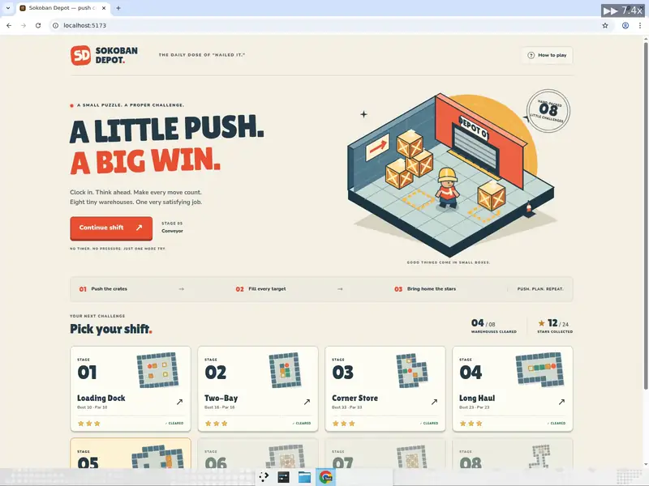
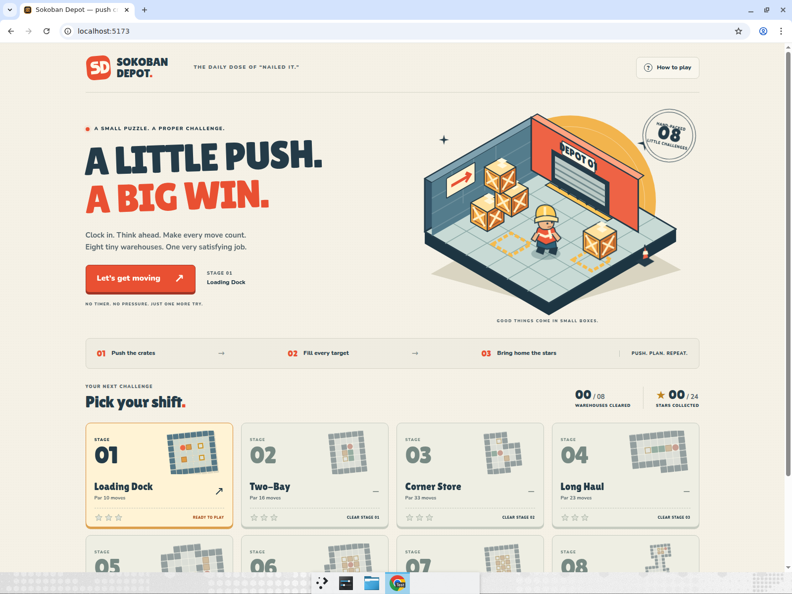
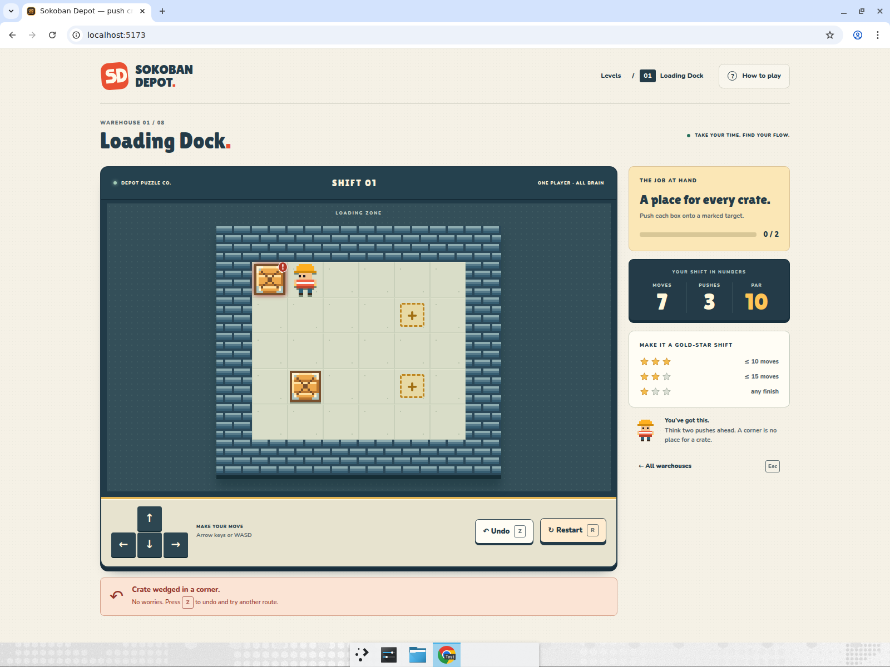
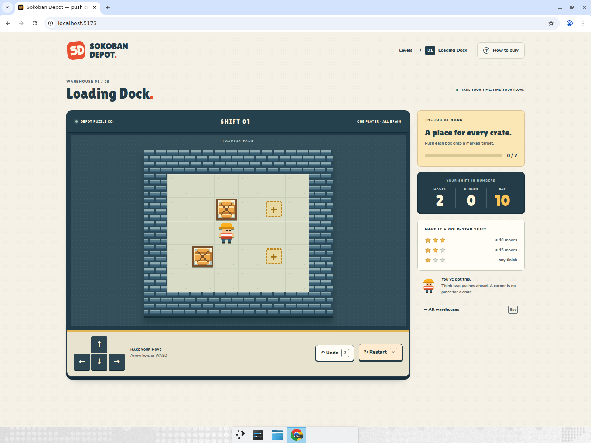
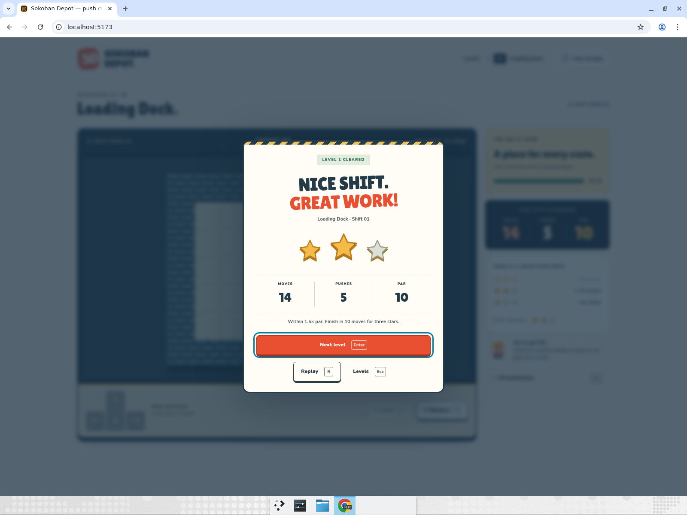
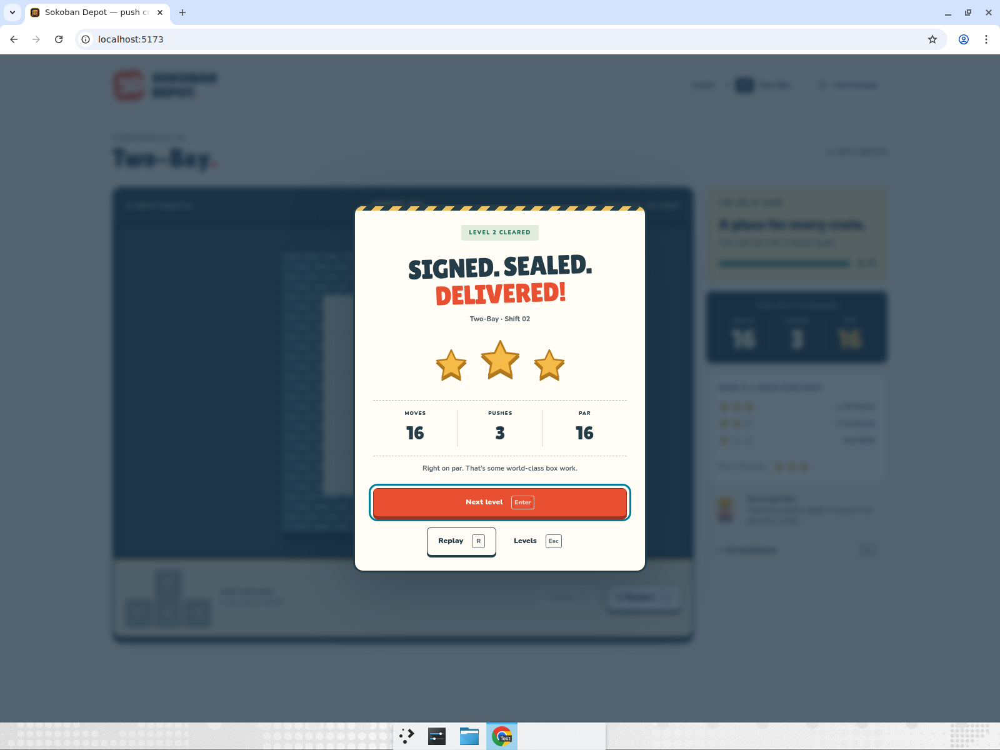
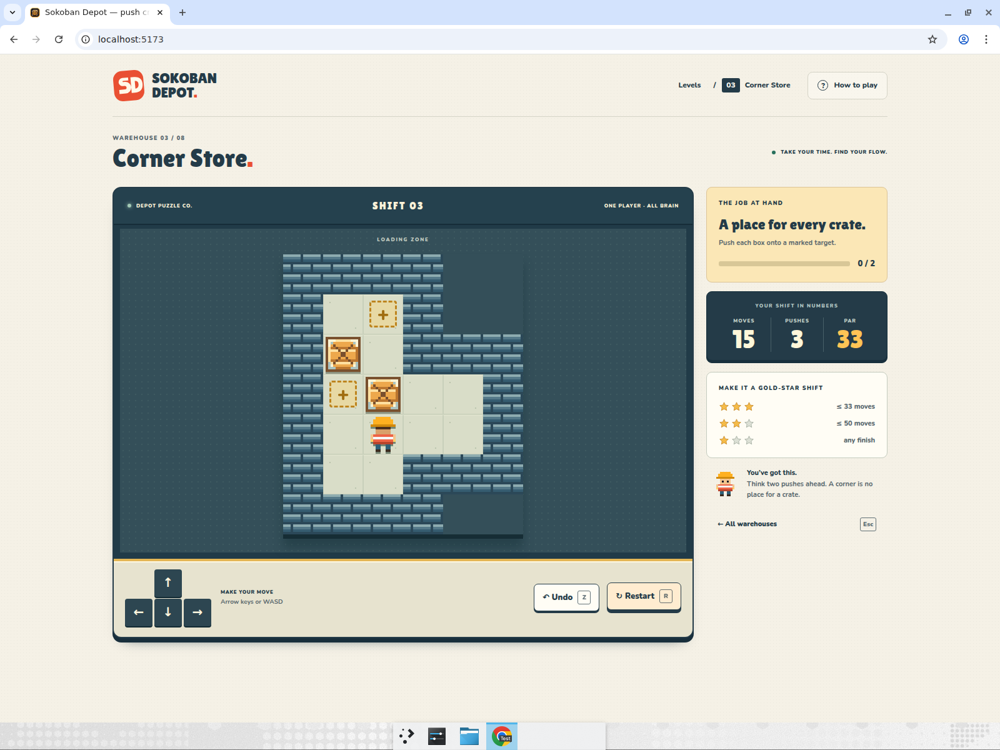
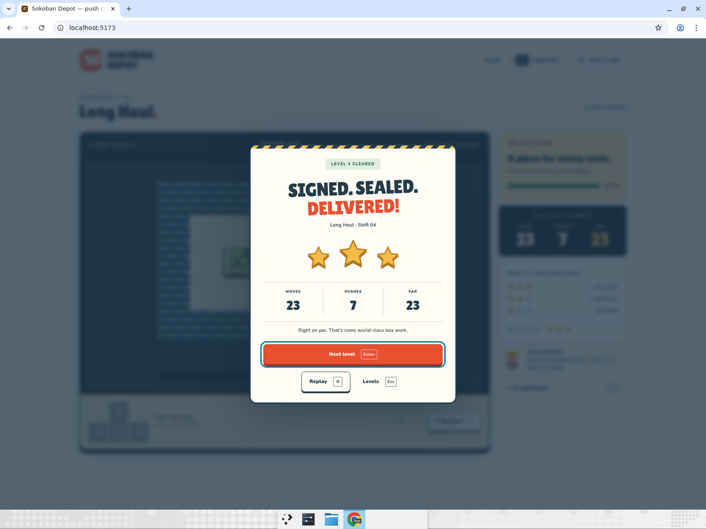
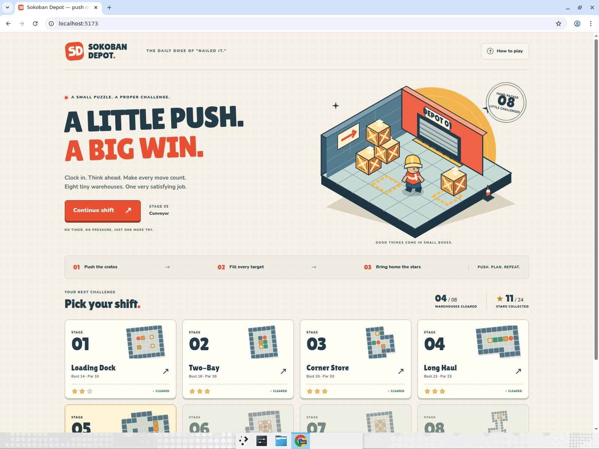

# Sokoban Depot: push crates onto targets

A warehouse-themed Sokoban built with Vite + React + TypeScript. Eight hand-made levels of
increasing difficulty (a warm-up plus classic layouts from the freely distributable *Microban*
set), arrow-key / WASD movement, unlimited undo (`Z`), restart (`R`), move and push counters,
a par move count per level with a 1–3 star rating, a level-select screen with minimaps and
sequential unlocking, and progress persisted in `localStorage`. All tiles — brick walls,
wooden crates, the yellow-hard-hat worker, dashed targets — are pixel art drawn with inline
SVG and CSS. An original SD monogram, warm cream / vermilion identity, illustrated depot
diorama, tactile stage cards and a navy arcade cabinet give the game its own visual world.
The two typefaces (Lilita One for display, Nunito for UI) are bundled from
`@fontsource` packages; there are no external assets and no network calls at runtime.

## Run it

```bash
cd sokoban-depot
npm install
npm run dev
```

Then open the printed `http://localhost:5173` URL. `npm run build` type-checks (strict) and
produces a static bundle in `dist/`; `npm run lint` runs oxlint.

`node scripts/verify-levels.mjs` runs a breadth-first solver over every level to prove it is
solvable and that `par` equals the optimal move count.

Keyboard: `↑ ↓ ← →` or `W A S D` move (and push) · `Z` / `Backspace` undo · `R` restart ·
`Esc` / `L` level select · `Enter` / `Space` / `N` next level after clearing one.
The on-screen direction pad supports mouse and touch. **How to play** opens a keyboard-accessible
help dialog; the victory dialog also traps focus, and Tab + Enter activates its selected action.

Stars: 3 for finishing at or under par, 2 for at most 1.5× par, 1 for any finish. The best
result per level is kept.

## Notable design decisions

- **Undo is a full state stack, not a reversed move.** Every step pushes the previous
  `GameState` (player, crates, counters) onto a history array, so undo is O(1), exact, and
  also rewinds the move/push counters — which is what makes "backtrack out of a mistake and
  still earn stars" possible.
- **Corner deadlocks are detected and surfaced.** A crate that is off-target and wedged
  against two perpendicular walls can never move again; the crate glows red and a banner
  under the board says to press `Z`. The player is never blocked from continuing — it
  is a hint, not a game-over.
- **Par values are machine-verified.** `scripts/verify-levels.mjs` is a dependency-free BFS
  solver; the `par` in `src/game/levels.ts` is the optimal move count it reports.
- **Levels unlock sequentially** and progress lives under the `sokoban-depot:progress:v1`
  key, with a *Reset progress* button on the level-select screen.
- **An original arcade identity.** Cream, vermilion, ink blue and cargo yellow connect the
  monogram, hand-drawn SVG depot diorama, stage tickets, cabinet, scoreboard and delivery-receipt
  victory screen. The art is source code, with no generated images or external requests.
  Tokens live in `src/index.css`; component styles live in `src/App.css`.
- **A board that fits its cabinet.** `ResizeObserver` derives the tile size from available
  width and height, including narrow screens. Walls, targets, crates and the worker remain
  distinct across the tested desktop and mobile widths. Matched crates gain check badges; stuck crates gain warning badges.
  Reduced-motion preferences disable animation and transitions.

## Computer-use showcase

This app exists to demonstrate **spatial planning, backtracking with undo, and level
progression**: driving a puzzle purely with the keyboard, recognising a mistake, rewinding it,
and carrying on through a sequence of levels. After building it, Devin opened the app in a
maximised Chrome window and performed the following scenario end to end while recording:

1. Opened the level-select screen (fresh progress: 0 of 8 cleared, levels 2–8 locked) and
   entered **Loading Dock**.
2. Deliberately made a mistake: pushed the upper crate up against the top wall and then left
   into the top-left corner. **Expected:** the crate is outlined red and the "Crate wedged in
   a corner" banner appears under the board (7 moves, 3 pushes).
3. Pressed `Z` five times to rewind past the bad pushes. **Expected:** banner disappears,
   crate returns to its starting cell, move counter drops back to 2, pushes to 0.
4. Finished level 1 with the arrow keys. **Expected:** "Level 1 cleared" card with
   moves/pushes/par, confetti and a star rating (14 moves vs par 10 → 2 stars).
5. Pressed `Enter` to go to level 2 (Two-Bay) and solved it with `WASD` in par
   (16 moves → 3 stars).
6. Pressed `Enter`, solved level 3 (Corner Store) with the arrow keys in par (33 moves → 3 stars).
7. Pressed `Enter`, solved level 4 (Long Haul) in par (23 moves → 3 stars).
8. Pressed Tab → Enter to activate **Replay**, then solved Long Haul again at par.
   **Expected:** replay stays on level 4 and resets its counters; the second completion also earns 3 stars.
9. Pressed Tab twice → Enter to activate **Levels** on the win card. **Expected:** levels 1–4 show *cleared* badges and
   their stars (2 + 3 + 3 + 3 = 11 / 24), level 5 is unlocked, levels 6–8 remain locked.
10. Reloaded the page. **Expected:** the same 4 / 8 cleared and 11 / 24 stars are restored
   from `localStorage`.

All ten steps passed on the latest recorded run.

Exact key sequences (`U/D/L/R` are arrow presses):

| Stage | Keyboard sequence | Final moves / pushes / stars |
|---|---|---|
| Loading Dock | `DRURULL`, five `Z`, then `LURRDLLLDRRR` | 14 / 5 / 2 |
| Two-Bay | `dssadwwaswwaassd` (WASD) | 16 / 3 / 3 |
| Corner Store | `DLURRRDLULLDDRULURUULDRDDRRULDLUU` | 33 / 8 / 3 |
| Long Haul | `ULLDLDRUURRDLLRRDDLURUL` | 23 / 7 / 3 |

Supplemental Chrome checks passed at 390×844 and 320×740: responsive cabinet and victory
layout, direction pad, undo, restart, help keyboard isolation, reset confirmation/cancel,
victory focus and reload persistence. Testing found that opening a stage from a scrolled
mobile lobby retained the old scroll offset; screen navigation now resets to the top, and
the original reproduction passed on retest. Levels 5–8 were solver-verified rather than
completed in the browser; physical touch hardware was not tested.

### Recording

**[Watch the full recording (mp4, 104 seconds)](https://app.devin.ai/attachments/087d747f-5957-434b-8819-ad315b8992fa/showcase.mp4)**



[Supplemental responsive and control checks](https://app.devin.ai/attachments/777f6713-6e75-4430-a8e1-59fd3df68b55/responsive-checks.mp4)

### Key moments

| Fresh arcade lobby | Crate wedged in the corner on level 1 |
|---|---|
|  |  |

| Five undos later: back to move 2 | Level 1 cleared with 2 stars after the recovery |
|---|---|
|  |  |

| Two-Bay cleared with WASD at par | Corner Store: planning the next push |
|---|---|
|  |  |

| Long Haul cleared at par | Level select after levels 1–4: 11 / 24 stars |
|---|---|
|  |  |

## Project layout

```
src/
  App.tsx                    screen routing (select ⇄ play), progress wiring
  components/
    Logo.tsx                 SD monogram + typographic wordmark
    DepotScene.tsx           original isometric depot illustration (inline SVG)
    LevelSelect.tsx          level cards with minimaps, stars, lock state
    PlayScreen.tsx           board + sidebar, keyboard handling, win overlay
    Board.tsx                absolutely positioned tiles and animated entities
    Sprites.tsx              pixel-art wall / crate / worker drawn as SVG rects
    Stars.tsx                star rating icons
  game/
    levels.ts                the eight levels in classic text format + par
    engine.ts                parse, move/push rules, solved & deadlock checks, stars
    useSokoban.ts            history stack: step / undo / restart
    progress.ts              localStorage persistence and unlock rules
scripts/
  verify-levels.mjs          BFS solver that checks solvability and par
```
