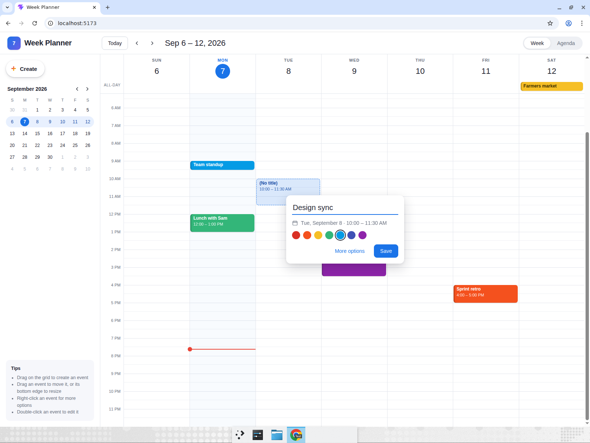
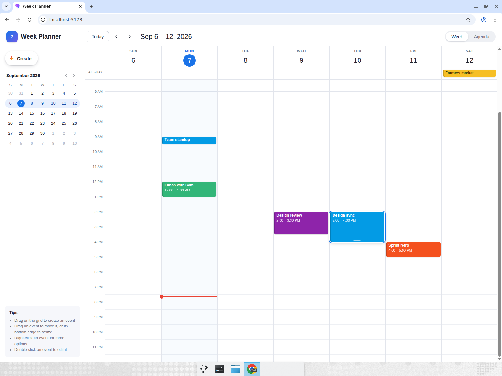
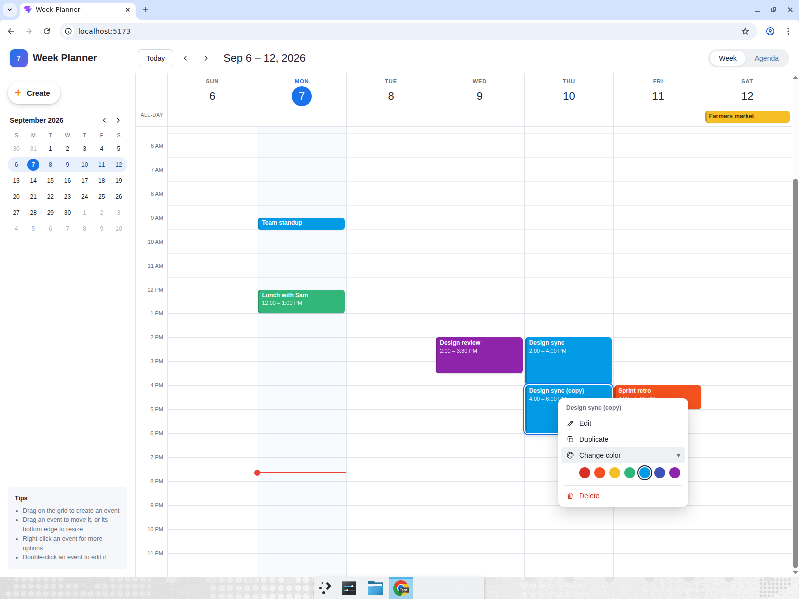
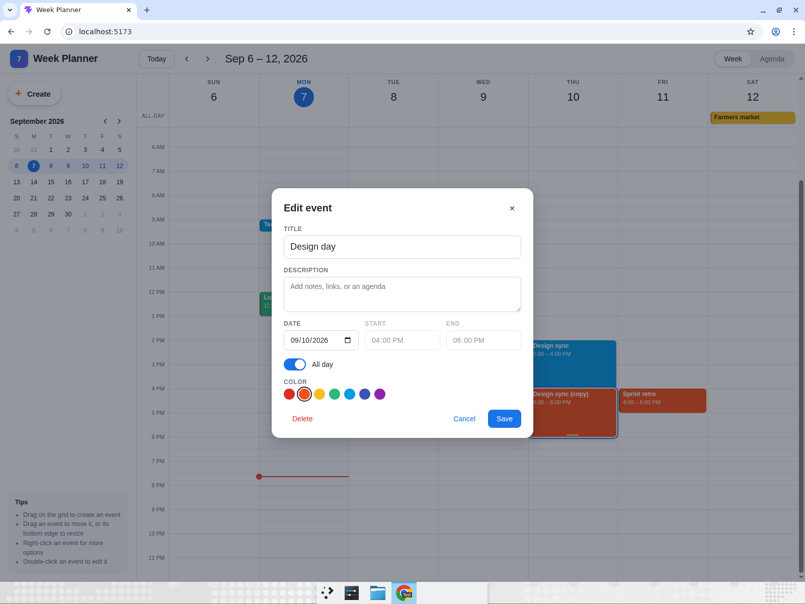
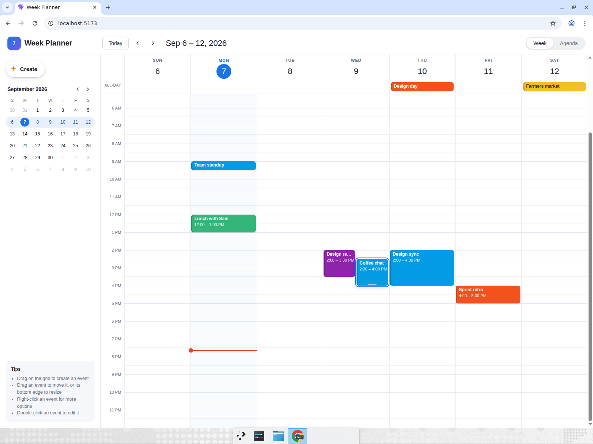
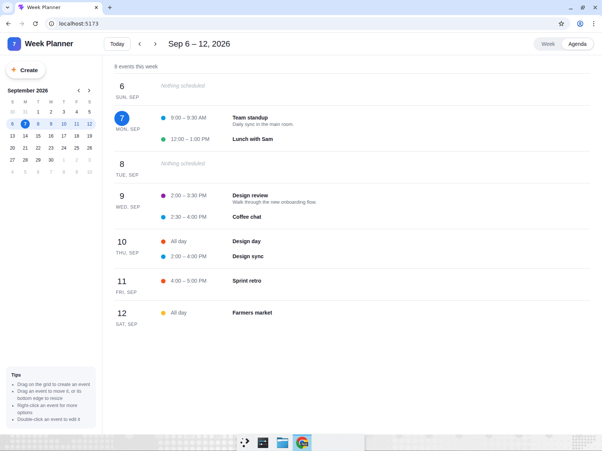

# Week Planner

A Google-Calendar-style week view built with Vite, React and TypeScript, with no UI kit and no backend. The grid shows seven day columns against 24 hours in 30-minute slots, a live current-time indicator, previous/next/Today navigation and a mini month picker in the sidebar. Events are created by click-dragging on empty time slots (a ghost event grows as you drag, then a popover asks for a title and color), moved by dragging them to another day or time, resized by dragging their bottom edge, and right-clicked for a custom context menu (Edit, Duplicate, Change color, Delete). Double-clicking opens an edit modal with title, description, date, start/end time and an all-day toggle; all-day events live in a strip above the grid. Overlapping events lay out side by side, everything persists to `localStorage`, and an Agenda view lists every event grouped by day.

## Run it

```bash
cd week-planner
npm install
npm run dev
```

Then open the URL Vite prints (usually http://localhost:5173). `npm run build` type-checks and produces a production bundle; `npm run lint` runs oxlint.

## How it works

- `src/components/WeekView.tsx` owns the pointer interactions. A single `Interaction` state (`create` | `move` | `resize`) is driven by window-level mouse listeners so drags keep tracking even when the cursor leaves the grid, and every position snaps to 30-minute slots.
- `src/layout.ts` groups transitively-overlapping events into clusters and assigns each event a column, which is how overlapping events render side by side.
- `src/useEvents.ts` is the event store: it seeds a few events for the current week on first load and mirrors every change to `localStorage` under the key `week-planner:events`.
- `src/components/ContextMenu.tsx`, `CreatePopover.tsx` and `EditModal.tsx` are the three overlays; `useClampedPosition` keeps the floating ones inside the viewport.

## Computer-use showcase

After building the app, Devin opened it in a real, maximized Chrome window and drove it with the mouse and keyboard exactly as a person would. Every step below was performed live and visually asserted in the recording.

**Recording:** [week-planner-showcase-edited.mp4](https://app.devin.ai/attachments/3c49973b-72c2-4836-8247-1f621460452d/week-planner-showcase-edited.mp4)

1. **Drag to create.** Pressed on Tuesday at 10:00 and dragged down to 11:30 while the ghost event grew, released, typed “Design sync” in the popover and saved. Asserted the event appears on Tuesday showing `10:00 – 11:30 AM`.

   

2. **Move and resize.** Dragged “Design sync” from Tuesday morning onto Thursday at 2:00 PM and asserted `2:00 – 3:30 PM` in the Thursday column. Then grabbed its bottom edge and dragged down one slot; asserted the range became `2:00 – 4:00 PM` (30 minutes longer).

   

3. **Right-click menu.** Right-clicked the event and chose **Duplicate**; asserted “Design sync (copy)” appeared directly after it at `4:00 – 6:00 PM`. Right-clicked the copy, opened **Change color** and picked a new swatch; asserted the copy changed from blue to orange.

   

4. **Edit modal and all-day.** Double-clicked the copy to open the edit modal, renamed it to “Design day”, switched on **All day** and saved. Asserted the timed block disappeared and an orange “Design day” chip appeared in Thursday's all-day strip.

   

5. **Overlapping events.** On Wednesday, dragged upward from an empty 3:30 PM slot to 2:30 PM, overlapping the seeded “Design review”, and titled it “Coffee chat”. Asserted the two events render side by side at half width instead of stacking.

   

6. **Navigation, Agenda and persistence.** Clicked › and ‹ and asserted the title changed to `Sep 13 – 19, 2026` and back; clicked a day in the following week in the mini month picker and asserted the main view jumped to that week, then clicked **Today**. Switched to **Agenda** and asserted all eight events were listed. Pressed F5 and asserted the created events, the overlap, the color change and the all-day chip all survived the reload.

   
